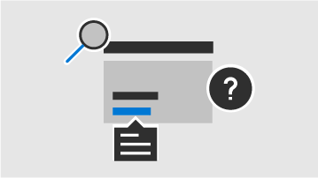
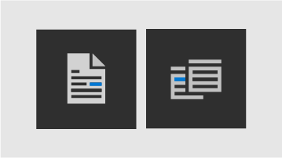
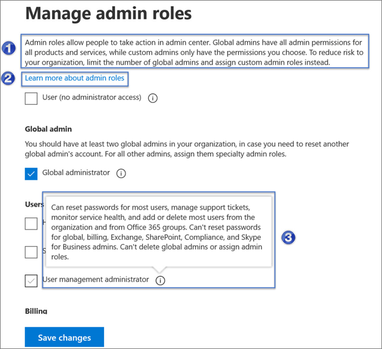
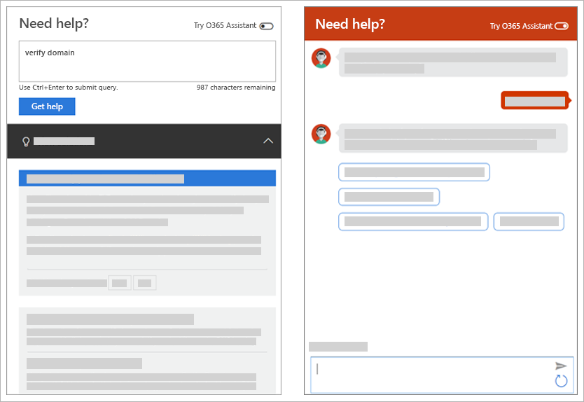

<!-- The following is just placeholder text from Madhura's mail. We need to add images/examples of each -->

# What are the many ways Help is available in the Microsoft 365 admin center?

We've tried to design the admin center so you can complete a task quickly. But sometimes it just isn't clear how to get something done. For those situations, we've got your back! We provide tips throughout the admin center, as well as a virtual assistant to answer your questions.  
 

<ul class="panelContent cardsW">
    <li>
        <a href=" ">
        

            

                

                    

                        

                            
                        

                    

                    

                        <h3>Integrated help</h3>
                        
Short text description for link.

                    

                

            

        

        </a>
    </li>
    <li>
        <a href="  ">
        

            

                

                    

                        

                            
                        

                    

                    

                        <h3>Intelligent assistance</h3>
                        
Short text description for link.

                    

                

            

        

        </a>
    </li>
    <li>
        <a href="  ">
        

            

                

                    

                        

                            
                        

                    

                    

                        <h3>Guides and articles</h3>
                        
Short text description for link.

                    

                

            

        

        </a>
    </li>
</ul>

## Integrated help
Help is integrated throughout the admin center so it's there right when you need it.

1. **Inline help text**. Static content that’s up front and is used to relay info that’s critical to the task at hand. For example, providing an overview of a feature or setting, explaining the user impact or outcome of a specific action, describing next steps, and more.
2. **Links to articles**. Provide a quick pathway to official help content. Rather than interrupt your workflow by forcing you to hunt online for answers, links take you to contextual articles based on the page you're currently using. 
3. **Tips**. Provide on-the-spot help if you encounter potentially unfamiliar concepts or need additional information about a setting (such as the effect of different values). If needed, tips also include links to additional content.

## Modern self-help powered by AI
Clicking the "Need Help" button in the Microsoft 365 admin center opens a our modern self-help experience. For example, if you search for *verify my domain*. 
The help pane returned an Insight card and a few articles we think will help you.  The insight is powered by Machine Learning that helps us surface a solution that has been helpful to other admins who have entered similar queries. 

Or, for those times when you don't quite know how to get something done in your specific situation, use the O365 Assistant. Just click the toggle at the top of the "Need Help" pane to turn it on. 

The O365 Assistant provides a conversational interface for getting help. Enter your query and the chatbot will ask clarifying questions to get you to the right answer for your specific situation.  Think of it as your virtual helper to discover solutions and complete tasks. 

For example, if I enter "reset password" the chatbot asks me questions about whether I want to reset my own password or someone else's.    

## Guides and articles

Whether you're looking for comprehensive deployment guides, quick step-by-step procedures, or PowerShell cmdlets, we've got it all on the web. Our guide and articles are thoroughly reviewed and tested by our content developers to ensure you always have the most up to date and accurate information. Check out our articles and guides at the [Microsoft Docs](https://docs.microsoft.com/Office365/index?view=o365-worldwide) site.

