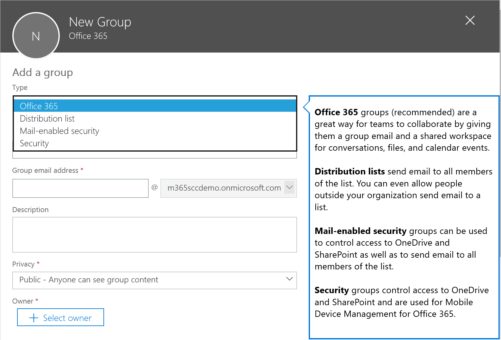
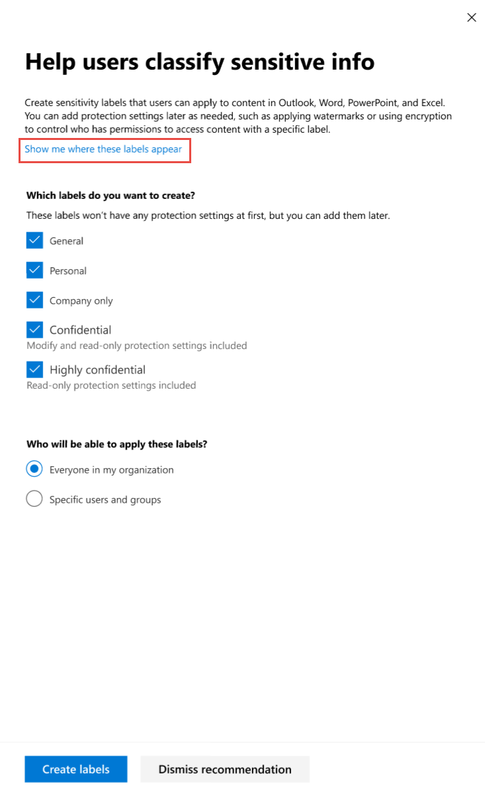
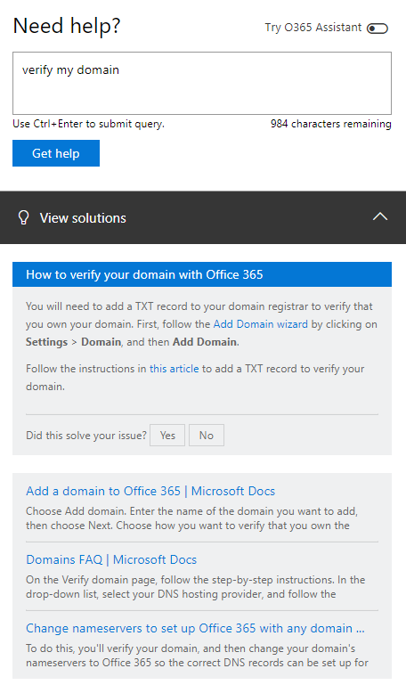
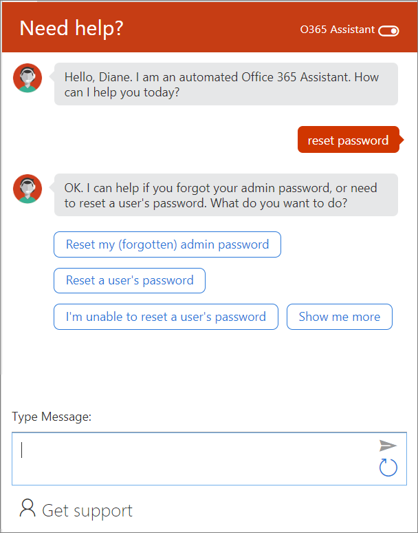

<!-- The following is just placeholder text from Madhura's mail. We need to add images/examples of each -->

# What is Help?

We've included tips and help throughout the admin center so you can find the information you need. This article explains what help is available 

## Help bubbles
Help bubbles provide on-the-spot help if you encounter potentially unfamiliar concepts or need additional information about a setting (such as user impact or effect of different values). If needed, bubbles also include links to additional content.

In this example, a help bubble is used in the New Group wizard to provide detailed information about each of the group types to help the user decide which best suits their needs.

## Links to documentation
Links provide a quick pathway to official help content. Rather than interrupt their workflow by forcing them to hunt online for answers, links take you to articles based on the page you're currently using. You can discover more about a feature or the learn about the ramifications of a specific setting.

In this example, as you complete a recommendation to set up sensitivity labels in their organization, the link “Show me where these labels appear” takes you to [this document](https://go.microsoft.com/fwlink/?linkid=2005245) so you can learn where the labels will appear to your users.

## Toolboxes
Toolboxes provide an aggregated list of tasks related to managing a larger scenario. Each entry includes a description of the task and links directly to the in-app feature where that task is performed.

In this example, the GDPR Toolbox in the Office 365 Security & Compliance Center provides links to features that will help you discover, govern, protect, and monitor the personal data in the organization (all common requirements for GDPR compliance).

## M365 "Need Help" pane
Clicking the "Need Help" button in the Microsoft 365 admin center opens a search box where you can describe a issue you're having or search for help articles.

In this example, we searched for *verify my domain*. 
The help pane returned an Insight card and a few articles we think will help you.

Or, you can use the O365 Assistant. Just click the toggle at the top of the "Need Help" pane to turn it on. Enter your query and we'll help get you to the right answer to your question.   

