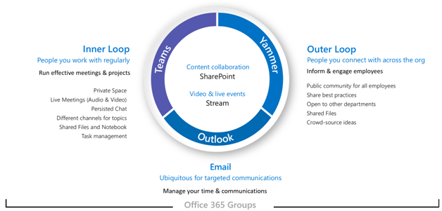

# Plan for Office 365 Groups governance

Office 365 Groups has a rich set of tools to implement any governance capabilities your organization might require. This article guides IT pros to ask the right questions to determine their requirements for governance and how to meet them based on their organizational profile.

## Why Office 365 Groups?

We know that organizations today are using a diverse toolset. There’s the team of developers using team chat, the executives sending email, and the entire organization connecting over enterprise social. Multiple collaboration tools are in use because every group is unique and has their own functional needs and workstyle. Some will use only email while others will live primarily in chat. If users feel the IT provided tools do not fit their needs, they will likely download their favorite consumer app which supports their scenarios. Although this process allows users to get started quickly, it leads to a frustrating user experience across the organization with multiple logins, difficulty sharing, and no single place to view content.

This concept is referred to as “Shadow IT” and poses a significant risk to organizations. It reduces the ability to uniformly manage a user’s access, ensure security, and service compliance needs. Office 365 Groups empowers users and reduces the risk of shadow IT by providing many of the tools needed to collaborate in a single step.

Office 365 Groups let you choose a set of people with which you wish to collaborate and easily sets up a collection of resources for those people to share. Manually assigning permissions to resources is a thing of the past as adding members to the Office 365 Group automatically grants the needed permissions to all assets provided by the group

## Technical Architecture 

There are three main communication modalities supported by Office 365 Groups. Groups can be created within these experiences and used across the Office 365 suite:
- [Outlook](https://support.office.com/en-us/article/learn-about-office-365-groups-b565caa1-5c40-40ef-9915-60fdb2d97fa2?ui=en-US&rs=en-US&ad=US): collaboration through email with a shared group inbox and calendar
- [Microsoft Teams](https://support.office.com/en-us/article/learn-about-office-365-groups-b565caa1-5c40-40ef-9915-60fdb2d97fa2?ui=en-US&rs=en-US&ad=US): a persistent chat-based workspace where you can have informal, real-time, conversations around a variety of topics, organized by specific sub-groups 
- [Yammer](https://support.office.com/en-us/article/learn-about-office-365-groups-b565caa1-5c40-40ef-9915-60fdb2d97fa2?ui=en-US&rs=en-US&ad=US): enterprise social experience for collaboration

Note: When a creating a new group via other teamwork applications such as SharePoint, Planner or Stream will create an Office 365 Group with an Outlook communication modality with the ability to connect to Microsoft Teams.  

Depending on where an Office 365 Group is created, certain resources are provisioned automatically, such as:
- Inbox – For email conversations between your members. This inbox has an email address and can be set to accept messages from people outside the group and even outside your organiza-tion, much like a traditional distribution list.
 - Calendar – For scheduling events related to the group
- SharePoint Team Site – A central repository for information, links and content relating to your group
- SharePoint Document Library – A central place for the group to store and share files
- OneNote Notebook – For gathering ideas, research, and information
- Planner – For assigning and managing project tasks among your group members
- Yammer Group – A common place to have conversations and share information
- Microsoft Teams – chat-based workspace in Office 365

To learn more about which resources are created for each group, visit [Learn about Office 365 Groups](https://support.office.com/en-us/article/learn-about-office-365-groups-b565caa1-5c40-40ef-9915-60fdb2d97fa2).

Note: When a new Office 365 Group is created via Yammer or Teams, they are not visible in Outlook or the address book because the primary communication between those users happens in their respective clients. 

Note: When a new Yammer group is created, the Office 365 group does not create a group mailbox or calendar resource. Therefore, a Yammer group cannot be connected to Microsoft Teams. See [Yammer and Groups](#bookmark)

## Where to start a conversation
There are multiple places to have a conversation within Office 365 and understanding where to start a conversation can help organizations define a strategy for communication.

- Teams: chat-based workspace (high velocity collaboration) – inner loop
  - Built for collaboration with the people you work with every day
  - Puts information at the fingertips of users in a single experience
  - Add tabs, connectors and bots
  - Live chat, audio/video conferencing, recorded meetings.
- Yammer: connect across the org (enterprise social) – outer loop
  - Communities of Practice - Cross-functional groups of people who share a common interest or expertise but are not necessarily working together on a day-to-day basis 
  - Leadership connection, learning communities, role-based communities 
- Outlook Groups: modern DL (email-based collaboration)
  - Ubiquitous for targeted communication
  - Upgrade DLs to Office 365 Groups – [Why you should upgrade?]()
- SharePoint – Core content collaboration experience for all Office 365 Groups
  - Every Office 365 Group gets a connected SharePoint team site
  - Share content, create customized pages and author news 
  - [Connect](https://docs.microsoft.com/en-us/sharepoint/dev/features/groupify/groupify-overview) existing SharePoint team sites to new Office 365 Groups 

##  Managing and governing Office 365 at scale

There exists a rich set of tools to implement any governance capabilities your organization might require. The following describes the capabilities, best practice and guidance to ask the right questions to determine the requirements for governance, and how to meet them

### Control who can create Office 365 Groups
Groups can be created by end-users from multiple end-points including Outlook, SharePoint, Microsoft Teams, and other environments. Guidance

#### *Guidance*
- Strongly consider self-service to empower group owners
- Document and communicate how to request a group
- Revisit who can create groups during your cloud journey
- Consider using dynamic membership to configure Security group’s members to control group creation.
- Assess which groups scenarios can managed via a dynamic membership and allow self-service for the rest
There are three primary models of provisioning in Office 365 Groups: Open, IT-led or Controlled. Each has its own advantages.

| Model          | Advantages                                                   |
| -------------- | ------------------------------------------------------------ |
| Open (default) | Users can create their own groups as needed without needing to wait for, or bother IT |
| IT-led         | Users request a group from IT. IT can guide them in selecting the best collaboration tools for their needs |
| Controlled     | Group creation restricted to specific people, teams or services (See: [Control who can create ](https://support.office.com/en-us/article/manage-who-can-create-office-365-groups-4c46c8cb-17d0-44b5-9776-005fced8e618) |

| Stage           | Description                                                  |
| --------------- | ------------------------------------------------------------ |
| Decision points | - Which provisioning  model fits your organization requirements?  - Does your organization require limiting group creation to administrators? - Does your organization require limiting group creation to security group members?  - Does your organization require some groups to be created dynamically based on user attributes e.g department? |
| Next Steps      | - Document your organization’s requirements for group and team creation  - Plan to implement these requirements as a part of your groups rollout.  - Communicate and publish your policies to inform end users of the behavior they can expect. - Plan to implement dynamic membership where applicable |

Note: Limiting group and team creation can slow your users’ productivity because many Office 365 services require that groups be created for the service to function. For additional information, navigate to and expand [Why control who creates Office 365 Groups?](https://docs.microsoft.com/en-us/office365/admin/create-groups/manage-creation-of-groups?view=o365-worldwide%23why-control-who-creates-office-365-groups)

#### *Resources*
- [Manage who can create Office 365 groups](https://support.office.com/article/Manage-who-can-create-Office-365-Groups-4c46c8cb-17d0-44b5-9776-005fced8e618?ui=en-US&rs=en-US&ad=US)
- [Populate groups dynamically based on object attributes](https://docs.microsoft.com/en-us/azure/active-directory/active-directory-accessmanagement-groups-with-advanced-rules)
- [How to change the default setting of Office 365 Groups for Outlook, to public or private](https://support.office.com/article/office-365-groups-in-outlook-private-by-default-36236e39-26d3-420b-b0ac-8072d2d2bedc)
- [Syncing Security Groups with team membership ](https://techcommunity.microsoft.com/t5/Microsoft-Teams-Blog/Syncing-Security-Groups-with-team-membership/ba-p/241959)

### Group soft delete and restore
#### *Guidance*
- Communicate the restore process to your users
- Train your helpdesk team
- Track upcoming groups that will be deleted using PowerShell script

| Stage           | Description                                                  |
| --------------- | ------------------------------------------------------------ |
| Decision points | - Do you require that certain assets to be archived for long term storage?   - Do you have certain retention requirements for your organization? |
| Next Steps      | - Communicate and publish the delete and restore policies to inform users of the behavior they can expect  - Document your organizations requirements for monitoring deleted groups. - Plan to implement these requirements as part of your groups rollout. |

#### *Resources*
- [Restore a deleted Office 365 Group](https://support.office.com/article/Restore-a-deleted-Office-365-Group-b7c66b59-657a-4e1a-8aa0-8163b1f4eb54?ui=en-US&rs=en-001&ad=US) 

### Group naming policy
#### *Guidance*
- Use short strings as suffix
- Use attributes with values
- Don’t be too creative, total name length has a maximum of 264 characters
- Upload your organization specific blocked words to restrict usage

| Stage           | Description                                                  |
| --------------- | ------------------------------------------------------------ |
| Decision points | - Does your organization require a specific naming convention for groups? - Does your organization require the naming convention across all workloads? - Does your organization have specific words that you want to prevent users from using? |
| Next Steps      | - Document your organization’s requirements for naming Office 365 groups.  - Plan to implement these requirements as part of your groups rollout. - Communicate and publish the naming policies and standards to inform end users. |

#### *Resources*
- [Office 365 Groups Naming Policy](https://support.office.com/article/Office-365-Groups-Naming-Policy-6ceca4d3-cad1-4532-9f0f-d469dfbbb552)  

### Group expiration policy
#### *Guidance*
- Pilot with specific groups initially
- Choose inactive groups based on the activity report in Office Admin center
- Communicate renewal process to group owners
- Onboard your helpdesk team
- Ensure groups have multiple owners & configure email for orphan groups

| Stage           | Description                                                  |
| --------------- | ------------------------------------------------------------ |
| Decision points | - Does your organization require specifying an expiration date for teams? - Determine the strategy for dealing with orphan groups? |
| Next Steps      | - Document your organization’s requirements for group expiration, data retention, and archiving. - Plan to implement these requirements as part of your groups rollout. - Plan to implement a custom job to report on groups that have single owners or are ownerless |

#### *Resources*
- [Office 365 Group Expiration Policy](https://support.office.com/article/Office-365-Group-Expiration-Policy-8d253fe5-0e09-4b3c-8b5e-f48def064733?ui=en-US&rs=en-US&ad=US)
- [Configure Office 365 groups expiration (preview)](https://docs.microsoft.com/en-us/azure/active-directory/active-directory-groups-lifecycle-azure-portal)

### Group guest access
#### *Guidance*
- Enable guest access! Block for specific groups if required.
- Govern using allow/block guest domains, guest inviter role, access reviews, terms of use
- Track guest user activity via audit logs

| Stage           | Description                                                  |
| --------------- | ------------------------------------------------------------ |
| Decision points | - Do you have specific domains you wish to block or allow guest users from? - Do you need to restrict the ability to add guests to teams on a per-group basis? - Does your organization require to present relevant disclaimers for legal or compliance requirements? - Does your organization have the need to reduce administrative over-head of adding and removing users? - Does your organization expect audit controls for guest/external access? |
| Next Steps      | - Document requirements for guest/external access for certain classified groups including the retention period and occurrence. - Document organization’s requirements for which groups will require terms of use and access review.  - Perform reviews to efficiently manage group memberships for both internal and guest users |

#### *Resources*
- [Guest access in Office 365 groups](https://support.office.com/article/Guest-access-in-Office-365-Groups-bfc7a840-868f-4fd6-a390-f347bf51aff6)
- [Guest access in Office 365 groups – Admin Help](https://support.office.com/article/Guest-access-to-Office-365-groups-Admin-Help-7c713d74-a144-4eab-92e7-d50df526ff96?ui=en-US&rs=en-US&ad=US)
- [Azure AD access reviews](https://docs.microsoft.com/en-us/azure/active-directory/active-directory-azure-ad-controls-perform-access-review)
- [Azure Active Directory Terms of Use feature](https://docs.microsoft.com/en-us/azure/active-directory/active-directory-tou)
- [Google Federation  ](https://docs.microsoft.com/en-us/azure/active-directory/b2b/google-federation)
- [Authorize guest access in Microsoft Teams](https://na01.safelinks.protection.outlook.com/?url=https%25253A%25252F%25252Fdocs.microsoft.com%25252Fen-us%25252Fmicrosoftteams%25252Fteams-dependencies&data=02%25257C01%25257C%25257C4e9b4fd0821b4648353c08d61a746dee%25257C72f988bf86f141af91ab2d7cd011db47%25257C1%25257C0%25257C636725484699802243&sdata=hH5%25252FFKdcvZBM5WpXne4QUDlRyEC56t9g2R%25252BcOMLsxbk%25253D&reserved=0)

### Group policies & information protection
#### *Guidance*
- Configure classification, usage guidelines, labels aligned with your org needs
- Retention policies can be defined independently of labels
- Audit groups activities: creation, deletion, etc.
- Control group privacy and guest access based on classification

| Stage           | Description                                                  |
| --------------- | ------------------------------------------------------------ |
| Decision points | - Does your organization require the classifications of all content? - Does your organization require content to be retained for a specific period of time? - Does your organization require specific data retention policies be ap-plied to groups? - Does your organization expect to require the ability to archive inactive groups to preserve the content? - Do group creators need the ability to assign organization-specific classifications to teams? |
| Next Steps      | - Document your organization’s requirements for classification.  - Determine the policies to be enforced based on the classification e.g. sensitivity, retention, guest access - Define the sensitivity labels for your organization and what protection settings you want associated. - Define a label policy to control which users and groups see those labels - Plan to implement these requirements as a part of your groups rollout |

#### *Resources*
- [Configure Group settings](https://docs.microsoft.com/en-us/azure/active-directory/active-directory-accessmanagement-groups-settings-cmdlets)
- [Overview of retention policies](https://support.office.com/article/Overview-of-retention-policies-5e377752-700d-4870-9b6d-12bfc12d2423?ui=en-US&rs=en-US&ad=US)
- [Overview of sensitivity labels](https://docs.microsoft.com/en-us/Office365/SecurityCompliance/sensitivity-labels)
- [Overview of labels](https://support.office.com/article/Overview-of-labels-af398293-c69d-465e-a249-d74561552d30?ui=en-US&rs=en-US&ad=US)
- [Search the audit log](https://support.office.com/article/Search-the-audit-log-in-the-Office-365-Security-Compliance-Center-0d4d0f35-390b-4518-800e-0c7ec95e946c%23PickTab=BYB)
- [Create or remove an in-place legal hold](https://technet.microsoft.com/library/dd979797(v=exchg.150).aspx)
- [Create a preservation policy](https://support.office.com/en-us/article/create-a-preservation-policy-2a8940d5-929b-4ac5-abae-82cda3e702bc)
- [Run a Content Search in the Office 365 Security & Compliance Center](https://support.office.com/en-us/article/run-a-content-search-in-the-office-365-security--compliance-center-61852fd9-fe8a-4880-a339-cb19ed3bff4a)
- [Bulk create and publish retention labels by using PowerShell](https://docs.microsoft.com/en-us/office365/securitycompliance/bulk-create-publish-labels-using-powershell)

### Upgrade traditional collaboration tools 
#### *Guidance*
- Easily upgrade all your eligible DL in seconds via the Exchange Admin center or using PowerShell cmdlets.
- Connect existing SharePoint team sites to new Office 365 Groups

| Stage           | Description                                                  |
| --------------- | ------------------------------------------------------------ |
| Decision points | - Does your organization have distribution lists that are [not eligible]() for upgrade? - Determine which type of group is the distribution list best migrated to? |
| Next Steps      | - Identify which distribution lists would be candidates for upgrading to Office 365 Groups   - Analyze your existing SharePoint team sites to see which sites are ready to be group-connected - Let other teams in your company know that you upgraded your distribution group and what steps you took to make it successful! |

#### *Resources*
- [Upgrade Distribution Lists (DL) to groups in Outlook](http://aka.ms/whyupgradedls): 
- [Why you should upgrade your DL to groups in Outlook](https://aka.ms/whyupgradedls)
- Upgrade with one click via Exchange admin center or via [PowerShell scripts](https://support.office.com/en-us/article/Migrate-distribution-lists-to-Office-365-Groups-Admin-help-787d7a75-e201-46f3-a242-f698162ff09f?ui=en-US&rs=en-US&ad=US)
- [Migrate distribution lists to Office 365 Groups - Admin help](https://support.office.com/en-us/article/upgrade-distribution-lists-to-office-365-groups-in-outlook-787d7a75-e201-46f3-a242-f698162ff09f)
- [Connect existing SharePoint sites to Office 365 groups:](https://docs.microsoft.com/en-us/sharepoint/dev/transform/modernize-connect-to-office365-group)
- [Analyze and use the scanner data](https://docs.microsoft.com/en-us/sharepoint/dev/transform/modernize-connect-to-office365-group-scanner)
- [SharePoint Modernization Scanner](https://github.com/SharePoint/PnP-Tools/tree/master/Solutions/SharePoint.Modernization)

### Groups reporting
#### *Guidance*
- You can use the Groups activity reports to gain insights into the activity of Office 365 Groups in your organization and see how many Office 365 Groups are being created and used
- Monitor group activity across group mailbox conversations, group site/files activity, details around group membership including external member counts.
- Monitor regularly to reach out to group owners of active groups to learn uses cases and amplify them internally
- Leverage Power BI content packs for additional insights

| Stage           | Description                                                  |
| --------------- | ------------------------------------------------------------ |
| Decision points | - Does your organization require regular reports to understand usage of Office 365 groups? - Does your organization require reporting on all groups that have external members? |
| Next Steps      | - Document your organization’s requirements for regularly review groups activity reports. |

#### *Resources*
- [Office 365 Reports in the admin center](https://support.office.com/article/Office-365-Reports-in-the-admin-center-Office-365-groups-a27f1a99-3557-4f85-9560-a28e3d822a40)
- [Office 365 Adoption content pack](https://support.office.com/en-us/article/Office-365-Adoption-Content-Pack-77ff780d-ab19-4553-adea-09cb65ad0f1f)
- [Azure AD content pack](https://docs.microsoft.com/en-us/azure/active-directory/active-directory-reporting-power-bi-content-pack-how-to)
- [Microsoft Graph groups activity API](https://developer.microsoft.com/en-us/graph/docs/api-reference/v1.0/resources/office_365_groups_activity_reports)
- [Office 365 Groups Report (Unified Groups)](https://gallery.technet.microsoft.com/office/Office-365-Groups-Report-7e3e161b)
- [Audit activity reports in the Azure Active Directory portal](https://na01.safelinks.protection.outlook.com/?url=https%25253A%25252F%25252Fdocs.microsoft.com%25252Fen-us%25252Fazure%25252Factive-directory%25252Freports-monitoring%25252Fconcept-audit-logs&data=02%25257C01%25257C%25257C4e9b4fd0821b4648353c08d61a746dee%25257C72f988bf86f141af91ab2d7cd011db47%25257C1%25257C0%25257C636725484699802243&sdata=FoaW9kIc%25252FtNM9QCazX8M6%25252FpgHkp0wHB6qd%25252Brnw2u0S8%25253D&reserved=0)
- [Microsoft Graph - Use delta query to track changes](https://na01.safelinks.protection.outlook.com/?url=https%25253A%25252F%25252Fdeveloper.microsoft.com%25252Fen-us%25252Fgraph%25252Fdocs%25252Fconcepts%25252Fdelta_query_overview&data=02%25257C01%25257C%25257C4e9b4fd0821b4648353c08d61a746dee%25257C72f988bf86f141af91ab2d7cd011db47%25257C1%25257C0%25257C636725484699802243&sdata=gAwQ1DVgpxaCTQg6LkV0mxVxGBmQUtrj9WG0EdoC360%25253D&reserved=0)

## Getting started based on your cloud adoption journey 

Office 365 Groups provides a rich set of governance capabilities your organization might require. Consider the following organization profiles as guidance to understand best practices, ask the right questions to determine the requirements for governance, and how to meet them.

**Consider the following organization profiles**

### Small business	
Consider an organization that has deployed Office 365 with at least Exchange Online and SharePoint Online licenses that includes the Business Essentials and Business Premium plans, and the Enterprise E1, E3 and E5 plans with no Azure Active Director Premium licensing

| Stage | Description |
| --------------- | ------------------------------------------------------------ |
| Guidance | - Consider a self-service provisioning model  - Groups in Outlook & SharePoint sites are [private by default](https://techcommunity.microsoft.com/t5/Office-365-Groups/Groups-in-Outlook-and-Group-connected-team-sites-are-now-private/m-p/186395) - Groups can be created by upgrading existing distribution lists (DLs) either one-by-one or in bulk via PowerShell.See [Upgrade distribution lists to Office 365 Groups](https://support.office.com/en-us/article/Upgrade-distribution-lists-to-Office-365-Groups-in-Outlook-787D7A75-E201-46F3-A242-F698162FF09F) - Enable guest access but govern using allow/block guest domains. - Use group reporting to gain insights on how users are using groups. - Consider [creating an org-wide team Microsoft Teams]() as a way for everyone to be a part of a single team for collaboration |
| Next Steps      | - Consider using [site designs and site scripts](#bookmark1) to define the default design to controls using the actions defined within the [JSON schema reference](#bookmark2) - Review [groups reporting](https://support.office.com/en-us/article/Office-365-Reports-in-the-admin-center-Office-365-groups-a27f1a99-3557-4f85-9560-a28e3d822a40)   - Track total groups and inactive/active groups   - Track both Exchange and SharePoint storage used - View group activity across group mailbox conversations, group site/files activity, etc. |

### Medium-sized business 	
In addition to the above recommendations consider the following for medium-sized business who has deployed Office 365 with at least an Enterprise E3/E5 with Azure Active Directory Premium P1 licenses

| Stage | Description |
| --------------- | ------------------------------------------------------------ |
| Guidance | - Decide on an Open or IT-led provisioning model.   - Consider creating certain groups tied to [dynamic memberships rules](https://docs.microsoft.com/en-us/azure/active-directory/users-groups-roles/groups-dynamic-membership) based on Azure AD attributes like Department - Define classifications within your organization e.g. Highly Confidential, Confidential (default), General - Define the policies based on classification such as retention and sensitivity - SharePoint is the content service for every Office 365 Group. Consider designing and [Deploying SharePoint Online sites for three tiers of protection](https://docs.microsoft.com/en-us/office365/enterprise/deploy-sharepoint-online-sites-for-three-tiers-of-protection) (baseline, sensitive, and highly confidential). For more information about these three tiers of protection, see [Secure SharePoint Online sites and files](https://docs.microsoft.com/en-us/office365/enterprise/secure-sharepoint-online-sites-and-files). - Both public and private groups are listed in the GAL by default. Deter-mine which groups you want to appear in the GAL specifically groups created outside of Microsoft Teams.  Use the [Set-UnifiedGroup](https://technet.microsoft.com/library/mt238274(v=exchg.160).aspx) cmdlet's "HiddenFromAddressListsEnabled" or “HidefromExchangeC-lients” to hide specific groups. |
| Next Steps      | - Define [Usage guidelines](https://docs.microsoft.com/en-us/azure/active-directory/active-directory-accessmanagement-groups-settings-cmdlets) to educate your users about best practices that help keep their groups effective, and educate them on internal content policies. E.g. understanding classifications, policies and procedures.  -	Define group lifecycle period that groups must be renewed or will be deleted - [expiry policy]() - Consider creating the following custom jobs to implement policies based on classifications   - Set Privacy to Private   - Disable external membership/sharing    - Emails to notify group members for groups with [no owner](https://support.office.com/en-us/article/Assign-a-new-owner-to-an-orphaned-group-86bb3db6-8857-45d1-95c8-f6d540e45732)   - Enforce ownership policy (min. 2 owners) - Define retention policies for groups based on classification.    - Overview of retention policies   - Using Powershell to identify groups with a classification and [Set-RetentionCompliancePolicy](https://docs.microsoft.com/en-us/powershell/module/exchange/policy-and-compliance-retention/set-retentioncompliancepolicy?view=exchange-ps) - Consider using [site designs and site scripts](#bookmark3) to define the controls using the actions defined within the [JSON schema reference.](#bookmark4) - Consider building [a simple site directory using a site design](https://docs.microsoft.com/en-us/sharepoint/dev/declarative-customization/site-design-trigger-flow-tutorial) and Micro-soft Flow. Whenever a site is created using this site design, details of the site are captured and written to a list. |

### Regulated or Enterprise 	
In addition to the above recommendations consider the following for highly regulated or large enter-prises such as government, financial services, or healthcare who has deployed Office 365 with at least an Enterprise E3/E5 with Azure Active Directory Premium P1/P2 licences.

| Stage | Description |
| --------------- | ------------------------------------------------------------ |
| Guidance | - Define policies for data governance of the SharePoint site associated to the group based on classification   - [Protect SharePoint Online files with Office 365 labels and DLP](https://docs.microsoft.com/en-us/office365/enterprise/protect-sharepoint-online-files-with-office-365-labels-and-dlp)   - [Protect SharePoint Online files with Azure Information Protection](https://docs.microsoft.com/en-us/office365/enterprise/protect-sharepoint-online-files-with-azure-information-protection) - Group site provisioned in region tied to user’s Preferred Data Location ([multi-geo](https://docs.microsoft.com/en-us/office365/enterprise/multi-geo-capabilities-in-onedrive-and-sharepoint-online-in-office-365)) - Membership reviews for groups with external members ([access reviews](https://docs.microsoft.com/en-us/azure/active-directory/active-directory-azure-ad-controls-access-reviews-overview)) - Ensure employees or guest users see relevant disclaimers for legal or compliance requirements before getting access. ([terms of use](https://docs.microsoft.com/en-us/azure/active-directory/governance/active-directory-tou)) - Identify and report on Office 365 groups with a certain [classification that also have external users](https://techcommunity.microsoft.com/t5/Office-365-Groups/Sample-Powershell-to-identify-groups-with-HBI-classification-and/m-p/215561) - Secret groups where memberships needed to be hidden must be created using the [New-UnifiedGroup](https://technet.microsoft.com/en-us/library/mt219359(v=exchg.160).aspx) cmdlet (using the HiddenGroup-MembershipEnabled switch) on Group creation. - Define the [sensitivity labels](https://docs.microsoft.com/en-us/Office365/SecurityCompliance/sensitivity-labels) for the organization to [Restrict access to content by using encryption](https://docs.microsoft.com/en-us/Office365/SecurityCompliance/encryption-sensitivity-labels) and publish to specific Office 365 Groups. - Prevent sensitive content from leaving your organization on devices running Windows using [sensitivity labels with Windows Information Protection](https://docs.microsoft.com/en-us/windows/security/information-protection/windows-information-protection/how-wip-works-with-labels?branch=vsts17546553) |
| Next Steps      | - Use site design and site scripts to define the default [actions](https://developer.microsoft.com/en-us/office/blogs/site-scripts-site-designs-summer-2018-update/) that occur when a new site is created. E.g. [Configure external sharing setting](https://github.com/SharePoint/sp-dev-site-scripts/tree/master/samples/site-apply-external-sharing-setting) or [Trigger a Microsoft Flow to call an Azure function](https://github.com/SharePoint/sp-dev-site-scripts/tree/master/samples/site-azure-function) to apply configurations that are not supported natively.  - Document requirements to [Protect SharePoint Online files with Office 365 labels and DLP](https://docs.microsoft.com/en-us/office365/enterprise/protect-sharepoint-online-files-with-office-365-labels-and-dlp) to sites associated to Office 365 Groups.  - Document organization requirements to [Secure SharePoint Online sites and files](https://docs.microsoft.com/en-us/office365/securitycompliance/secure-sharepoint-online-sites-and-files) that are connected to Office 365 groups.  - Document organization requirements to publish [sensitivity labels](https://docs.microsoft.com/en-us/Office365/SecurityCompliance/sensitivity-labels) to specific users or groups to protect content. |

## Groups Management Capability Planning Guide

A number of groups-related controls can be administered through AAD so to help you plan ahead, learn more about setting these policies and what licenses they require.

Use the following table to determine which capabilities you will need to deploy your organizations requirements

| **Capability**      | **Details**                                    | **Azure AD Premium license required** | **Decision** |
| ------------------- | ---------------------------------------------- | ------------------------------------- | ------------ |
| Group naming policy | Use Prefix-Suffix–based, Custom Blocked Words. | P1                                    | TBD          |
| Group classification | Assign classifications to teams. | P1                                    | TBD          |
| Group guest access | Allow or prevent guests from being added to groups. | No                                    | TBD          |
| Group creation | Limit team creation to administrators. | No                                    | TBD          |
| Group creation | Limit team creation to security group members. | P1                                    | TBD          |
| Group usage guidelines | Set a link the Group Usage Guidelines which will be visible on all group creation endpoints. | P1                                    | TBD          |
| Hidden membership | Hide the members of the Office 365 Group from users who aren't members of the group | No                                    | TBD          |
| Expiration policy | Manage the lifecycle of Office 365 groups by setting an expiration policy. | P1                                    | TBD          |
| Group activity reports | Gain insights into the activity of Office 365 Groups in your organization and see how many Office 365 Groups are being created and used. | No                                    | TBD          |
| Retention policy | Retain or delete data for a specific time period by setting retention policies for Office 365 Groups in the Security & compliance center. **Note:** Using this feature requires licensing of Office 365 Enterprise E3 or above. | No                                    | TBD          |
| Data loss prevention policy | Identify sensitive information across Office 365 group connected sites and prevent the accidental sharing. **Note:** Using this feature requires licensing of Office 365 Enterprise E3 or above. | No                                    | TBD          |
| Archive and restore | Archive a team when it’s no longer active but you want to keep it around for reference or to reactivate in the future. | No                                    | TBD          |
| Access Reviews | Perform reviews to efficiently manage group memberships for both internal and guest users | P2                                    | TBD          |
| Terms of Use | A simple method that organizations can use to present information to end users. This presentation ensures users see relevant disclaimers for legal or compliance requirements. | P2                                    | TBD          |

