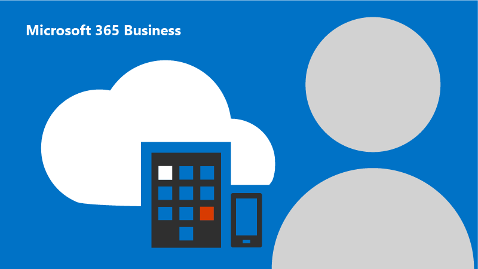

# Training for the Microsoft cloud

  
 **Set up Office 365 for business**
  
Short, easy videos.
  
[Take training](https://support.office.com/article/6ab4bbcd-79cf-4000-a0bd-d42ce4d12816?wt.mc_id=Admin_Training_for_the_Microsoft_cloud.aspx)
  

  
 **Everyday basics**
  
For everyone in your business.
  
[Get started](https://support.office.com/article/396b8d9e-e118-42d0-8a0d-87d1f2f055fb?wt.mc_id=Admin_Training_for_the_Microsoft_cloud.aspx)
  

  
 **Management tasks**
  
Help with licenses and more.
  
[Watch videos](https://support.office.com/article/6d4259dd-0933-4117-94b6-36c602e3460d?wt.mc_id=Admin_Training_for_the_Microsoft_cloud.aspx)
  

  
 **Learn about Microsoft 365 Business**
  
Run your business with the latest versions of Windows and Office apps like Word and Excel. Use file storage from anywhere and rely on enterprise-grade data protection and security that extends to all your business devices. 
  
Easy video tutorials to help you get started.
  
[Office 365 admin videos](https://support.office.com/article/6ab4bbcd-79cf-4000-a0bd-d42ce4d12816#picktab=Microsoft_365_Business?wt.mc_id=Admin_Training_for_the_Microsoft_cloud)
  

  
 **Advanced IT Pro training**
  
Free IT pro courses from LinkedIn Learning.
  
[Advanced training](https://support.office.com/article/68cc9b95-0bdc-491e-a81f-ee70b3ec63c5?wt.mc_id=Admin_Training_for_the_Microsoft_cloud.aspx)
  

  
 **Microsoft Teams training**
  
Use Teams to drive projects and teamwork in your organization.
  
[Start training](https://go.microsoft.com/fwlink/?linkid=869518)
  

  
 **Yammer training**
  
Engage in conversations across your company.
  
[Start training](https://support.office.com/article/2c0ce4c6-0a99-466f-bf1b-cbe7ffa9779a?wt.mc_id=Admin_Training_for_the_Microsoft_cloud.aspx)
  

  
 **Microsoft Teams training**
  
Use Teams to drive projects and teamwork in your organization.
  
[Start training](https://go.microsoft.com/fwlink/?linkid=869518)
  

  
 **Yammer training**
  
Engage in conversations across your company.
  
[Start training](https://support.office.com/article/2c0ce4c6-0a99-466f-bf1b-cbe7ffa9779a?wt.mc_id=Admin_Training_for_the_Microsoft_cloud.aspx)
  

