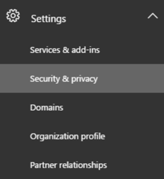

# Office 365 Customer Lockbox Requests

As an Office 365 admin, customer lockbox requests allows you to control how a Microsoft support engineer accesses your data. Sometimes if you run into an issue, you might need a Microsoft support engineer to help you fix it. In some cases, the support engineer will require access to your Office 365 content to troubleshoot and fix the issue. Customer lockbox requests allows you to control whether to give the support engineer access to your data. There's also an expiration time on the request and content access is removed after the support engineer has fixed the issue. Check out [Overview of security &amp; compliance in Office 365](https://support.office.com/article/DCB83B2C-AC66-4CED-925D-50EB9698A0B2) for more information about how Office 365 uses your data. 
  
 **Important** Customer lockbox capability is never used when troubleshooting doesn't require access to customer content. For a majority of support cases, resolution doesn't require the use of customer lockbox access. 
  
Customer lockbox is included in the Office 365 E5 plan. If you don't have an Office 365 E5 plan, you can buy a separate Advanced Compliance SKU with any Office 365 Enterprise plan. Check out [Plans and pricing](https://products.office.com/en-us/business/office-365-enterprise-e5-business-software) for more info. Customer lockbox works with Exchange Online, SharePoint Online, and OneDrive for Business. 
  
**Customer lockbox request overview video**

> [!VIDEO https://www.microsoft.com/videoplayer/embed/8fecf10b-1f03-4849-8b67-76d3d2a43f26?autoplay=false]
  
## Example of a Customer Lockbox Request

Below is a sample customer lockbox request.
  
1. Someone at your company or school has an issue with their Office 365 mailbox.
    
2. After some troubleshooting, you can't fix the issue and open a support request with Microsoft support.
    
3. The support engineer reviews your service request, and needs access to your Exchange Online content to repair the issue.
    
4. The support engineer logs into the customer lockbox request tool and sends you an email letting you know there's a pending customer lockbox request. All requests are reviewed and approved by Microsoft support managers before you get the request.
    
5. The customer lockbox request tool sends you an email letting you know there's a pending lockbox request. If you reject or don't approve the request in 12 hours, access is automatically revoked.
    
    
  
6. You log into the Office 365 admin center and approve the request.
    
    > [!IMPORTANT]
    > We don't include any links in the customer lockbox email that requires you to login to Office 365. 
  
7. The support engineer gets the approval message, logs into Exchange Online and fixes the issues. As soon as the issue is fixed, the customer lockbox request is closed and access is revoked, or once the support engineer starts the process, they have 4 hours to fix the issue before access is revoked.
    
## Turn Customer Lockbox request on or off in the Office 365 admin center

You can turn customer lockbox requests on or off in the Office 365 admin center. When you turn on customer lockbox requests, Microsoft is required to obtain your approval prior to accessing your content to fix an issue. To turn customer lockbox requests on or off:
  
1. To do these steps, you must be a Global Administrator, Customer Lockbox access approver or get Organization Management Role applied through RBAC.
    
2. [Sign in to Office 365](where-to-sign-in.md) with your work or school account. 
    
3. Go to the [ Office 365 admin center ](../admin-overview/about-the-admin-center.md).
    
4. Navigate to **Settings** \> **Security &amp; privacy** and scroll to locate **Customer Lockbox**:
    
    
  
5. Click **Edit** and move the toggle **On** or **Off** to turn lockbox requests on or off. 
    
    
  
## Approve or deny a Customer Lockbox request in the Office 365 admin center

1. To do these steps, you must be a Global Administrator, Customer Lockbox access approver or get Organization Management Role applied through RBAC.
    
2. [Sign in to Office 365](where-to-sign-in.md) with your work or school account. 
    
3. Go to the [ Office 365 admin center ](../admin-overview/about-the-admin-center.md).
    
4. Navigate to **Settings** \> **Support** \> **Service requests**.
    
    
  
5. Select a customer lockbox request, and then select **Approve** or **Reject**.
    

