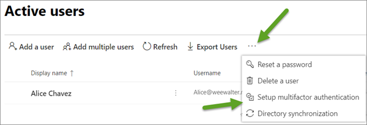

# Set up multi-factor authentication
  
This article describes how to set up multi-factor authentication (MFA) for Office 365 users. For more information about MFA, see [Plan for multi-factor authentication for Office 365 Deployments](multi-factor-authentication-plan.md) and [How Azure multi-factor authentication works](https://go.microsoft.com/fwlink/p/?LinkId=627437).
  
You get a free version of Azure multi-factor authentication as part of your Office 365 for business subscription. For a list of features included in your version of Office 365, see [How to get Azure Multi-Factor Authentication](https://docs.microsoft.com/en-us/azure/multi-factor-authentication/multi-factor-authentication-versions-plans).
  
## Enable multi-factor authentication for your organization

All Office 2016 client applications support MFA through the use of the Active Directory Authentication Library (ADAL). This means that app passwords aren't required for Office 2016 clients. However, you need to make sure your Office 365 subscription is enabled for ADAL, or modern authentication.

1. To enable modern authentication, go to the admin center at <a href="https://go.microsoft.com/fwlink/p/?linkid=2024339" target="_blank">https://admin.microsoft.com</a>.
2. Choose **Settings** \> **Services & add-ins** and then choose **Modern authentication** from the list.
3. Check the **Enable modern authentication** box in the **Modern authentication** panel. 

    

## Set up multi-factor authentication in the Microsoft 365 admin center

1. In the admin center, go to **Users** > [Active users](https://go.microsoft.com/fwlink/p/?linkid=834822).
    
2. **IMPORTANT**: BEFORE you select a user, choose **More (...)** \> **Setup Azure multi-factor authentication**.  

- If you're using the preview version of the admin center, you can find the option for MFA here:  

     
 
- In the classic version, you'll find it here:
    
    
  
> [!Tip]
> If you don't see the **More (...)** option, then you aren't a global admin for your subscription. Only global admins can enable or disable MFA.

3. Find the people for whom you want to enable MFA. In order to see everyone, you might need to change the **Multi-Factor Auth status** view at the top. 
    
    The views have the following values, based on the MFA state of the users:
    
  - **Any** Displays all users. This is the default state. 
    
  - **Enabled** The person has been enrolled in MFA, but has not completed the registration process. They will be prompted to complete the process the next time they sign in. 
    
  - **Enforced** The person may or may not have completed registration. If they have completed the registration process, then they are using MFA. Otherwise, they will be prompted to complete the process the next time they sign in. 
    
4. Select the check box next to the people for whom you want to enable MFA.
    
5. On the right, under **quick steps**, you'll see **Enable** and **Manage user settings**. Choose **Enable**.
    
6. In the dialog box that opens, choose **enable multi-factor auth**.
    
## Allow MFA users to create App passwords for Office client apps

Older email applications like Office 2013 need app passwords. Here's how to allow your users to create them: 

1. In the admin center, go to **Users** > [Active users](https://go.microsoft.com/fwlink/p/?linkid=834822).
    
2. **IMPORTANT**: Before you select a user, choose **More (...)** \> **Setup Azure multi-factor authentication**.  

- If you're using the preview version of the admin center, you can find the option for MFA here:  

     
 
- In the classic version, you'll find it here:
    
    
  
> [!Tip]
> If you don't see the **More (...)** option, then you aren't a global admin for your subscription. Only global admins can enable or disable MFA.
 
3. On the **multi-factor authentication** page, choose **service settings**.
    
    
  
4. Under **app passwords**, choose **Allow users to create app passwords to sign into non-browser apps**.
    
    People can then use client Office apps after they create a new password.
    
5. Choose **Save**, then choose **Close**.
    
## Manage MFA user settings

1. You must be an Office 365 global admin to do these steps.
    
2. On the **multi-factor authentication** page, select the check box next to the people you want to manage. 
    
3. On the right, under **quick steps**, choose **Manage user settings**.
    
4. In the **Manage user settings** dialog box, select one or more of the following options: 
    
  - **Require selected users to provide contact methods again**
    
  - **Delete all existing app passwords generated by the selected users**
    
  - **Restore multi-factor authentication on all remembered devices**
    
5. Choose **Save**, then choose **Close**.
    
## Bulk update users in MFA

You can bulk update the status for existing people by using a CSV file. The CSV file is used only for enabling or disabling MFA, based on the user names present in the file. It is not used to create new users.
  
1. You must be an Office 365 global admin to do these steps.
    
2. On the **multi-factor authentication** page, choose **bulk update**.
    
3. In the **Select a CSV file** dialog box, choose **Browse for file**.
    
4. Browse for the file that contains the updates, then choose **Open**. The column headings in your file must match the column headings in the following example:
    
    
  
5. Choose the **Next** arrow. 
    
6. After the file is verified, choose the **Next** arrow to update the accounts. 
    
7. When the process is finished, choose the **Done** checkmark. 

## Instructions for your users after MFA is set up

After you enable MFA on your tenant, give the following instructions to people to set up their second sign-in method for Office 365:
  
- [Set up 2-step verification for Office 365](https://support.office.com/article/ace1d096-61e5-449b-a875-58eb3d74de14.aspx)

- [Create an app password for Office 365](https://support.office.com/article/3e7c860f-bda4-4441-a618-b53953ee1183.aspx)
