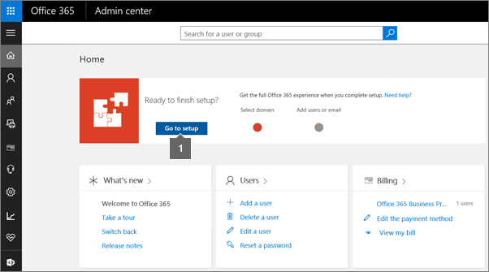

# Verify your Office 365 domain to prove ownership, nonprofit or education status, or to activate Yammer

Contributors: 
  
 **[Domains FAQ](https://support.office.com/article/1272bad0-4bd4-4796-8005-67d6fb3afc5a)** if you don't find what you're looking for. 
  
There are several types of Office 365 setup where you need to just add and verify your organization or company domain, without adding or changing DNS records for your Office 365 services (at least initially).
  
If you're becoming the admin for your school's domain that people are already using with Office 365 or need to prove that your organization is a nonprofit, you'll need to sign up for a free Office 365 Nonprofit trial. See [Office 365 Nonprofit plans](https://products.office.com/en-us/nonprofit/office-365-nonprofit-plans-and-pricing) for instructions. 
  
One you have your trial, you just need to verify that you own your domain, which the setup wizard (in Office 365) guides you through, step by step.
  
## Verify your Office 365 domain to prove ownership using setup in the Office 365 admin center

Here are the basic steps:
  
1. Choose **Setup** in the [Office 365 admin center](https://support.office.com/article/17d3ff3f-3601-466e-b5a1-482b31cfb791 .aspx) to start the wizard. (Be sure to sign in to Office 365 first.) 
    
  
  - To become the Office 365 admin for your school, [follow these steps](https://support.office.com/article/22d6591b-a5af-41f9-bc86-52f62e7aa400) to find and choose the **Become an admin** option in Office 365. 
    
  - To get started with Yammer activation, [add your company domain name for Yammer Enterprise](https://go.microsoft.com/fwlink/?LinkId=512139).
    
2. You'll be prompted to add a TXT DNS record at the DNS host website for your domain. Why? Because by signing in at the DNS host and adding a record for your domain, you prove to Office 365 that you own the domain name.
    
3. After you add the record, you'll go back to the Office 365 portal and confirm that you've added it, so Office 365 can check.
    
That's it!
  
## Learn more

Have a nonprofit and want to get Office 365? [Make sure your organization qualifies](https://go.microsoft.com/fwlink/?LinkId=627222) and then sign up for the service. 
  
Want to know more about becoming the Office 365 admin for your school? [Learn all about it](https://go.microsoft.com/fwlink/?LinkId=512141).
  
Need more info about setting up and activating Yammer? Check out the details in [adding your company domain name for Yammer Enterprise](https://go.microsoft.com/fwlink/?LinkId=512139) and [activating Yammer](https://go.microsoft.com/fwlink/?LinkId=512140).
  

