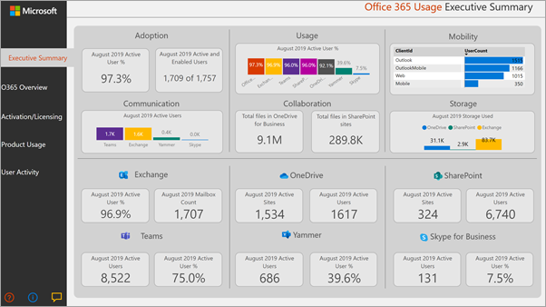

# Microsoft 365 usage analytics
---
Microsoft 365 usage analytics is also available for Office 365 US Government Community.
 
## Overview of Microsoft 365 usage analytics

Use Microsoft 365 usage analytics within Power BI to gain insights on how your organization is adopting the various services within Office 365 to communicate and collaborate. You can visualize and analyze Office 365 usage data, create custom reports and share the insights within your organization and gain insights into how specific regions or departments are utilizing Office 365.
  
Microsoft 365 usage analytics is a content pack that gives you access to a pre-built dashboard that provides a cross-product view of the last 12 months and contains a number of pre-built reports. Each report provides you with specific usage insights. User specific information is available for the last full calendar month.
  
The [data model](usage-analytics-data-model.md) that powers the content pack includes user attributes from Active Directory, enabling the ability to pivot in certain reports. The following Active Directory attributes are included: location, department and organization. 
  
See [Enable Microsoft 365 usage analytics](enable-usage-analytics.md) to start collecting data. 
  
Microsoft 365 usage analytics contains a number of reports detailed in the following sections. 

You can access detailed reports for each area by selecting the data tables. You can view all pre-built reports by selecting the tabs at the bottom of the site, once you are viewing the reports. For more detailed instructions, read [Navigating and utilizing the reports in Microsoft 365 usage analytics](navigate-and-utilize-reports.md) and [Customizing the reports in Microsoft 365 usage analytics](customize-reports.md).

## Executive summary

The executive summary is a high-level, at-a-glance view of Microsoft 365 for Business adoption, usage, mobility, communication, collaboration, and storage reports, and is meant for business decision makers. It provides a view into how some individual services are being used based on all the users who have been enabled, and of those users, those who are active. All values of the month shown on the report refer to the latest complete month. This summary lets you quickly understand usage patterns in Office and how and where your employees are collaborating.

## O365 Overview

The Microsoft 365 overview report contains the following reports. You can view them by choosing the tab on top of the report page. All values of the month shown on the top section of the report refer to the latest complete month.

- **Adoption** — Offers an all-up summary of adoption trends. Use the reports in this section to learn how your users have adopted Microsoft 365, as well as how overall usage of the individual services has changed month over month. You can see how may users are enabled, how many people in your organization are actively using Microsoft 365, how many are returning users, and how many are using the product for the first time.

- **Usage** - Offers a drill-down view into the volume of active users and the key activities for each product for the last 12 months. Use the reports in this section to learn how people in your organization are using Microsoft 365.

- **Communication** — You can see at a glance whether people in your organization prefer to stay in touch by using Teams, Yammer, email, or Skype calls. You can observe if there are shifts in patterns in the use of communication tools among your employees. 

- **Collaboration** — See how people in your organization use OneDrive and SharePoint to store documents and collaborate with each other, and how these trends evolve month over month. You can also see how many documents are shared internally or externally and how many SharePoint sites or OneDrive accounts are actively being used, broken out by owners and other collaborators.

- **Storage** — Use this report to track cloud storage for mailboxes, OneDrive, and SharePoint sites.

- **Mobility** — Track which clients and devices people use to connect to email, Teams, Skype, or Yammer.

## Activation and licensing

The activation and license page offers reports on Microsoft 365 activation; that is, how many users have downloaded and activated Office apps and how many licenses have been assigned by your organization. The month value towards the top refers to the current month, and the metrics reflect values aggregated from the beginning of the month to the current date.

- **Activation** — Track service plan (for example, Office 365 ProPlus, Project, and Visio) activations in your organization. Each person with an Office license can install products on up to five devices. You can also use reports in this section to see the devices on which people have installed Office apps. Note that to activate a plan, a user must install the app and sign in with their account.

- **Licensing** —  This report contains an overview of license types, the count of users who were assigned each license type, and the license assignment distribution for each month. The month value towards the top refers to the current month, and the metrics reflect values aggregated from the beginning of the month to the current date.

## Product usage

This report contains a separate report for each Microsoft 365 service, including Exchange, Microsoft 365 groups, OneDrive, SharePoint, Skype, Teams, and Yammer. Each report contains total enabled vs. total active user reports, counts of entities such as mailboxes, sites, groups, and accounts, as well as activity type reports where appropriate. All values of the month shown on the top section of the report refer to the latest complete month.

## User activity

User activity reports are available for certain individual services. These reports provide user-level detail usage data joined with Active Directory attributes. In addition, the Department Adoption report lets you slice by Active Directory attributes so that you can see active users across all individual services. All metrics are aggregated for the latest complete month.

## FAQ

### Is this content pack going to be available through purchase or will it be free?

The content pack is available to all customers free of charge. You need to [sign up for the free Power BI service](https://go.microsoft.com/fwlink/p/?linkid=845347) to connect to the content pack. You can also customize the dashboards and reports with the free Power BI service.

To share the dashboards with others, both the user who is sharing and the user the dashboard is shared with must have Power BI Pro or Power BI Premium.

### Who can connect to Microsoft 365 usage analytics?

You have to be either a **global administrator**, **report reader**, **Exchange administrator**, **Skype for Business administrator**, or **SharePoint administrator**  in order to establish the connection to the content pack. See [About admin roles](../add-users/about-admin-roles.md) for more information.

### Who can customize the usage analytics dashboards and reports?

Only the user who made the initial connection to the content pack can customize the dashboard or create new reports in the Power BI web interface. See [Customizing the reports in Microsoft 365 usage analytics](customize-reports.md) for instructions.

### Can I only customize the dashboards and reports from the Power BI web interface?

In addition to customizing the dashboard and reports from the Power BI web interface, users can also use Power BI Desktop to connect directly to the Office 365 reporting service to build their own reports.

### How can I get the pbit file that this dashboard is associated with?

You can access to the pbit file from the [Microsoft Download center](https://download.microsoft.com/download/1/7/0/170A5A35-9E0D-478D-828C-4CA2D9A9F092/Microsoft%20365%20Usage%20Analytics.pbit).

### Who can view the dashboards and reports?

If you connected to the content pack, you can share it with anybody by using the [sharing functionality](https://go.microsoft.com/fwlink/p/?linkid=845494). Power BI licensing requires that both the user sharing and the user with whom a dashboard is shared have Power BI Pro or Power BI Premium.

### Can anyone share the dashboard, or does it have to be the person who connected to the dashboard?

When sharing the dashboard, you can either allow users to re-share the dashboard with others or not. You can set this option at the time of sharing.

### Is it possible to work on and customize the same content pack with a group of people?

Yes. To enable a group of admins to work together on the same content pack, you can leverage the app workspace functionality of Power BI, for more information, see [How should I collaborate and share dashboards and reports?](https://go.microsoft.com/fwlink/p/?linkid=851070) 

### For which timeframe is data available?

The majority of the reports display data for the previous 12 months. However, some of the charts may show less history since the data collection for different products and reports were started at different times and thus data for the full 12 months might not be available. All the reports will eventually build up to 12 months of history. Reports that show user level details show data for the previous complete month.

### What data is included in the content pack?

The data in the content pack currently covers the same set of activity metrics available in the [Activity Reports](../activity-reports/activity-reports.md). As reports are added to the activity reports, they will be added to the content pack in a future release.

### How does the data in the content pack differ from the data in the usage reports?

The underlying data you see in the content pack matches the data you see in the activity reports in the Microsoft 365 admin center. The key differences are that in the admin center data is available for the last 7/30/90/180 days while the content pack presents data on a monthly basis for up to 12 months.

In addition, user level details in the content pack are only available for the last complete month for users who were assigned a product license and performed an activity.

### When should I use the content pack and when the usage reports?

The [Activity Reports](../activity-reports/activity-reports.md)  are a good starting point to understand usage and adoption of Office 365. The content pack combines the Office 365 usage data and your organization’s Active Directory information and enables admins to analyze the data set using the visual analytics capabilities of Power BI. This enables admins to not just visualize and analyze Office 365 usage data, but also slice it by Active Directory properties such as departments, location etc. They can also create custom reports and share the insights within their organization. 

### How often is the data refreshed? 

When you connect to the content pack for the first time, it will automatically populate with your data for the previous 12 months. After that, the content pack data will refresh weekly. Customers can choose to modify the refresh schedule if their use of this data demands a different update rhythm.

The back-end Office 365 service will refresh data on a daily basis and provides data that is between 5-8 days latent from the current date.

The **Content date** column in each dataset represents the freshness date of the data in the content pack.

### How is an active user defined?

The definition of active user is the same as the definition of [active user](../activity-reports/active-users.md) in the activity reports.

### What SharePoint site collections are included in the SharePoint reports?

The current version of the content pack includes file activity from SharePoint team sites and SharePoint group sites.

### Which groups are included in the Office 365 Groups usage report?

The current version of the content pack includes usage from Outlook groups, Yammer groups, and SharePoint groups. It does not include groups related to Microsoft Teams or Planner.

### When will an updated version of the content pack become available?

Major changes to the content pack will be released twice a year which may include new reports or new data. Minor changes to the reports may be released on a more frequent basis.

### Is it possible to integrate the data from the content pack into existing solutions? 

The data in the content pack can be retrieved through the Office 365 APIs (in preview). When they ship to production they will be merged within the [Microsoft Graph reporting APIs](https://go.microsoft.com/fwlink/p/?linkid=848843). 

### Are there plans to expand the content pack to show usage data from other Microsoft products?

This is considered for future improvements. Check the [Microsoft 365 Roadmap](https://www.microsoft.com/microsoft-365/roadmap) for updates.

### How can I pivot by company information in Active Directory?

Company information is included one of the Active Directory fields in the content pack and you can see it as a pre-built filter in the **Product User activity** reports. It is available as column in the **UserState** table.

### Is it possible to bring in additional fields from Active Directory?

Additional customization on this data is possible by connecting to the [Microsoft Graph reporting APIs](https://go.microsoft.com/fwlink/p/?linkid=848843) to pull additional fields from Azure Active Directory and join to the dataset. 

### Is it possible to aggregate the information in the content pack across multiple subscriptions?

At this time, the content pack is for a single subscription, as it is associated with the credentials that was used to initially connect to it.

### Is it possible to see usage by plan (i.e. E1, E3)?

In the content pack, usage is represented at the per product level. Data about the various subscriptions that are assigned to users are provided, however it is not possible to correlate user activity to the subscription assigned to user.

### Is it possible to integrate other data sets into the content pack?

You can use Power BI Desktop to connect to the Office 365 APIs (in preview) to bring additional data sources to combine with the content pack data.

For more information see the [Customize document](customize-reports.md).

### Is it possible to see the "Top Users" reports for a specific timeframe?

All user level reports present aggregated data for the previous month.

### Will the content pack be localized? 

This is currently not on the roadmap.

### I have a specific question about the data I'm seeing for my organization. Who can I reach out to?

You can use the feedback button in the admin center activity overview page, or you can open a [support case](../contact-support-for-business-products.md) to get help with the content pack. 

### How can partners access the data?

If a partner has delegated admin rights, he or she can connect to the content pack on behalf of their customer.

### Can I hide identifiable information such as user, group, and site names in reports?

Yes, see [Make the collected data anonymous](enable-usage-analytics.md#make-the-collected-data-anonymous).

  

