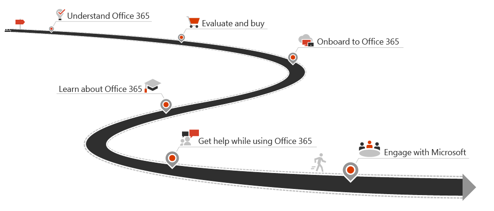

# Office 365 content roadmap

This roadmap guides you through the content for Office 365.
]

---

<h2>Understand</h2>
<ul class="panelContent cardsW">
    <li>
        

            

                

                    

                        <h3>Enterprise</h3>
                        
<a href="https://products.office.com/en-us/business/enterprise-productivity-tools">What is Office 365?</a>

                        
<a href="/office365/enterprise/">Office 365 for enterprises</a>

                    

                

            

        

    </li>
    <li>
        

            

                

                    

                        <h3>Business</h3>
                        
<a href="https://support.office.com/article/4608c472-4532-44a0-ae0f-e7f0b12d2113">What is Office 365?</a>

                        
<a href="https://products.office.com/en-us/business/small-business-solutions">Office 365 for small businesses</a>

                    

                

            

        

    </li>
    <li>
        

            

                

                    

                        <h3>Education</h3>
                        
<a href="https://www.microsoft.com/en-us/education">What is Office 365?</a>

                        
<a href="https://products.office.com/en-us/student/office-in-education?rtc=1">Office 365 for education and students</a>

                    

                

            

        

    </li>
</ul>
<h2>Evaluate</h2>
<ul class="panelContent cardsW">
    <li>
        

            

                

                    

                        <h3>Enterprise</h3>
                        
<a href="/office365/servicedescriptions/office-365-platform-service-description/office-365-plan-options">Office 365 service descriptions</a>

                        
<a href="https://products.office.com/business/compare-more-office-365-for-business-plans">Plans and pricing for enterprises</a>

                    

                

            

        

    </li>
    <li>
        

            

                

                    

                        <h3>Business</h3>
                        
<a href="https://www.microsoft.com/en-us/microsoft-365/business/small-business-solutions">Take a guided tour</a>

                        
<a href="https://products.office.com/compare-all-microsoft-office-products?tab=2">Plans and pricing for businesses</a>

                    

                

            

        

    </li>
    <li>
        

            

                

                    

                        <h3>Education</h3>
                        
<a href="/office365/servicedescriptions/office-365-platform-service-description/office-365-education">Office 365 Education service description</a>

                        
<a href="https://products.office.com/en-us/academic/compare-office-365-education-plans">Plans for Office 365 Education</a>

                    

                

            

        

    </li>
</ul>
<h2>Onboard</h2>
<ul class="panelContent cardsW">
    <li>
        

            

                

                    

                        <h3>Enterprise</h3>
                        
<a href="/office365/enterprise/get-your-organization-ready-for-office-365">Deploy and manage Office 365 for enterprises</a>

                        
<a href="/office365/admin/admin-home?view=o365-worldwide">Office 365 admin help</a>

                        
<a href="/office365/enterprise/microsoft-cloud-it-architecture-resources">Cloud architecture resources</a>

                    

                

            

        

    </li>
    <li>
        

            

                

                    

                        <h3>Business</h3>
                        
<a href="https://support.office.com/article/26524a2c-1d65-48ab-8927-ae0b27370c62">Set up your small business with Office 365</a>

                        
<a href="/office365/smallbusiness/build-your-small-business/build-your-small-business">Build your small business with Office 365</a>

                        
<a href="/office365/admin/admin-home?view=o365-worldwide">Office 365 admin help</a>

                    

                

            

        

    </li>
    <li>
        

            

                

                    

                        <h3>Education</h3>
                        
<a href="/office365/admin/admin-home?view=o365-worldwide">Admin help</a>

                        
<a href="https://support.office.com/article/7fb1b2f9-94c2-4cbb-b01e-a6eca34261d6">Office 365 Education Self-Sign up: Technical FAQ</a>

                    

                

            

        

    </li>
</ul>
<h2>Learn</h2>
<ul class="panelContent cardsW">
    <li>
        

            

                

                    

                        <h3>For everyone</h3>
                        
<a href="https://support.office.com/office-training-center">Office 365 training</a>

                        
<a href="https://support.office.com/article/396b8d9e-e118-42d0-8a0d-87d1f2f055fb">Office basics training</a>

                        
<a href="https://support.office.com/article/378767af-7ac3-4d68-9d0f-709b6948a76b">Get started in six simple steps</a>

                        
<a href="https://support.office.com/article/25f909da-3e76-443d-94f4-6cdf7dedc51e">Office quick start guides</a>

                        
<a href="https://support.office.com/article/0865d155-bd36-407a-82be-929f2cd76f26">Learning templates for Word, Excel, and PowerPoint</a>

                    

                

            

        

    </li>
    <li>
        

            

                

                    

                        <h3>For business and enterprise</h3>
                        
<a href="https://support.office.com/article/6ab4bbcd-79cf-4000-a0bd-d42ce4d12816">Small business training</a>

                        
<a href="https://support.office.com/article/68cc9b95-0bdc-491e-a81f-ee70b3ec63c5">Admin and IT Pro courses</a>

                        
<a href="https://www.microsoft.com/en-us/learning/office365-certification.aspx">Office 365 certifications</a>

                    

                

            

        

    </li>
    <li>
        

            

                

                    

                        <h3>For educators and students</h3>
                        
<a href="https://support.office.com/education">Education help center</a>

                        
<a href="https://support.office.com/article/395ab230-55bf-44c6-b265-e832d729b694">Student help center</a>

                        
<a href="https://education.microsoft.com/">Self-paced training</a>

                        
<a href="https://aka.ms/teachertrainingpacks">Train others</a>

                        
<a href="https://www.youtube.com/playlist?list=PLiluTszfwwMI5HoyZ8cmbBosuSfJc74kE">Support and training video playlist</a>

                    

                

            

        

    </li>
</ul>
<h2>Get help</h2>
<ul class="panelContent cardsW">
    <li>
        

            

                

                    

                        <h3>For everyone</h3>
                        
<a href="https://support.office.com">Office help and training</a>

                        
<a href="https://support.office.com/article/95c8d81d-08ba-42c1-914f-bca4603e1426">What's new in Office 365?</a>

                        
<a href="https://support.office.com/article/da36192c-58b9-4bc9-8d51-bb6eed468516">When do I get the newest features?</a>

                    

                

            

        

    </li>
    <li>
        

            

                

                    

                        <h3>For business and enterprise</h3>
                        
<a href="/office365/admin/manage/stay-on-top-of-updates?view=o365-worldwide">Stay on top of Office 365 changes</a>

                        
<a href="/office365/admin/contact-support-for-business-products?view=o365-worldwide&tabs=phone">Contact support</a>

                    

                

            

        

    </li>
    <li>
        

            

                

                    

                        <h3>For educators and students</h3>
                        
<a href="https://support.office.com/education">Education help center</a>

                        
<a href="https://support.office.com/article/student-help-center-395ab230-55bf-44c6-b265-e832d729b694">Student help center</a>

                    

                

            

        

    </li>
</ul>
<h2>Engage with Microsoft</h2>
<ul class="panelContent cardsW">
    <li>
        

            

                

                    

                        <h3>Enterprise</h3>
                        
<a href="https://twitter.com/Office365">Office 365 on Twitter</a>

                        
<a href="https://techcommunity.microsoft.com/t5/Office-365/ct-p/Office365">Office 365 Tech Community</a>

                        
<a href="https://techcommunity.microsoft.com/t5/Office-365-Blog/bg-p/Office365Blog">Office 365 blog on Microsoft Tech Community</a>

                    

                

            

        

    </li>
    <li>
        

            

                

                    

                        <h3>Business</h3>
                        
<a href="https://www.microsoft.com/en-us/microsoft-365/blog/office365forbusiness/">Office 365 for business blog</a>

                    

                

            

        

    </li>
    <li>
        

            

                

                    

                        <h3>Education</h3>
                        
<a href="https://educationblog.microsoft.com/en-us/tag/whats-new-in-edu/">What's new in EDU blog</a>

                        
<a href="https://twitter.com/microsoftedu ">MicrosoftEDU on Twitter</a>

                    

                

            

        

    </li>
</ul>