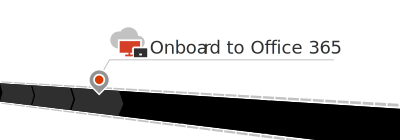
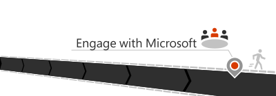

# Office 365 content roadmap

This roadmap guides you through the content for Office 365.

<ul class="panelContent cardsK">
    <li>
        <a href="#Understand">
            

                

                    

                        

                            
 
                                
                            

                        

                        

                            <h3>Understand Office 365</h3>
                        

                    

                

            

        </a>
    </li>
    <li>
        <a href="#Evaluate">
            

                

                    

                        

                            
 
                                
                            

                        

                        

                            <h3>Evaluate and buy</h3>
                        

                    

                

            

        </a>
    </li>
    <li>
        <a href="#Onboard">
            

                

                    

                        

                            
 
                                
                            

                        

                        

                            <h3>Onboard to Office 365</h3>
                        

                    

                

            

        </a>
    </li>
    <li>
        <a href="#Learn">
            

                

                    

                        

                            
 
                                
                            

                        

                        

                            <h3>Learn about Office 365</h3>
                        

                    

                

            

        </a>
    </li>
    <li>
        <a href="#Help">
            

                

                    

                        

                            
 
                                
                            

                        

                        

                            <h3>Get help while using Office 365</h3>
                        

                    

                

            

        </a>
    </li>
    <li>
        <a href="#Engage">
            

                

                    

                        

                            
 
                                
                            

                        

                        

                            <h3>Engage with Microsoft</h3>
                        

                    

                

            

        </a>
    </li></ul>

---

<h2 id="Understand">Understand Office 365</h2>
<ul class="panelContent cardsW">
    <li>
        

            

                

                    

                        <h3>Enterprise</h3>
                        
<a href="https://go.microsoft.com/fwlink/?linkid=2090441">What is Office 365?</a>

                        
<a href="/office365/enterprise/">Office 365 for enterprises</a>

                    

                

            

        

    </li>
    <li>
        

            

                

                    

                        <h3>Business</h3>
                        
<a href="https://go.microsoft.com/fwlink/?linkid=856675">What is Office 365?</a>

                        
<a href="https://go.microsoft.com/fwlink/?linkid=2090339">Office 365 for small businesses</a>

                    

                

            

        

    </li>
    <li>
        

            

                

                    

                        <h3>Education</h3>
                        
<a href="https://go.microsoft.com/fwlink/?linkid=2090340">What is Office 365?</a>

                        
<a href="https://go.microsoft.com/fwlink/?linkid=2090341">Office 365 for education and students</a>

                    

                

            

        

    </li>
</ul>
<h2 id="Evaluate">Evaluate and buy</h2>
<ul class="panelContent cardsW">
    <li>
        

            

                

                    

                        <h3>Enterprise</h3>
                        
<a href="/office365/servicedescriptions/office-365-platform-service-description/office-365-plan-options">Office 365 service descriptions</a>

                        
<a href="https://go.microsoft.com/fwlink/?linkid=843151">Plans and pricing for enterprises</a>

                    

                

            

        

    </li>
    <li>
        

            

                

                    

                        <h3>Business</h3>
                        
<a href="https://go.microsoft.com/fwlink/?linkid=2090443">Take a guided tour</a>

                        
<a href="https://go.microsoft.com/fwlink/?linkid=856886">Plans and pricing for businesses</a>

                    

                

            

        

    </li>
    <li>
        

            

                

                    

                        <h3>Education</h3>
                        
<a href="/office365/servicedescriptions/office-365-platform-service-description/office-365-education">Office 365 Education service description</a>

                        
<a href="https://go.microsoft.com/fwlink/?linkid=824860">Plans for Office 365 Education</a>

                    

                

            

        

    </li>
</ul>
<h2 id="Onboard">Onboard to Office 365</h2>
<ul class="panelContent cardsW">
    <li>
        

            

                

                    

                        <h3>Enterprise</h3>
                        
<a href="/office365/enterprise/get-your-organization-ready-for-office-365">Deploy and manage Office 365 for enterprises</a>

                        
<a href="/office365/admin/admin-home?view=o365-worldwide">Office 365 admin help</a>

                        
<a href="/office365/enterprise/microsoft-cloud-it-architecture-resources">Cloud architecture resources</a>

                    

                

            

        

    </li>
    <li>
        

            

                

                    

                        <h3>Business</h3>
                        
<a href="https://go.microsoft.com/fwlink/?linkid=856680">Set up your small business with Office 365</a>

                        
<a href="/office365/smallbusiness/build-your-small-business/build-your-small-business">Build your small business with Office 365</a>

                        
<a href="/office365/admin/admin-home?view=o365-worldwide">Office 365 admin help</a>

                    

                

            

        

    </li>
    <li>
        

            

                

                    

                        <h3>Education</h3>
                        
<a href="/office365/admin/admin-home?view=o365-worldwide">Admin help</a>

                        
<a href="https://go.microsoft.com/fwlink/?linkid=512065">Office 365 Education Self-Sign up: Technical FAQ</a>

                    

                

            

        

    </li>
</ul>
<h2 id="Learn">Learn about Office 365</h2>
<ul class="panelContent cardsW">
    <li>
        

            

                

                    

                        <h3>For everyone</h3>
                        
<a href="https://go.microsoft.com/fwlink/?linkid=871123">Office 365 training</a>

                        
<a href="https://go.microsoft.com/fwlink/?linkid=511828">Office basics training</a>

                        
<a href="https://go.microsoft.com/fwlink/?linkid=2090344">Get started in six simple steps</a>

                        
<a href="https://go.microsoft.com/fwlink/?linkid=2008317">Office quick start guides</a>

                        
<a href="https://go.microsoft.com/fwlink/?linkid=2090345">Learning templates for Word, Excel, and PowerPoint</a>

                    

                

            

        

    </li>
    <li>
        

            

                

                    

                        <h3>For business and enterprise</h3>
                        
<a href="https://go.microsoft.com/fwlink/?linkid=2088352">Small business training</a>

                        
<a href="https://go.microsoft.com/fwlink/?linkid=853063">Admin and IT Pro courses</a>

                        
<a href="https://go.microsoft.com/fwlink/?linkid=2090343">Office 365 certifications</a>

                    

                

            

        

    </li>
    <li>
        

            

                

                    

                        <h3>For educators and students</h3>
                        
<a href="https://go.microsoft.com/fwlink/?linkid=2090445">Education help center</a>

                        
<a href="https://go.microsoft.com/fwlink/?linkid=2090446">Student help center</a>

                        
<a href="https://go.microsoft.com/fwlink/?linkid=854201">Self-paced training</a>

                        
<a href="https://aka.ms/teachertrainingpacks">Train others</a>

                        
<a href="https://go.microsoft.com/fwlink/?linkid=2090447">Support and training video playlist</a>

                    

                

            

        

    </li>
</ul>
<h2 id="Help">Get help while using Office 365</h2>
<ul class="panelContent cardsW">
    <li>
        

            

                

                    

                        <h3>For everyone</h3>
                        
<a href="https://go.microsoft.com/fwlink/?linkid=787131">Office help and training</a>

                        
<a href="https://go.microsoft.com/fwlink/?linkid=733686">What's new in Office 365?</a>

                        
<a href="https://go.microsoft.com/fwlink/?linkid=2090530">When do I get the newest features?</a>

                    

                

            

        

    </li>
    <li>
        

            

                

                    

                        <h3>For business and enterprise</h3>
                        
<a href="/office365/admin/manage/stay-on-top-of-updates?view=o365-worldwide">Stay on top of Office 365 changes</a>

                        
<a href="/office365/admin/contact-support-for-business-products?view=o365-worldwide&tabs=phone">Contact support</a>

                    

                

            

        

    </li>
    <li>
        

            

                

                    

                        <h3>For educators and students</h3>
                        
<a href="https://go.microsoft.com/fwlink/?linkid=2090445">Education help center</a>

                        
<a href="https://go.microsoft.com/fwlink/?linkid=2090446">Student help center</a>

                    

                

            

        

    </li>
</ul>
<h2 id="Engage">Engage with Microsoft</h2>
<ul class="panelContent cardsW">
    <li>
        

            

                

                    

                        <h3>Enterprise</h3>
                        
<a href="https://go.microsoft.com/fwlink/?linkid=2090228">Office 365 on Twitter</a>

                        
<a href="https://go.microsoft.com/fwlink/?linkid=845579">Office 365 Tech Community</a>

                        
<a href="https://go.microsoft.com/fwlink/?linkid=852873">Office 365 blog on Microsoft Tech Community</a>

                    

                

            

        

    </li>
    <li>
        

            

                

                    

                        <h3>Business</h3>
                        
<a href="https://go.microsoft.com/fwlink/?linkid=2090533">OfficeSmallBiz on Twitter</a>

                        
<a href="https://go.microsoft.com/fwlink/?linkid=2090229/">Office 365 for business blog</a>

                    

                

            

        

    </li>
    <li>
        

            

                

                    

                        <h3>Education</h3>
                        
<a href="https://go.microsoft.com/fwlink/?linkid=2090532">What's new in EDU blog</a>

                        
<a href="https://go.microsoft.com/fwlink/?linkid=2090230">MicrosoftEDU on Twitter</a>

                    

                

            

        

    </li>
</ul>