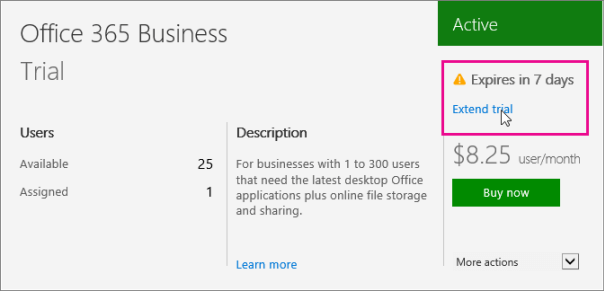

# Extend your trial for Office 365 for business

Do you need more time to try out the features of Office 365 for business before buying? If your trial subscription is within 15 days of expiring and the trial hasn't been extended before then you can extend your trial for another 30 day period. You can only do this one time.
  
## Video: Extend your Office 365 for business trial

> [!VIDEO https://www.microsoft.com/videoplayer/embed/39ea8717-10fe-4665-a101-7c9f98474a7f?autoplay=false]
  
## How to extend your trial subscription of Office 365 for business

1. In the Office 365 admin center, go to the [Subscriptions](https://go.microsoft.com/fwlink/p/?linkid=842054) page, or choose **Billing** > **Subscriptions**.
    
    In the Office 365 admin center, go to the [Subscriptions](https://go.microsoft.com/fwlink/p/?linkid=847745) page, or choose **Billing** > **Subscriptions**.
    
    In the Office 365 admin center, go to the [Subscriptions](https://go.microsoft.com/fwlink/p/?linkid=850626) page, or choose **Billing** > **Subscriptions**.
    
2. On the **Subscriptions** page, select the trial subscription that you want to extend and then select **Extend trial**. 
    
  
3. Complete the steps in the wizard.
    
When you're ready to buy Office 365, see [Buy a subscription to Office 365 for business from your free trial](https://support.office.com/article/485fee6d-b22e-440a-9053-a4e7fa509c92).
  
||
|:-----|
| **New to Office 365?**         Discover free video courses for [Office 365 admins and IT pros](68cc9b95-0bdc-491e-a81f-ee70b3ec63c5.md), brought to you by LinkedIn Learning. |
   
## See also

#### Other Resources

[Billing in Office 365 for business - Admin Help](https://support.office.com/article/ea7bf1b2-1c2f-477f-a813-313e3ce0d896)

