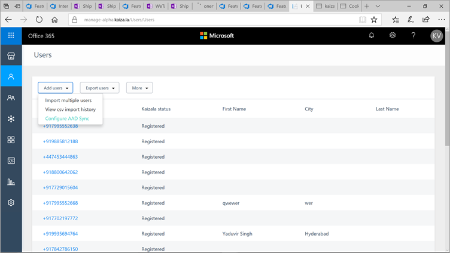
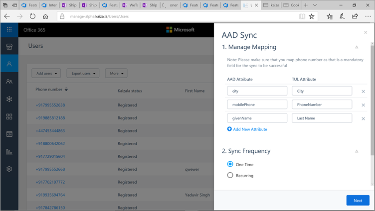
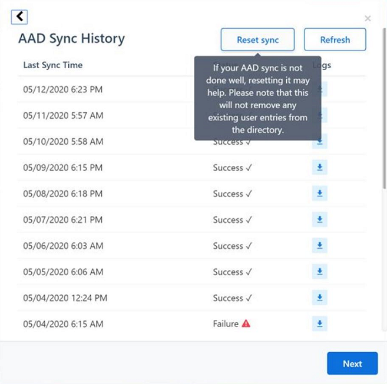

# Azure Active Directory sync with the Kaizala Directory

The Azure Active Directory (Azure AD) sync feature lets you sync user information in Azure AD with the Kaizala Directory, which serves as your organization directory. As an admin, you can import data and sync changes occurring in the Azure AD. You can use this feature for:

- **User management** - Any user changes in Azure AD are automatically synced with the organization directory and associated groups. For example, if a user’s job title is changed in Azure AD, the information will be updated in the organization directory. Similarly, if a user is deleted from the organization’s Azure AD, the user is automatically removed from the organization group.

- **Dynamic group management** - Allows you to dynamically create and manage groups based on rules and user attributes. For example, you can set a rule to create a group for employees with the *Senior Manager* designation in the *Finance* department.

### Prerequisites

- You must be a Kaizala organization admin with a Kaizala Pro license

## How the Azure AD sync feature works

- New users added in the Azure AD of the organization are automatically added to the organization directory.
- Users deleted from the Azure AD are automatically removed from the organization directory and all organization groups.
- Any information changed in the Azure AD will sync with the Kaizala Directory. For example, if designation of a user is changed in the Azure AD, the change is automatically reflected in the organization directory. 

## Configure the Azure AD and Kaizala Directory sync

To configure the Azure AD and Kaizala Directory sync:

1. Log in to the [Kaizala management portal](https://manage.kaiza.la).

2. From the menu on the left, select **Directory**.

3. Select **More**, and then select **Configure AAD Sync**.

4. Under **AAD Sync**, in the **Manage Mapping** section:
   - Review and edit name, phone number, and city information of the user to sync with Azure AD attribute.
   - Select **Add New Attribute** to add more information. 

5. In the **Sync Frequency** section, choose the sync frequency to meet your requirement:
   - Select **One-time** to sync just once.
   - Select **Recurring** to sync every day. 

6. Select **Next** to start the Azure AD-Kaizala Directory data sync. 
   > [!NOTE]
   > After you select **Next**, the sync process will start and it will take some time for the process to complete. The Azure AD sync will happen regularly based on the frequency set by you.

7. You can check the sync status through logs.

Once synced, AAD users will become part of Employee network.

## DeltaLink expiration Error - Azure AD sync Failure

If you're having problems with AAD Sync and see a Failure status, from the AAD sync history pane download the log file by clicking on the download icon next to the failed AAD Sync entry. This log file is essential for troubleshooting the AAD sync problems. If the log file shows “DeltaLink older than 30 days is not supported." as error, click of **Reset sync** in the AAD sync history pane and try doing AAD Sync again.

