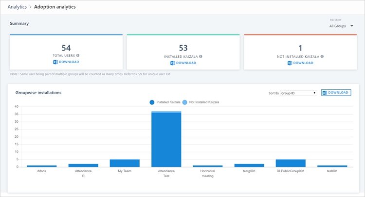
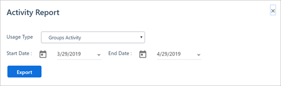
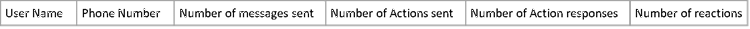
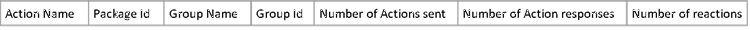
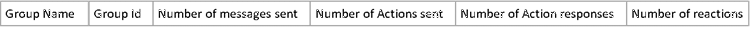

# Adoption and activity reports in Kaizala

## Adoption reports

Adoption reports help the admins drive app installation among their group member and organization members by providing actionable insights about installations. Global admins can view details for all members that are part of organization while group admins can view details of the groups of which they are an admin. 

The CSV download functionality provides the list of users in each category and the count of users in each of the groups. Additional group filters help narrowing down the results to selected groups. 

## Activity reports

Activity reports allow admins to view the insights about activities of users, actions, and groups. Users can use the following interaction to download a report for specific time period (up to a maximum of 31 days). 

Downloaded CSVs appear in the following formats. 

**Users Report**

**Actions Report**

**Groups Report**

## Usage trends

To view the report on usage telemetry, go to **Reports** from the navigation bar. From there, go to the tile **Usage Telemetry**. This report displays the following information for organization groups:

- Analysis of the number of messages sent within your ecosystem, as well as the number of unique users who used each message type.
- Growth trends of the types of messages sent within your group.

