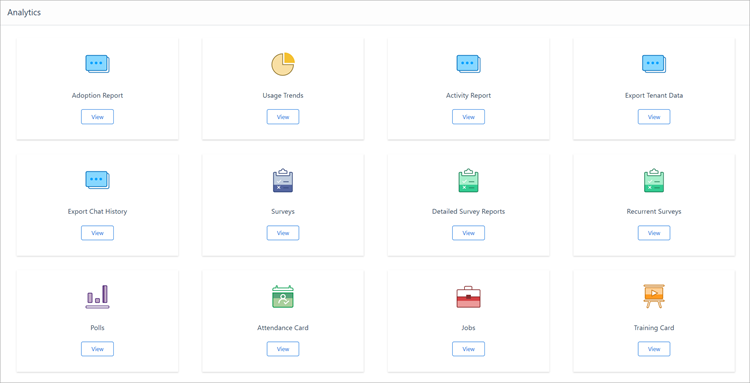

# Analytics in Kaizala

The Analytics dashboard allows the global administrator, Kaizala administrator, and group administrators to view reports and telemetry data for Kaizala actions within organization groups. Reporting isn't available for private conversations and groups.

Data for all reports is displayed within 4 to 5 minutes. You can experience delays of up to 4 hours for reflecting reports after a group is first marked as an organization group.
 

The following reports are currently available:

- [Adoption and activity reports](adoption-and-activity-reports.md)
  - Adoption report
  - Activity report
  - Usage trends
- [Action reports](action-reports.md)
  - Survey report
  - Detailed survey report
  - Recurrent surveys
  - Polls
  - Attendance cards
  - Jobs
  - Training cards
  - Location cards

> [!NOTE]
> Global admininstrators and Kaizala administrators will be able to see reports for all organization groups. Kaizala group admins will see reports for their organization groups only. Group members can't see reports for any group.
