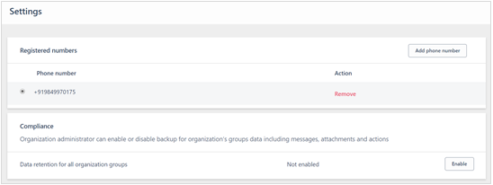
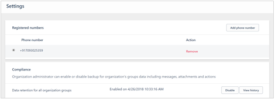
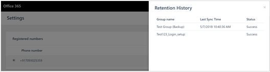
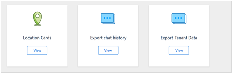
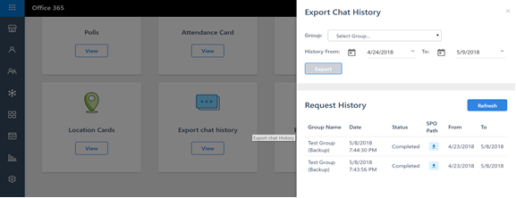
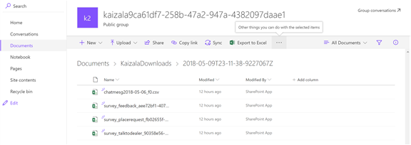

# Back up and export organization data in Kaizala

As the organization admin, you can ensure that data within your organization groups is backed up and ready to be retrieved when needed. The data that you can back up include:  
- Messages 
- Attachments  
- Action card data, including responses  

### Prerequisites

- You should be the organization admin of Kaizala for your organization with a Kaizala Pro license.  
- Your organization should have licenses for Microsoft Exchange and Microsoft SharePoint.  

## Enable organization data retention  

To enable data retention for all your organization groups:  
1. Sign in to the [Kaizala management portal](https://manage.kaiza.la/). 
2. From the menu on the left, select **Settings**.     
3. Go to the **Compliance** section. If data backup has not been enabled for your organization, you will see the **Enable** option. 
> [!NOTE]
> Only the organization admin can see the **Compliance** section.  

4. Select **Enable**. This will enable regular backups of data in all your organization groups.  
> [!NOTE]
> If any of the prerequisites previously listed are not met, you will see a "Missing Required Subscriptions" message.  

5. To review the history of data backups for your organization groups, select **View History**. 

### Export organization data  

To export organization data: 
1. Log in to the Kaizala management portal. 
2. From the menu on the left, select **Reports**.     

3. Locate the **Export chat history** option and select **View**. The **Export** option is shown to you.  

4. Select the group and the date range for which you want to export the data and click **Export**. You can view the status of export process in the **Request History** section. After the **Status** column displays the **Completed** status, select the download icon in the **SPO Path** column to download the file.
5. You will be taken to your group shared on Microsoft SharePoint where you can download Chat Messages and Action Card responses directly.

> [!NOTE]
> After the creation of a group in Kaizala, the data backup will be enabled only if the following three conditions are met:  
>- Organization admin has enabled backup in the Kaizala management portal. 
>- The group shared on Microsoft SharePoint has been created. Because the groups are created automatically on SharePoint, allow 10-15 minutes for provisioning of the group shared on SharePoint. 
>- Repository for media backup will be created as soon as the first attachment is sent in a group.  
