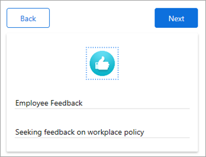
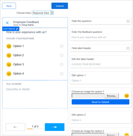
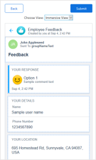
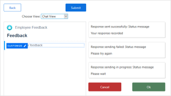

# Collect feedback with Kaizala

The company connect group is also a convenient mobile channel to collect feedback on relevant issues, decisions, and policies, especially for remote workers.

You can gather feedback from employees, partners, suppliers, and customers through feedback forms, polls, and surveys. All responses are automatically aggregated to give you insights into the responses. 

## Step 1 – Create and publish a feedback form

To collect feedback, design a custom Kaizala Action through the Action Designer interface within the Kaizala management portal. 

1. Go to the [Kaizala management portal](https://manage.kaiza.la/) and sign in.
2. To create a Kaizala Action, go to **Actions** from the left navigation bar, and select **New Action** from the upper-right of the page.
3. Select the Feedback template for the new action. 
4. Fill out the name and description, and then select **Next**.

   

5. As you prefer, customize the Response View, Immersive View, and Chat view. (Add questions and answer options and set a custom format.) 

   **Example of Response View**

   

   **Example of Immersive View**

   

   **Example of Chat View**

   

6. After you are done, tap **Submit**. Users will now be able to see the details page of the new action. 
7. At this moment, the action is in draft state.
8. You need to publish the action. To publish an action:
   - When your action is successfully uploaded, it is available in draft state.
   - You need to stage the uploaded version in order to [test and debug](/kaizala/actions/test) your action.
   - After you have tested your action, you can activate the action. The action moves to the active state.
   - Read more about the [lifecycle of a Kaizala Action](/kaizala/actions/actionlifecycle).

*Next>* [Digitize everyday tasks](digitize-tasks.md)