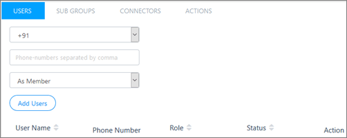
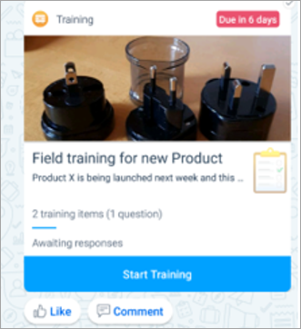
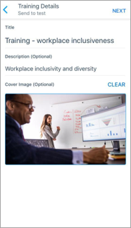
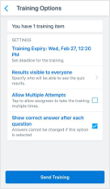
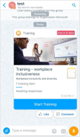
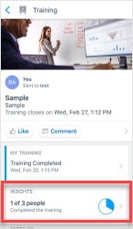

# Connect your value chain in Kaizala

Microsoft Kaizala lets you create groups to establish a mobile communication channel with your entire workforce, partners, and customers.

You can use these groups to:

- Raise awareness about corporate policies, initiatives, and announcements.
- Conduct workforce trainings and surveys.
- Collect feedback from employees, partners, and customers.

Engage your workforce by creating a company connect hub with Kaizala: 

- [Create company connect groups](#create-company-connect-groups)
- [Conduct trainings on Kaizala](#conduct-trainings-on-kaizala)
- [Collect employee feedback with Kaizala](#collect-employee-feedback-with-kaizala)

## Create company connect groups

Think of a “company connect group” as a one-way communication channel between the organization and workers. This allows the company to broadcast important information to the workforce.

In Kaizala, a company connect group can be set up by following these easy steps.

### Step 1 – Create a hub and spoke group
 
A hub and spoke group in Kaizala is a unique group where members can interact with the admin of the group on a one-to-one basis, but the interactions cannot be seen by other group members. 

> [!NOTE]
> You can only create hub and spoke groups through the Kaizala management portal. 

Key characteristics of a hub and spoke group:

- Admins can connect with any number of members.
- Members cannot see or interact with each other.
- Members can communicate with admins only through admin-defined custom cards such as giving feedback and sharing requirements.
- Members can subscribe to a public group using a link.
- Groups can either be managed (group admins can view, manage and invite subscribers) or public (subscribers can invite other subscribers; group admins cannot view or manage subscribers).

To create a hub and spoke group:

1. On the Kaizala management portal, from the left navigation bar, choose **Groups**.
2. Select **Create Group**, and from the drop-down menu, select **Public Group**.

   

3. Enter the group name, and a short and long description. 
4. If you'd like, enter a welcome message, which subscribers will see when they join.
5. Choose between two group types: **Managed** or **Public**.
   - **Managed** groups type allow the group admins to view, manage, and invite subscribers.
   - **Public** groups type allow subscribers to also invite other subscribers. Group admins cannot view or manage subscribers.
6. If only a few users need to be added, add them manually through the **Users** tab.
7. On the **Users** tab, make sure the phone numbers are from the correct region. Enter a phone number in the text box for every user you want to add to this Kaizala group. You can also enter a list of comma-separated phone numbers. Finally, click or tap Add users. For example, to add three users, enter: 99885544, 99885543, 99885542.

   

### Step 2 – Add your employees to the group

If you want to add several users without using the comma separated list, use bulk upload.

**User Group Mapping CSV** – Use this CSV template file to enter the group name, users' phone numbers, and user type. You can add multiple groups at a time. The CSV template file contains relevant instructions and examples. Read the instructions carefully before filling and uploading the file. This file is mandatory and must be uploaded before proceeding to the next step.

You can add multiple groups and users at once from an Excel spreadsheet or other file saved in CSV format.

- Click or tap **Groups**, and then click or tap **Bulk Upload Users**.

### Step 3 – Onboard the content moderation team

For the company connect group created in step 1, identify admins or champs who will manage and moderate group content. 

Key responsibilities of the group admin or champ are:

- **User engagement** – share training and how-to materials.
- **Content moderation** – share and implement guidelines on appropriate usage. 
- **Helping users** –  show how to perform queries.
- **User management** – remove or add members. 

Your corporate communications team or senior team members are most likely to fit these roles.

Here are some guidelines for admins or champs. (**NEED LINK HERE**)

> [!TIP]
> You can set up RSS feeds to automatically post organizational content from across channels such as social media, websites and blogs. Follow [these steps here](https://docs.microsoft.com/kaizala/businesssolutions/corporatecommunications/getrssfeedsonkaizala/displayrssfeedsinkaizalagroups).

## Conduct trainings on Kaizala

The company connect group is a great way to share training, especially for workers in unstructured mobile-only environments. (Think about your field sales agents, or your front-line workforce.) Kaizala not only allows you to share important content, but it also helps you track training progress, and it reminds to people to complete the curriculum. 

You can conduct training through the company connect group in three easy steps.

### Step 1 – Create and share trainings 

Add the Training “Action card” to the company connect group you just created. 

The Kaizala training card lets you send content along with questions or quizzes to your team. Relevant reports are available on the Kaizala management portal.

You can set up training on Kaizala quickly if content and questions are ready.

To access the Training Action Card:
1.	In the group conversation, in the chat box at the bottom of the page, tap the paperclip icon.
2.	The available actions are listed in the first row. 
3.	To discover more actions:
    - Tap **Add More** at the upper right. 
    - Or, tap **Discover** > **Kaizala Actions** to see a full list of available actions.
4. Tap the Training Action Card to add to your palette, and then tap **Add to chats**.
5. To add the training card to the group, use the card itself to set up training (assuming you have training content ready). 
6. In the group conversation, in the chat box at the bottom of the page, tap the paperclip icon.
7. Click on the training card option, and enter training details such as a title and a description, and add a cover image. 

    

8. Use the **Add content** button to include content such as images, documents, and videos on the Kaizala training card. (Use the **Add Questions** button to enter questions with selectable answer options. This is a great way to test knowledge.)
9. When you're done adding content, select **Next**.
10. Enter any relevant options, such as when the training expires and whether you want to make the results visible.

    
 
11. Share the training with the company connect group. 

    

### Step 2 – Send reminders to defaulters

With Kaizala, you can help people stay on track by reminding them to complete the training on time.
 
To send a reminder:

1. Tap the published action in your conversation.
2. Tap **Remind people to respond** at the bottom of the page.

### Step 3 – Report to track completion and performance

Group admins can use the Kaizala action card to see how many people have completed the training. 
 
To check reports on training:

1. Tap the training action card in the group chat window. 
2. Tap **Insights** to see how many people have finished the training. 

   

## Collect employee feedback with Kaizala

The company connect group is also a convenient mobile channel to collect feedback on relevant issues, decisions, and policies, especially for remote workers.

You can gather feedback from employees, partners, suppliers, and customers through feedback forms, polls, and surveys. All responses are automatically aggregated to give you insights into the responses. 

You can collect feedback through the company connect group in two easy steps.

### Step 1 – Collect employee feedback 

To collect feedback, design a custom Kaizala Action through the Action Designer interface within the Kaizala management portal. 

1. Log on to the [Kaizala management portal](https://manage.kaiza.la/).
2. Create a Kaizala Action: Go to **Actions** from the left navigation bar, and select **New Action** from the upper-right of the page.
3. Select the Feedback template for the new action. 
4. Fill out the name and description, and then tap **Next**.
5. As you prefer, customize the Response View, Immersive View, and Chat view. (Add questions and answer options and set a custom format.) 

   **Example of Response View**

   

   **Example of Immersive View**

   

   **Example of Chat View**

   

6. After you are done, tap **Submit**. Users will now be able to see the details page of the new action. 
7. At this moment, the action is in draft state.
8. You need to publish the action. To publish an action:
   - When your action is successfully uploaded, it is available in draft state.
   - You need to stage the uploaded version in order to [test and debug](https://docs.microsoft.com/kaizala/actions/test) your action.
   - After you have tested your action, you can activate the action. The action moves to the active state.
   - Read more about the [lifecycle of a Kaizala Action](https://docs.microsoft.com/kaizala/actions/actionlifecycle).

### Step 2 – Onboard communications team to analyze feedback

Make sure your organization corporate communications team or relevant other team is onboarded to the group as an *admin*.

This will allow the admins to perform various roles such as:

- **Content curation** – share timely surveys for feedback collection.
- **Content moderation** – share and implement guidelines on appropriate usage. 
- **Helping users** – with how to perform queries.

Your corporate communications team or senior team members are most likely to fit these roles.

Here are some guidelines for admins or champs. (**NEED LINK HERE**)

With the connect your value chain in place, now [digitize your everyday tasks](digitize-tasks.md).

