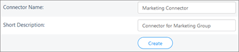
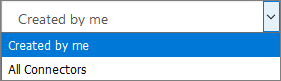

# Kaizala Connectors

Kaizala Connector allows developers to integrate an organization's systems and processes with Kaizala using REST based APIs. For example, you can:
  
- automate group creation
    
- Manage group membership
    
- post messages
    
Kaizala Connectors provide actions on the following entities:
  
- messages
    
-  instant messages 
    
- surveys and polls
    
- groups
    
## Create Kaizala Connector

To create a new Kaizala Connector:
  
- Navigate to **Connectors** on the left navigation bar. Click **New Connector** on the top right of the page. 
    
    
  
- On the New Connector page, enter a **Connector Name** and a short description for the connector. Click or tap **Create**.
    
    
  
Connector Id and Connector Secret are attributes that are used along with a generated, group-specific refresh token to make REST API calls, in specific Kaizala groups. You can also view these details from the connector details in the Kaizala admin center.
  
## View Kaizala Connectors

To view Kaizala Connectors:
  
1. Navigate to **Connectors** on the left navigation bar. 
    
2. By default, connectors created by the logged-in user are shown. To see all the Connectors in the organization, select **All Connectors** from the drop-down menu list. 
    
    
  
## Activate or deactivate Kaizala Connector

Deactivating a Kaizala Connector means that the connector won't be available to generate tokens for any new groups. The connector will continue working for existing groups, for which the token has been generated. A connector can be removed from a group without being re-activated. However, once removed, the connector can't generate a token for the group it was removed from, unless it is activated again. To activate or deactivate a connector:
