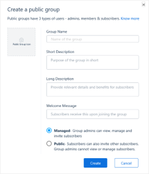
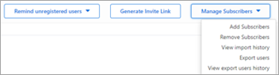
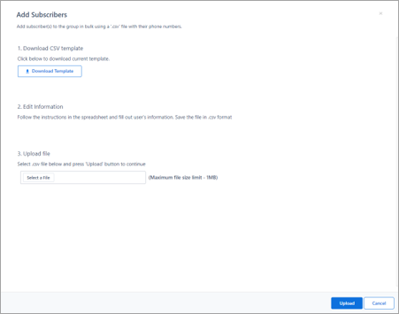

# Create company connect groups in Kaizala

*Company connect groups* are one-way communication channels. They allow an organization to broadcast important announcements, updates, and information to the workforce. An organization can create company connect groups for their employees, partners, and customers. 

## Step 1 – Create a hub-and-spoke group
 
A hub-and-spoke group in Kaizala is a unique group where admins can broadcast messages to all of its members, and members of the group can interact with the admins of the group on a one-to-one basis without their messages being visible to other group members. 

> [!NOTE]
> You can only create hub and spoke groups through the Kaizala management portal. 

1. On the [Kaizala management portal](https://manage.kaiza.la), from the left navigation bar, choose **Groups**.
2. Select **Create Group**, and from the drop-down menu, select **Broadcast Group**.
3. Enter the group name, a short and long description, and a welcome message.

   

4. Choose between two group types: **Managed** or **Public**.
   - **Managed** groups allow the group admins to view, manage, and invite subscribers.
   - **Public** groups allow subscribers to also invite other subscribers.

## Step 2 – Add people to the group

If you want to add several users without using the comma separated list, use bulk upload.

After you create a broadcast group, you can add subscribers (employees, partners, or customers) to it. Once they have been added, the broadcast group will start showing up on their Kaizala app.

1. To add subscribers, select **Manage Subscribers**, and then select **Add Subscribers**. 

   

2. On the **Add Subscribers** page, download the CSV template and follow the format to add your subscribers. Save the file when you're done.

   

3. Choose **Select File** to choose the file you just saved, and then click **Add**.

## Step 3 – Onboard the content moderation team

Identify admins who will manage and moderate group content. 

Key responsibilities of the group admin are:

- **User engagement** – share company information, articles, and updates.
- **Content moderation** – share and implement guidelines on appropriate usage. 
- **Helping users** –  show how to perform queries.
- **User management** – remove or add members. 

Your corporate communications team or senior team members are most likely to fit these roles. Add these users as admins to the group under the **Users** tab.

> [!TIP]
> - You can set up RSS feeds to automatically post organizational content from across channels such as social media, websites and blogs. Follow [these steps here](https://docs.microsoft.com/kaizala/businesssolutions/corporatecommunications/getrssfeedsonkaizala/displayrssfeedsinkaizalagroups).   
>- Consider creating separate groups for company employees, suppliers, and partners. This will allow you to send relevant content to each group depending on the group members. 

*Next>* [Collect employee feedback](collect-feedback.md)