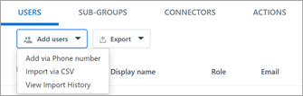
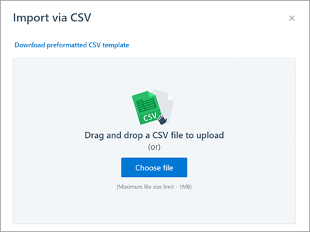
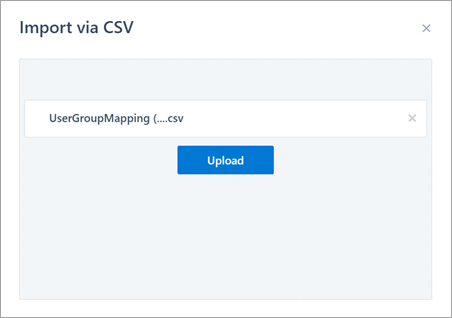

# Create large groups for discussions

Use Kaizala to create groups that reflect how your organization works. For example, Contoso Corp could have several groups, such as Contoso – All Employees, Contoso - Finance, Contoso – Sales, Contoso - Sales (East), and so on.

Use the Kaizala management portal to manage your groups centrally, and to add or manage users in bulk (even in thousands) while retaining complete control over chat data. 

## Step 1 – Create a group

1. On the [Kaizala management portal](https://manage.kaiza.la), from the left navigation bar, select **Groups**.
2. Select **Create Group**, enter the group name, and then click or tap **Create**.

   

## Step 2 – Bulk upload users to the group 

1. Once the group is created, select **Add users** > **Import via CSV**.

   

2. Download the preformatted CSV template and follow the instructions in the CSV file to populate the CSV with phone numbers. 
3. Once populated, drag-and-drop the CSV file or select **Choose file** to upload the file.

   

4. Select **Upload** to add the numbers to the group. 

   

5. To track the progress of the uploaded file, select **Bulk upload – history**.
6. Identify and onboard admins for the groups to help drive adoption and engagement of these groups. They should follow up with people to install the app and also be responsible for answering questions asked on the group.

*Next>* [Connect with employees](connect-with-employees.md)