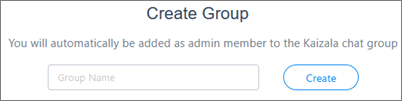
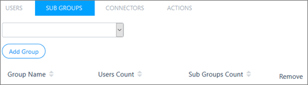

# Create Kaizala groups

[!INCLUDE [retirement-note](includes/retirement-note.md)]

You can create different [types of groups](groups-in-kaizala.md) from the Kaizala mobile app, Kaizala web app, and Kaizala management portal. The following section describes how to create groups from the portal.

## Create a flat group

1. On the [Kaizala management portal](https://manage.kaiza.la), from the left navigation bar, choose **Groups**.
2. Select **Create group**, enter the group name, and then click or tap **Create**.
    
   

### Create a flat group from existing Microsoft 365 groups or distribution lists

1. On the [Kaizala management portal](https://manage.kaiza.la), from the left navigation bar, choose **Groups**.
2. Select **Create group** > **Create from Microsoft 365 group or distribution list**.

### Create flat groups in bulk

1. On the [Kaizala management portal](https://manage.kaiza.la), from the left navigation bar, choose **Groups**.
2. Select **Add users in bulk**, and add the users.
3. Download the CSV template. Fill in the names of new groups that you want to create, and upload the CSV.

## Create a broadcast group

1. On the [Kaizala management portal](https://manage.kaiza.la), from the left navigation bar, choose **Groups**.
2. Select **Create group**, and then select **Create broadcast group**. 

## Create a hierarchical group

Kaizala lets you create hierarchical group structures by adding subgroups. 

1. On the [Kaizala management portal](https://manage.kaiza.la), from the left navigation bar, choose **Groups**.
2. Select a group you want to modify.
3. From the top navigation bar of the group, select **Sub Groups**.
4. Choose a group you want to link from the drop-down list, and then click or tap **Add Group**.
   
   

### Add a subgroup in bulk

1. On the [Kaizala management portal](https://manage.kaiza.la), from the left navigation bar, choose **Groups**.
2. Select **Add users in bulk**, and add the users.
3. From the drop-down menu, select **Add subgroups to group**.
4. Download the CSV template. Fill in the names of subgroups and parent groups, and upload the CSV.

## Export Kaizala group information

You can export all Kaizala group information to a CSV file.

1.	On the [Kaizala management portal](https://manage.kaiza.la), from the left navigation bar, choose **Groups**. 
2.	Click or tap **Export**.

You can then view groups information from an Excel spreadsheet or another app that can open CSV files. 

## Troubleshooting Kaizala groups

Read this section to help troubleshoot group issues that you're having in Kaizala.
  
### I am unable to add groups through the Bulk Upload Users feature

For each bulk upload activity, there is a unique job that gets created. From the Kaizala home page, go to **Groups** > **Bulk Upload Users** to view the history of bulk upload jobs. Find the job that you're having issues with, select the job name, and read the error log to find any errors. Fix the errors and then try to re-run the bulk upload. 
  
### I already created a group from the mobile app. How do I convert this to an organization group?

You can convert it to an organization group. 

- Using the [Kaizala management portal](https://manage.kaiza.la):
  1. Select **Groups** in left navigation bar. 
  2. On the **Groups** page, select the **Private** tab. 
  3. Select a group, and then select **Map to Organization**.

- Using the Kaizala mobile app:
  1. Tap **Chats**, and then open the group.
  2. Tap the group name.
  3. Tap the **More (...)** icon.
  4. Tap **Add to organization**.

*Next>* [Manage Kaizala groups](manage-kaizala-groups.md)

