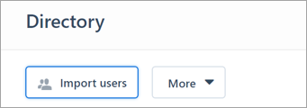
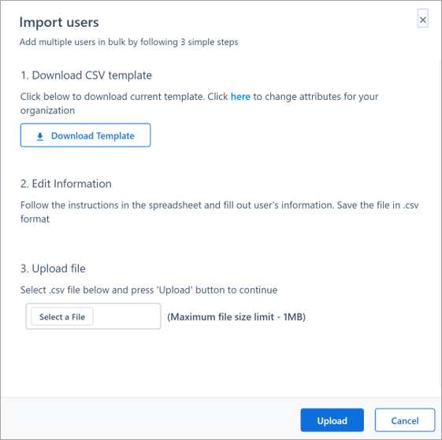
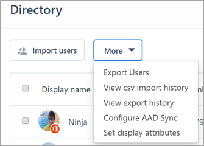

# Create the company phone directory for Kaizala

With Kaizala you can easily create, manage, and organize your company’s entire phone directory in a single place. You can add phone numbers and other key attributes such as name, email ID, company name, and designation for your employees, partners, and customers.

## Step 1 – Export contacts from your existing systems

As a first step, export contact information from your existing systems such as RAMCO, SAP, Salesforce CRM, or others. If you are an existing Office 365 user and use Azure Active Directory (Azure AD) to manage your employee information, use the [Azure AD sync](aad-sync-with-tul.md) capability provided by Kaizala.

## Step 2 – Import contacts to Kaizala to prepare the phone directory

> [!NOTE]
> The following steps can be performed an Office 365 admin or a Kaizala admin.

1. Go to the [Kaizala management portal](https://manage.kaiza.la) and sign in.
2. Select **Directory** > **Add Users**, and then select **Import Users**.

   

3. On the **Import Users** page, download the CSV template.
4. Follow the template to add your users (employees, partners, and customers) exported from other systems to Kaizala. Save the file in .csv format.

   

5. Choose **Select a File**, and then select the file you previously saved. Finally, select **Upload**.
6. Select **More** , and then select **View csv import history** to check the status of the uploaded file.

   
 
7. Select **Refresh** to get the latest status. If the status is **Completed**, you can find the updated user list on the **Users** page.

*Next>* [Invite people to install Kaizala](invite-people.md)

