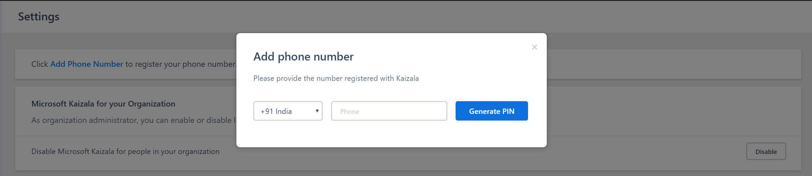
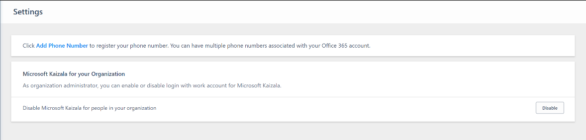
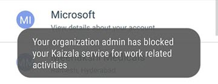
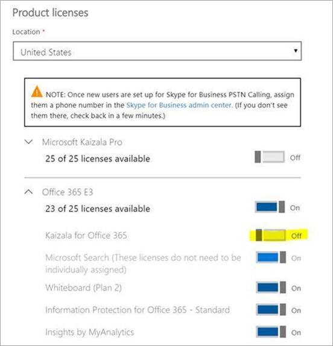

# Enable or disable Kaizala Pro for your organization 

[!INCLUDE [retirement-note](includes/retirement-note.md)]

Microsoft Kaizala Pro is currently [available](regional-availability.md) internationally, with the exception of Cuba, Iran, North Korea, People's Republic of China, Sudan, Syria, Region of Crimea, and Russia. If Kaizala Pro is available in your area, it’s enabled by default for your organization. For all organizations located somewhere else, Kaizala Pro is disabled by default. In any case, the Office 365 administrator can always enable or disable Kaizala Pro. 

The Office 365 administrator can control whether members of an organization can use Office 365 to log in to the Kaizala app and the Kaizala management portal. 

Enabling Kaizala Pro allows users to:
- Log in to the Kaizala app to search for other employees from Azure Active Directory and access groups with enhanced security.
- Log in to the Kaizala management portal to see reports, set up actions, and create connectors.
 
## To enable or disable Kaizala Pro

1. In the [Kaizala management portal](https://manage.kaiza.la/), sign in using your Office 365 account and go to **Settings**. From here, you can enable and disable Kaizala Pro.
2. Skip the prompt to add a phone number (when no phone numbers are mapped already) by closing the pop-up window.

3. The **Microsoft Kaizala for your Organization** section provides an option to toggle the current setting. Select **Disable** or **Enable** and confirm your decision in the pop-up window. 

> [!NOTE]
> Only the Office 365 administrator can enable or disable Kaizala Pro.

When Kaizala Pro is disabled, users will see the following messages.

|End point  |Role |Message  |
|---------|---------|---------|
|Management portal  |Office 365 admin    |   |
|Management portal  |Other users        |   |
|Mobile app     |All users        |   (Note: The message displayed varies depending on the app's version.)       |

Once the app is disabled, members of the organization can no longer sign in using Office 365 on the Kaizala app or the Kaizala management portal. However, employees can still use the Kaizala app for their personal use outside of work.

> [!NOTE]
> Kaizala will remain visible in the [Office 365 app launcher](https://support.office.com/article/meet-the-office-365-app-launcher-79f12104-6fed-442f-96a0-eb089a3f476a) until the Kaizala license assigned to the user is removed. (To open the app launcher, click or tap the app launcher icon ].)

The following shows the admin center with the Kaizala license removed for a user.

## Kaizala Backfill and Trial License Expiration
> If your Kaizala Pro Trial license has expired and you have other M365/O365 E3 or E5 SKUs, you are still eligible for Kaizala Pro through those SKUs. You can safely ignore the Kaizala Pro Trial license expiry message which appears under Subscriptions in the Admin portal. As long as you have logged in to the Kaizala Management Portal recently, the backfill will come into effect and replace the expiring trial license without any service disruption.

For more information about how to remove licenses from a user, see [Remove licenses from users in Office 365 for business](/office365/admin/subscriptions-and-billing/remove-licenses-from-users?view=o365-worldwide).
