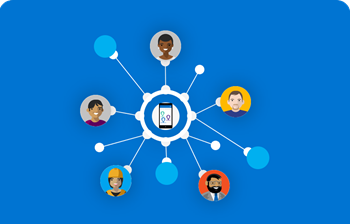
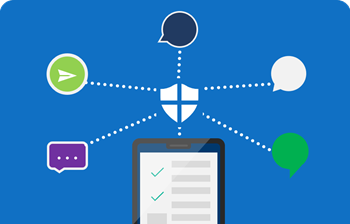
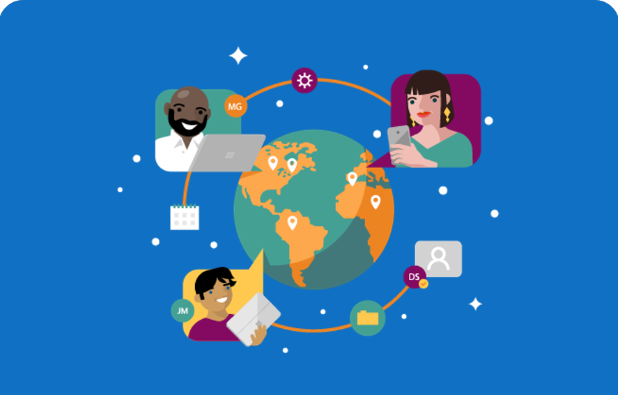
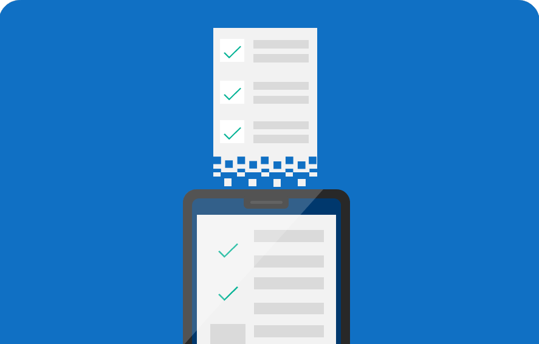

# Get started with Kaizala

Here are four easy – yet powerful – things you can do to get the most out of Kaizala. This simple getting started guide will enable the following four powerful scenarios for your organization.

**[Variation 1: Images reduced]**

|                         |                          |
|-------------------------|--------------------------|
|   **[Bring everyone together](bring-everyone-together.md)**   Build a company-wide **phone directory** and enable all your employees to discover and connect with anyone in the organization. |   **[Get conversations going](get-conversations-going.md)**   Enable **secure chat**, discussions, and knowledge sharing within your organization while retaining complete ownership of data.  |
|   **[Connect with employees](connect-with-employees.md)**   Create **company connect** groups and extend corporate communication by sharing announcements and collecting feedback with entire external networks.  |   **[Digitize everyday tasks](digitize-tasks.md)**   Use **Kaizala Actions** to digitize processes such as field data collection, attendance, trainings, surveys, and many more.  |

**[Variation 2: Sequential]**

|                         |                          |
|-------------------------|--------------------------|
| | **[Bring everyone together](bring-everyone-together.md)**   Build a company-wide **phone directory** and enable all your employees to discover and connect with anyone in the organization. |
| | **[Get conversations going](get-conversations-going.md)**   Enable **secure chat**, discussions, and knowledge sharing within your organization while retaining complete ownership of data.  |
| | **[Connect with employees](connect-with-employees.md)**   Create **company connect** groups and extend corporate communication by sharing announcements and collecting feedback with entire external networks.  |
| | **[Digitize everyday tasks](digitize-tasks.md)**   Use **Kaizala Actions** to digitize processes such as field data collection, attendance, trainings, surveys, and many more.      |

**[Original format]**

|                         |                          |
|-------------------------|--------------------------|
|   **[Bring everyone together](bring-everyone-together.md)**   Build a company-wide **phone directory** and enable all your employees to discover and connect with anyone in the organization. |   **[Get conversations going](get-conversations-going.md)**   Enable **secure chat**, discussions, and knowledge sharing within your organization while retaining complete ownership of data.  |
|   **[Connect with employees](connect-with-employees.md)**   Create **company connect** groups and extend corporate communication by sharing announcements and collecting feedback with entire external networks.  |   **[Digitize everyday tasks](digitize-tasks.md)**   Use **Kaizala Actions** to digitize processes such as field data collection, attendance, trainings, surveys, and many more.
     |

