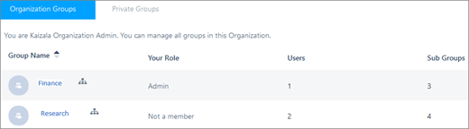

# Groups in Kaizala

Think of groups in Kaizala as just a collection of people. You can create Kaizala groups from the mobile app and the management portal. Kaizala offers different types of groups to suit your needs.

> [!VIDEO https://www.microsoft.com/videoplayer/embed/RE3auMb] 

## Types of groups

- **Flat (or personal) group** – Group users can see each other in the group and interact with them. This group has two types of user roles: admin and member.
- **Broadcast group** – This group has an additional type of user role: subscriber. Broadcast groups enable admins to interact with a large number of subscribers who do not see each other in the group. The subscribers interact with the admins by liking, commenting, or responding to any actions sent to the group. Responses to actions are sent only to admins, not to other subscribers.
- **Hierarchical group** – Kaizala has the ability to interact in different group structures depending on the type of communication between members. Hierarchical groups consist of both individuals and other subgroups. Members interact by responding to actions. Actions sent in any hierarchical group will be visible to all of its subgroups.

## Data ownership

For all of these types of groups – flat, broadcast, or hierarchical – there are two data ownership models supported by Kaizala: organization and private.

- **Organization** – If a group is an organization group, the data of the group is owned by the organization. The admin of an organization group can use advanced features, such as applying group policies, and also see reports for Kaizala Actions in the portal. Office 365 global admins can manage all organization groups, even those for which they aren't members.
- **Private** – The data in private groups is not owned by the organization, and they can't be managed via the Kaizala management portal. A group admin can add a private group to organization from the portal (**Private** tab) or the app. The vice versa is not possible.

*Next>* [Create Kaizala groups](create-kaizala-groups.md)
  

