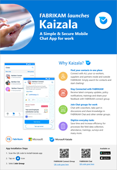
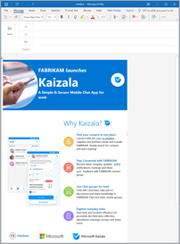

# Invite people to install Kaizala

Now that the company phone directory book has been formed in Kaizala, it’s time to invite everyone to install Kaizala. There are multiple ways to invite people in your organization to install Kaizala. 

## Step 1 – Send SMS invitations to install Kaizala

Kaizala management portal lets you send an SMS invitation to all the unregistered users. For detailed steps, see [Invite users to install Kaizala through SMS](invite-users-to-install-and-register.md).

## Step 2 – Communicate through existing digital channels

Awareness and motivation to move to Kaizala can both be created using digital channels such as:
- Your existing chat apps
- Company intranet
- Company email 

Start by sending out [a Kaizala poster and email message](https://docs.microsoft.com/Office365/Kaizala/invite-people#introducing-kaizala--poster-and-email-template) to help your employees learn what is Kaizala and why they should install it. 

## Step 3 – Create buzz through on-the-ground activities

On-the-ground activities can be especially important for driving a buzz at the workplace that positively influences the workforce to adopt Kaizala.

Here is a list of initiatives to create a positive buzz for Kaizala at your organization:

- Set up a Kaizala activation desk to help users install Kaizala and answer any of their questions about Kaizala.
- Put up a [Kaizala poster](https://docs.microsoft.com/en-us/Office365/Kaizala/invite-people#introducing-kaizala--poster-and-email-template) or send an [email message](hhttps://docs.microsoft.com/en-us/Office365/Kaizala/invite-people#introducing-kaizala--poster-and-email-template) to your organization so that employees can see the information.

### Introducing Kaizala – poster and email template

Create customized posters and email messages to get your organization excited about Kaizala. The files include step-by-step directions on how to personalize the poster and email message for your organization.

|Customizable poster  |Customizable email template       |
|---------|---------|
|**Poster: Introducing Microsoft Kaizala**  [Download the .pptx file](https://github.com/MicrosoftDocs/OfficeDocs-O365ITPro/raw/public/Office365-Kaizala/downloads/poster-introducing-kaizala.pptx?raw=true)     |**Email: Introducing Microsoft Kaizala**  [Download the .oft file](https://github.com/MicrosoftDocs/OfficeDocs-O365ITPro/raw/public/Office365-Kaizala/downloads/edm-introducing-kaizala.oft?raw=true)          |

*Next>* [Get conversations going](get-conversations-going.md)
