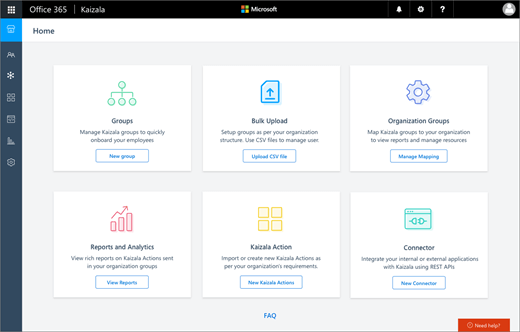

# Kaizala management portal

The best way to launch and scale Kaizala is through the management portal.

The Kaizala management portal is a web-based entry point that provides management, reporting, and extensibility capabilities for Kaizala. It lets you create new groups, add users, and view ready-to-use reports. With the Kaizala management portal, your organization can quickly onboard thousands or even millions of people to Kaizala, including employees, partners, vendors, and customers. The only thing each person needs is a unique phone number.
  
## Access the Kaizala management portal

To get started, sign in with your Azure Active Directory account through the [Kaizala management portal](https://go.microsoft.com/fwlink/p/?linkid=852455). After you log in, add your phone number to Kaizala. Once its authenticated, you can manage Kaizala features in the management portal. 
  
> [!IMPORTANT]
> You can have more than one phone number for a single Azure AD admin account. This lets you manage groups and users according to your own preferences. You can switch between phone numbers under **Settings**.
  
## Users of the Kaizala management portal

The following users can use the Kaizala management portal:

- **IT administrators** access the portal to set up groups and manage users in a secure and compliant manner. For example, an administrator can add or remove someone from a specific group, or even from all groups. When an employee leaves a company, he or she loses membership in the Kaizala organization and can no longer access organization data.
- **Developers** use the portal to either create a new Kaizala Action or customize a Kaizala Action. Developers can also add a new connector to integrate other systems with Kaizala.
- **Business users** go to the portal to view built-in reports, including real-time data updates for Kaizala Actions shared in organization groups.
    
  
  
|Menu     |What it's for|
|---------|-------------|
|[Kaizala Groups](groups-in-kaizala.md) |Create and manage Kaizala groups. |
|[Kaizala Users](add-users.md)   |Add and manage Kaizala users. |
|[Organization Groups](settings.md) |Connect Kaizala groups to your organization to view reports and manage resources. |
|[Broadcast Groups](groups-in-kaizala.md)  |Connect with a large set of subscribers to send and receive information.  |
|[Kaizala Reports](action-reports.md)  |View reports on Kaizala Actions.  |
|[Kaizala Actions](actions.md)  |Create new Kaizala Actions.  |
|[Kaizala Connectors](connectors.md) |Integrate other applications with Kaizala by using REST APIs. |
   

