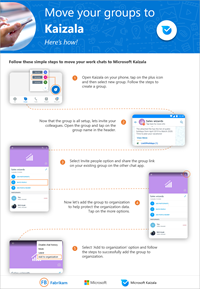
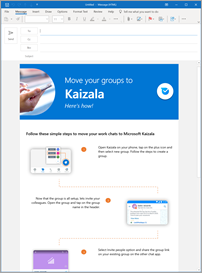

# Move existing groups to Kaizala 

You and your workforce in the office and in the field needs to communicate and coordinate to get work done. Often this communication happens over unsecure personal messaging apps, putting your organization’s data security at risk.
 
Use Kaizala to *secure chat*, enabling your organization to connect and coordinate across the external networks while retaining complete ownership of work-related chat data. Follow these steps to move conversations to Kaizala and secure your organization’s data.

## Step 1 – Create a group in Kaizala

1. Tap **Chats** > **New Group**.
2. Enter a name for your group, and then tap **Next**.
3. Tap **Done** to create your group.

> [!VIDEO https://www.microsoft.com/videoplayer/embed/RE2LbYp] 

> [!TIP]
> Personalize your groups by using your group photograph for the group icon.

## Step 2 – Invite others

1. From the **Chats** list, open the group.
2. Tap on the group name to open the **Group Info** page.
3. On the **Group Info** page, tap **Invite People**.
4. Tap **Share** to send the link to existing groups on other messaging apps.

   

> [!NOTE]
> Anyone who receives the link can join the group. 

## Step 3 – Map your group to the organization 

You must link your new group to your organization to ensure data security and to ensure all data stay with the organization.

1. Tap on the group name to open the **Group Info** page.
2. Tap **More**  on the upper right of the **Group Info** page.
3. Tap **Add to organization**. When mapping is done, you will see a prompt.

> [!NOTE]
> If you are not already signed in to Kaizala with your Office 365 email ID, you will get a prompt to sign in at this step. Simply sign in with your Office 365 email ID and proceed to map the group. 

## Step 4 – Ask your employees to move their work chat to Kaizala 

Now that all your chats are moved to Kaizala, its time to ask your employees to do the same. Personalize and share [this poster and email message](https://docs.microsoft.com/Office365/Kaizala/move-work-chats#move-groups--poster-and-email-template) with all your employees to help them move their groups to Kaizala.

### Move groups – poster and email template

Create customized posters and email messages to get your organization excited about Kaizala. The files include step-by-step directions on how to personalize the poster and email message for your organization.

|Customizable poster  |Customizable email template       |
|---------|---------|
|**Poster: Move your groups to Kaizala**  [Download the .pptx file](https://github.com/MicrosoftDocs/OfficeDocs-O365ITPro/raw/public/Office365-Kaizala/downloads/poster-move-groups-to-kaizala.pptx?raw=true)     |**Email: Move your groups to Kaizala**  [Download the .oft file](https://github.com/MicrosoftDocs/OfficeDocs-O365ITPro/raw/public/Office365-Kaizala/downloads/edm-move-groups-to-kaizala.oft?raw=true)          |

*Next>* [Create large groups for discussions](create-discussion-groups.md)
