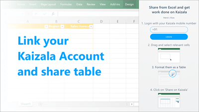
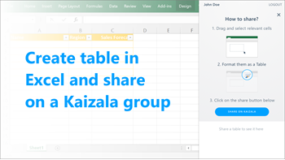
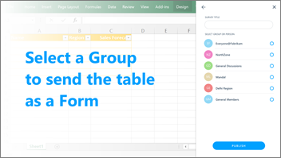
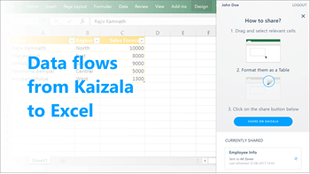

# Kaizala Office add-in

The Kaizala Office add-in allows you to collect user data from your employees, through the Kaizala mobile app. Using the Kaizala Office add-in, you can share a table to pre-existing groups linked with your Kaizala account. The table is published as a survey on the Kaizala mobile app. For each survey response submitted by a Kaizala app user, a row is added to the selected table in Excel.
  
## Get the Office add-in

- Start Excel and select **Insert** \> **Store**.
    
- In the search box for Office Add-Ins dialog, type in **Microsoft Kaizala** and search. 
    
- Choose and add the Microsoft Kaizala add-in.
    
You can also get the Microsoft Kaizala add-in from the Office Store, here: [Microsoft Kaizala Office add-in](https://appsource.microsoft.com/en-us/product/office/WA104381121?tab=Overview).
  
> [!NOTE]
> Microsoft Kaizala Office Add-in is available only in India. You need to set your Country Region to India and Language to English (India). 
  
## Use the Kaizala Office add-in

1. Create a new Excel file &amp; save it. You can also open an existing file.
    
2. On the **Insert** tab, select **My Add-Ins**. Click **Microsoft Kaizala Office Add-in**.
    
3. Login with your Kaizala phone number.
    
    
  
4. Drag, select the cells you want and click Insert. Then select Table. On the Dialog box, select check box for 'My Table has headers'. Each Column header represents a text question to be posted in the survey. Click Share on Kaizala.
    
    
  
5. Add the Survey Title (the title will be published on the Kaizala App) and choose the Kaizala Group where you want the survey to be published.
    
    
  
6. The published table will show up in the add-in. If you want to refresh the table with data from the survey, select the table and then click Refresh.
    
    
  

