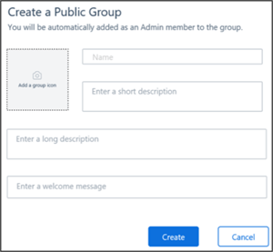
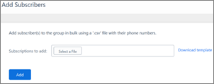

# Kaizala public groups

Kaizala public groups allow companies to use a single channel on Kaizala, where they can connect privately with lots of Kaizala subscribers. These channels make it easy to share and receive information.
    
## Kaizala Public Groups Types

- **Admins** can accept or reject subscribers. They can also add or remove members and manage settings on Kaizala.
- **Members** are the people belonging to a group.
- **Subscribers** are people who discovered a public group and want to be part of it. In some cases, they need the approval of the public group admin.

## Kaizala demo page

To see an interactive step-by-step demo and explanation of the configurations, see the [Kaizala Demo page](https://kaizalademo.office.com/).

## Create a public group

1. On the Kaizala management portal, from the left navigation pane, choose **Public Groups**.
2. Select **Create new** and enter a group picture and info. Click or tap **Create**.
    
    
  
You can add admins and members to the public groups you created.
  
## Add subscribers

After you create a public group, you can add subscribers to it. Once they have been added, the public group will be made visible to them.
  
1. To add subscribers, select a public group, and then click **Add Subscribers**. You can only add subscribers using a CSV file. This makes it easy for you to add them in bulk.
    
2. On the **Add Subscribers** page, download the CSV template and follow the format to add your subscribers. Save your file when you're done. For more information, see [Add several users at the same time to Office 365 - Admin Help](https://support.office.com/article/1f5767ed-e717-4f24-969c-6ea9d412ca88#__toc316652088).
    
3. Choose **Select File** to choose the file you just saved and then click **Add**.
    

  
## Invite subscribers

You can send a unique link to invite subscribers to your group. If people open the link, they’ll join the public group as subscribers.
  
1. To invite subscribers, select a public group, and select **Generate invite link**.
    
2. Copy the link and send it to the people you want. Once they click it, they’ll be added to the group.
    

  
Public groups are managed through the Kaizala management portal by public group admins. Organization group admins can manage all public groups in their organization.
  

