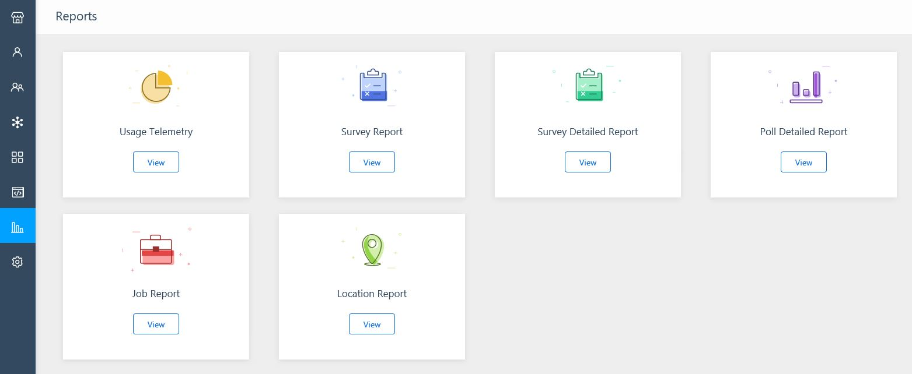

# Kaizala Reports

The Kaizala Reports dashboard allows you to view reports and telemetry data for Kaizala actions. Global and group admins can view these reports for Organization mapped groups. Reporting isn't available for private conversations and groups.
  
Data for all reports is displayed within 4 to 5 minutes. There is up to a 4 hour delay in reflecting reports after a group is first marked as an organizational group. 
  

  
The following reports are currently available on the dashboard:
  
- **Usage Telemetry**
    
- **Survey Report**
    
- **Survey Detailed Report**
    
- **Poll Detailed Report**
    
- **Job Report**
    
- **Location Report**
    
> [!NOTE]
> Kaizala Group admins will see reports for their organization groups. Kaizala organization admins will be able to see reports for all organization groups. Reports are available only for group admins. Members can't see reports for the group. 
  
## Usage telemetry

To view the report on usage telemetry, navigate to **Reports** from the navigation bar. From there, go to the tile **Usage Telemetry**. This report displays the following information for organization groups: 
  
- Analysis of number of messages sent in your ecosystem as well as the number of unique users who used each message type.
    
- Growth trends of message types sent in your group.
    
## Survey report

To view survey reports, from the home page go to **Reports** from the navigation bar. Select **Survey Report** tile from the list of available reports. This report displays the following information for organization groups: 
  
- Total number of surveys sent
    
- Total number of open surveys
    
- Total number of responses received for surveys
    
- Group wise survey status - how many surveys are still open (active), and which users can respond versus how many are already closed or expired
    
- Count of responses for each survey
    
The following filters are available in a survey report:
  
- Organization group - ability to select one or more groups. By default, all permissible organization groups are listed.
    
- Survey status - filter reports by survey status (Open or Closed)
    
- Survey created date - filter reports based on when a survey was created. Select a specific date or a date range.
    
## Survey detailed report

To view survey detailed report, navigate to **Reports** page from the home screen and select **Survey Detailed Report** 's tile. In the dialog, choose the group and survey from the drop-down lists. The report consists of 5 tabs. 
  

  
- Multi-choice Questions - this tab shows the summary and detailed analysis of options selected for MCQ-type questions.
    
- Numeric Questions - this tab shows the aggregated as well as detailed responses for each numeric and question, including sum, average and counts.
    
- Location - if the location for survey is turned on, then the responses are mapped to a location.
    
- Text Responses - an automatically generated word cloud, based on survey responses. Organizations can use surveys to get feedback from their employees, and then use this report to visualize the details.
    
- Images - view all the photos collected via a survey in a single place.
    
## Poll Detailed Report

To view poll detailed report, navigate to **Reports** page from the home screen and select **Poll Detailed Report** 's tile. In the dialog, choose the group and poll title from the drop down lists. The report consists only 1 tab which shows the summary and detailed analysis of choices made under that poll's question. 
  
## Job report

To view job reports, from the home page go to **Reports** from the navigation bar. Select the **Job Report** tile from the list of available reports and select an organization group from the drop down list. The report consists of 3 tabs. 
  
- Open Jobs - shows the total number of pending jobs, jobs past due date and jobs still open.
    
- Trends - depicts the On-time completion trend and a weekly Job trend. For each group, this report shows how many jobs were created each week as well as their status of completion. Jobs could be - Completed, Completed - Past Due, Pending, Pending - Past Due
    
- Group wise jobs status - how many jobs are Not Started, Partially Complete or Completed for each group.
    
## Location Report

To view location report, from the home page go to **Reports** from the navigation bar. Select the **Location Report** tile from the list of available reports. This report displays the following information for organization groups: 
  
- Locations of users who responded to location actions.
    
- Groups where the action was sent.
    
- Names of the responder.
    
## Report filters

Reports may have generic or specific filters that allow users to see reports for specific criteria. For example, users can use Group filter to see data for a specific group. Similarly, users can use the **Create Date** filter to see the Actions for a specific date or date range. 
  
### Report drilldown support

Some reports have drill-down support for hierarchical groups that shows aggregated data and graphs. To turn on report drill-down mode:
  
- Click or tap the arrow icon to turn on drill-down mode as shown below:
    
    
  
## Export Kaizala report data to a CSV file

You can export your Kaizala report data to a CSV file. Power BI allows to export data to CSV file from the graph. To export the data, click the **…** on the top right corner of the graph and choose **Export**.
  

  

