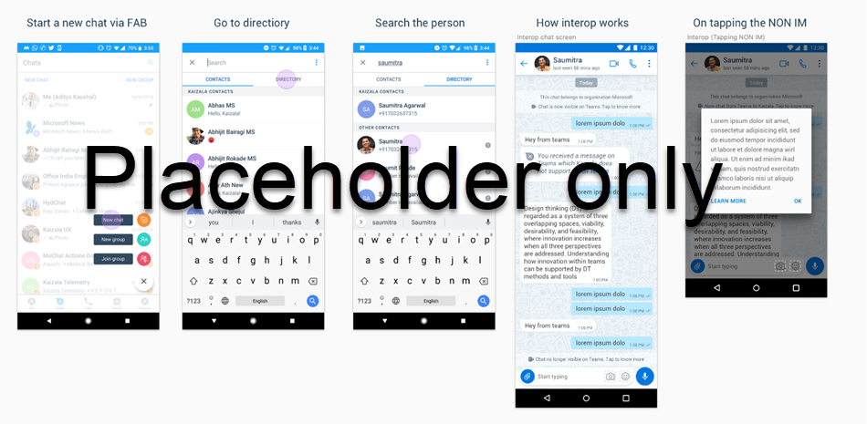

# Teams interop with Kaizala

Kaizala is designed to connect an organization’s external network (such as vendors) with its internal employees (such as information workers). The overarching goal is to let a Kaizala user chat with a Microsoft Teams user.

The first step is to enable interoperability (interop) between two Kaizala users within the same organization for individual messages.

Based on feedback from partners and customers, we will increase the scope of interop and include rich message types for groups (such as attachments). We will update our documentation here.

## How Teams interop works

### Conditions for interop to work 

- Currently, users must be registered on Kaizala and be on Microsoft Teams. Once registered, the user does not need to open Kaizala.
- Our goal is to let Kaizala and Teams users interop while being only on Teams.

### Set up interop with Teams   

Interop with Teams is automatically set up for organizational one-on-one chat *(Link to org chat - TBD)*.

To set up interop with Teams:

1. Link an Office 365 or work account on Kaizala (tap **Me** > **Linked Accounts** > Sign in to Office 365).
2. On the home screen, tap **Start a chat**.
3. Search for a recipient using an Office 365 name, and start an individual chat from the organizational directory.
4. A cross-chat with Teams is automatically enabled.

Currently, interop is possible only from the Kaizala user; it cannot be enabled from Teams.

Once interop has been initiated, both Teams or Kaizala users can send messages.

### End interop with Teams

Any of these methods will end interop with Teams:

- The user logs out of an Office 365 work account or otherwise switch accounts.
- The organization admin disables interop for the entire organization.
- The organization admin disables Kaizala for the entire organization.

After interop ends, users can still chat independently on Teams after logging into O365 login. On Kaizala, users can continue their private chat. Users will also be able to continue their org chat provided they have logged into their Office 365 accounts.

### Experience of interop with Teams 

- You can see if interop is enabled in a message on the chat canvas.
- Messages sent in individual chat on Kaizala will be visible on Teams.
- You will see a notification if you message an unsupported client. For example, if you send a GIF file in Teams, it will be visible as an unsupported message on Kaizala.
- Any message deleted on Teams is also deleted on Kaizala.

#### Supported message types and actions

##### Messages sent in Kaizala

|Type        |Event in Kaizala (1:1 chat) |Experience in Teams  |
|------------|---------|---------|
|Message     |Text     |Text message        |
|Message     |Action card        |Unsupported message with redirection to Kaizala |
|Message     |Attachment         |Unsupported message with redirection to Kaizala  |
|Message     |Other non-message event         |None         |
|Action      |Reply To         |Simple text message or unsupported card |

##### Messages sent in Teams

|Type        |Event in Teams |Experience in Kaizala  |
|------------|---------|---------|
|Message     |Text     |Text message        |
|Message     |Attachment        |Unsupported message with redirection to Kaizala |
|Message     |GIF         |Unsupported message with redirection to Kaizala  |
|Message     |Rich text (for example, formatted text, URL)         |Unsupported message with redirection to Kaizala |
|Message     |All other message types         |None         |
|Action      |Edit         |If unsupported, then unsupported message   If text, reply to the original message |
|Action      |Delete         |If unsupported, message will not be deleted   If text, message will be deleted |

##### Experience in Kaizala

The following shows the flow of the interop experience for Kaizala users.

##### Experience in Teams

The following shows the interop experience for Teams users.

## Compliance in Teams interop

Even though both Kaizala and Teams are part of Office 365, there are different compliance requirements for each platform. It is therefore critical to ensure that only the right people see the right kinds of data and messages.

- Both Kaizala and Teams are at compliance Tier C everywhere Kaizala is live.
- Both Kaizala and Teams are geo-regional compliant everywhere Kaizala is live.
- In other places where Kaizala is not live, the setting for interop is automatically disabled. The admin can always turn it on.

## What’s next in Teams interop

While we’ve taken small steps to implement full interop between Teams and Kaizala, we intend to refine this feature, including:

- Support for attachments in interop.
- Ability of Kaizala to interop with a Teams-only user.
- Initiate interop automatically from Teams.
- Interop for new groups.

