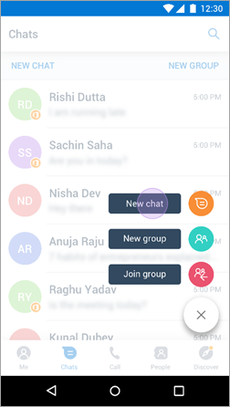
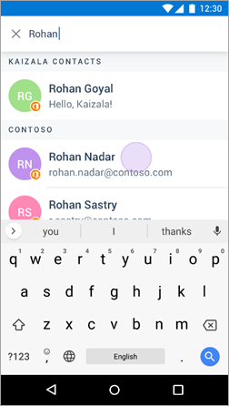
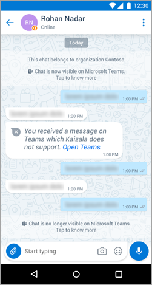
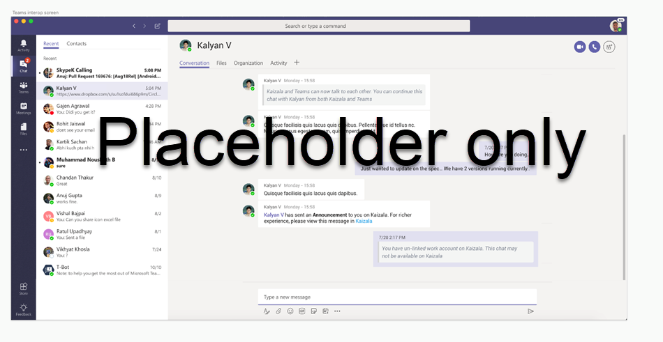
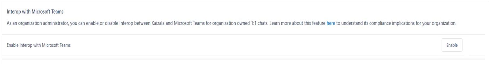

# Interop between Kaizala and Microsoft Teams

## How interop works with Microsoft Teams 

### Conditions for interop to work 

For the first phase, users must be registered on both Kaizala and Microsoft Teams. The ability to enable interop between Kaizala and Teams-only users will be coming.

### Set up interop with Microsoft Teams   

Interop with Microsoft Teams is automatically set up for [organizational one-on-one chat](https://support.office.com/en-us/article/organization-chats-and-groups-in-kaizala-c8a7855c-d232-4914-811c-f6708734dcc3).

To set up interop with Microsoft Teams:

1. Link an Office 365 or work account on Kaizala (tap **Me** > **Linked Accounts** > sign in to Office 365).
2. On the home screen, tap **Start a chat**.
3. Search for a recipient using an Office 365 name, and start an individual chat from the organizational directory.
4. A cross-chat with Microsoft Teams is automatically enabled.

Currently, interop is possible only from the Kaizala user; it cannot be enabled from Microsoft Teams.

Once interop has been initiated, both Microsoft Teams or Kaizala users can send messages.

The following shows the flow of the interop experience for Kaizala users.

|Start a new 1:1 chat  |Select a recipient from organization directory  |Interop with  Microsoft Teams is enabled by default when org 1:1 chat starts  |
|---------|---------|---------|
|     |         |         |

### End interop with Microsoft Teams

Any of these methods will end interop with Microsoft Teams:

- The user logs out of an Office 365 work account or otherwise switch accounts.
- The organization admin disables interop for the entire organization.
- The organization admin disables Kaizala for the entire organization.

After interop ends, users can still chat independently on Microsoft Teams after logging into Office 365 login. On Kaizala, users can continue their private chat. Users will also be able to continue their org chat provided they have logged into their Office 365 accounts.

### Experience of interop with Microsoft Teams 

- Messages sent in individual chat on Kaizala will be visible on Microsoft Teams.
- You will see a notification if you message an unsupported client. For example, if you send a GIF file in Microsoft Teams, it will be visible as an unsupported message on Kaizala.
- Any message deleted on Microsoft Teams is also deleted on Kaizala.

The following shows the interop experience for Microsoft Teams users.

#### Supported message types and actions

##### Messages sent in Kaizala

|Type        |Event in Kaizala (1:1 chat) |Experience in Microsoft Teams  |
|------------|---------|---------|
|Message     |Text     |Text message        |
|Message     |Action card        |Unsupported message with redirection to Kaizala |
|Message     |Attachment         |Unsupported message with redirection to Kaizala  |
|Message     |Other non-message event         |None         |
|Action      |Reply To         |Simple text message or unsupported card |
|Read receipts   |Read receipts are visible for messages sent on Kaizala   |None   |
|Notifications   |Notification of message received on Kaizala |Notifications will appear for Teams as well |

##### Messages sent in Microsoft Teams

|Type        |Event in Microsoft Teams |Experience in Kaizala  |
|------------|---------|---------|
|Message     |Text     |Text message        |
|Message     |Attachment        |Unsupported message with redirection to Kaizala |
|Message     |GIF         |Unsupported message with redirection to Kaizala  |
|Message     |Rich text (for example, formatted text, URL)         |URLs and emojis are supported. Teams formatted text is shown as simple text on Kaizala |
|Message     |All other message types         |None         |
|Action      |Edit         |If unsupported, then unsupported message   If text, reply to the original message |
|Action      |Delete         |If unsupported, message will not be deleted   If text, message will be deleted |
|Read receipts   |Message sent on Teams   |Read receipts is not visible on Kaizala (this ability will be coming)   |
|Notifications   |Notification of message received on Kaizala |Notifications will appear for Kaizala as well |

## Compliance in Microsoft Teams interop

There are differences between Kaizala and Microsoft Teams with respect to compliance in specific regions. For more details about compliance, see [Office 365 compliance framework](http://download.microsoft.com/download/1/4/3/1434ABAB-B8E9-412D-8C3A-187B5FCB7A2F/Compliance%20Framework%20document.pdf).

- Both Kaizala and Microsoft Teams are at compliance Tier C everywhere Kaizala is generally available. (Kaizala is commercially available [28 markets](regional-availability.md).)
- Both Kaizala and Microsoft Teams are geo-regional compliant everywhere Kaizala is generally available.
- In other places where Kaizala is not generally available, the setting for interop is automatically disabled. The admin can always turn it on.
- The organization admin can turn interop off or on from the **Settings** tab in the Kaizala management portal as shown in the following screenshot.

## What’s next in Microsoft Teams interop

- Support for attachments in interop.
- Ability of Kaizala to interop with a Microsoft Teams-only user.

This feature has begun flighting for select enterprise organizations. If you want to be part of this flighting, send a request to [kaizalafeedback@microsoft.com](mailto:kaizalafeedback@microsoft.com).

