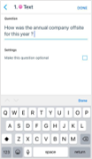
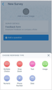
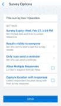
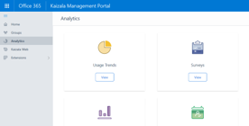
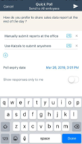
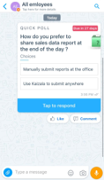
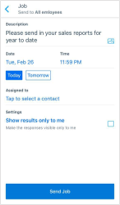
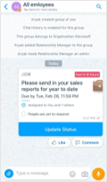

# Get work done with Kaizala Actions

Kaizala makes it easy to connect and coordinate with your workers, wherever they are. Kaizala Actions let you manage work or collect data from individuals and groups, even if they’re not in your organization.

> [!VIDEO https://www.microsoft.com/videoplayer/embed/RE2JDVf] 

Get work done in three easy steps.

### Step 1 – Send a survey to collect data from the field

Use the following steps to quickly create a survey to collect data from your workforce. 

1. In the group conversation, in the chat box at the bottom of the page, tap the paperclip icon.
2. Select the **Survey** option, and enter the relevant details such as title.
3. Use the **Add a question** button to enter questions on the form.

   

   You can pick the question response types, such as multiple choice, drop-down selection, free text, image, numeric, phone number, and date options.
   
   

   Finally, pick your survey options. You can decide when the survey will expire and whether you want to make answers visible to others.

   

4. Once you’re done setting up the questions, share the survey with the group. Admins can track how many people have answered the feedback by selecting the survey card in the chat window.

   

5. You can use the Survey Action card for several scenarios where data from remote workers needs to be collected. Some examples are collecting sales data from agents, conducting remote audits, and checking on faraway operations. 
6. 6.	Detailed reporting on all surveys sent out to your employees, suppliers and partners can be viewed on the Kaizala management portal under the **Analytics** section > **Surveys** tab. 

   

### Step 2 – Send a poll to collect user preferences

Use the following steps to quickly create simple surveys for fast feedback.
 
1. In the group conversation, in the chat box at the bottom of the page, tap the paperclip icon.
2. Select the **Quick Poll** option, and enter the relevant details such as questions and answer choices.

   

3. Employees can tap to respond to the poll.

   

4. Detailed reporting on all surveys sent out to your employees, suppliers and partners can be viewed on the Kaizala management portal under the **Analytics** section > **Surveys** tab. 

### Step 3 – Send a job and effectively manage tasks

Use the following steps to quickly send out jobs and tasks to remote workers. 

1. In the group conversation, in the chat box at the bottom of the page, tap the paperclip icon.
2. Select the **Job** option, and enter the relevant details such as job description and due date.

   

3. Employees can tap to respond to the poll.

   

4. Detailed reporting on all surveys sent out to your employees, suppliers and partners can be viewed on the Kaizala management portal under the **Analytics** section > **Surveys** tab. 

