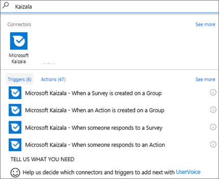
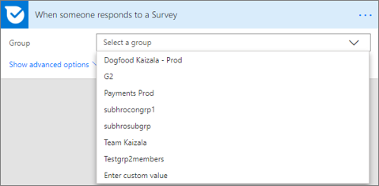
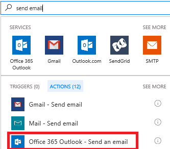
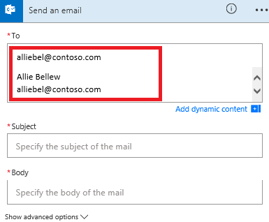
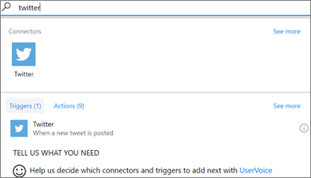
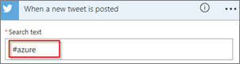
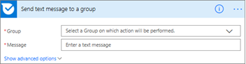

# Integrate your workflow in Kaizala using Microsoft Flow

Microsoft Flow automates business process by providing a platform to integrate one service with other services. These services are the ones, which are registered on Microsoft flow as Connectors. [Learn more about Microsoft Flow](https://go.microsoft.com/fwlink/?LinkID=858639). Microsoft Kaizala is now available as a Connector on Microsoft Flow. This helps a user to automate their workflow and improve their productivity by allowing Kaizala to integrate with other services seamlessly. Below are some examples of how Microsoft Flow allows users to automate their workflows across services:
  
- A pharmaceutical sales manager, wants to send product listing info in his sales team group on Kaizala, whenever he receives an email from the regional sales office.
    
- A Teams admin would like to save all attachments sent in a Kaizala Group to the Team's SharePoint site.
    
- A shop owner wants to receive an email for each sales response he gets on his surveys, sent to his customer group on Kaizala.
    
- An organization admin wants to send an announcement to a employee in the organization, whenever a new employee joins a particular organization group
    
## Create a Flow using Kaizala Trigger

What you need before you can run these steps:
  
- A Kaizala admin account, an account on flow.microsoft.com and your Office 365 username and password.
    
 **Receive an email in Outlook, whenever someone responds to a survey**
  
1. In flow.microsoft.com, select **My flows** in the top navigation bar, and then select **Create from blank**.
    
2. Click on **Search hundreds of connectors and triggers**.
    
3. On the **Search all connectors and triggers** page, type **Kaizala**, and then select **Microsoft Kaizala - When someone responds to a survey**.
    
    
  
4. If you haven't already connected your Kaizala account to Microsoft Flow, select **Sign in to Kaizala**, and enter your Kaizala admin username and password.
    
5. On the Group page, select the group in which the survey has been posted.
    
    
  
Now you can specify what action you want to take:
  
- Select **New step**, and then select **Add an action**.
    
- On the **Search all connectors and actions** page, type **send email**, and then select **Office 365 Outlook - Send an email**If you're prompted, sign in with your Office 365 global admin account.
    
    
  
- On the **Send an email** page, type your email address in the **To** field and select your name from the list. 
    
    
  
- In the **Subject** field, type **New Response from**, press the spacebar.
    
    
  
- Select **Responder Name** from the list of tokens, to add a placeholder for it. 
    
- In the **Body** field, click **Response Title token** to add a placeholder for it. 8. You can add more tokens, other content, or both to the body of the email. 
    
- At the top of the screen, name your flow, and then select **Create flow**. Select **Done** to update the list of your flows. 
    
- Post a response in the survey that you created in the selected group. Within a minute, an email message notifies you of the new survey.
    
## Create a Flow using Kaizala as Action

What you need before you can run these steps:
  
- A Kaizala admin account, an account on flow.microsoft.com and your Office 365 username and password.
    
 **Send a message on Kaizala group, whenever a tweet is posted for a particular hashtag**
  
1. In flow.microsoft.com, select **My flows** in the top navigation bar, and then select **Create from blank**.
    
2. Click on **Search hundreds of connectors and triggers**.
    
3. On the **Search all connectors and triggers** page, type **Twitter**, and then select **Twitter - When a new tweet is posted**.
    
    
  
4. If you haven't already connected your Twitter account to Microsoft Flow, select **Sign in to Twitter**, and enter your Twitter username and password.
    
5. In the **Search text** field, type the keyword you want. 
    
    
  
Now you can specify what action you want to take:
  
1. Select **New step**, and then select **Add an action**.
    
2. On the **Search all connectors and actions** page, type **Kaizala**, and then select **Microsoft Kaizala - Send a message**If you're prompted, sign in with your Office 365 global admin account.
    
3. On the **Send text message to a group** page, enter the group name and the message that you want to send. 
    
    
  
4. At the top of the screen, name your flow, and then select **Create flow**. Select **Done** to update the list of your flows. 
    
5. Send a tweet with the keyword that you indicated. Within a minute, a message notifies you of the new tweet in the selected Kaizala group.
    

