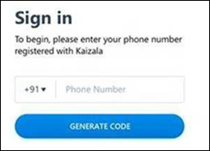

# Kaizala Web

Kaizala Web lets you access Kaizala through a browser on your computer. It gives you many of the same features as the Kaizala app. Before you can use Kaizala Web, you need to log in to the Kaizala app on your mobile device.
  
For more info about Kaizala, see [Microsoft Kaizala](https://products.office.com/en/business/microsoft-kaizala).
  
## Set up Kaizala Web

1. Make sure you have installed the latest version of Kaizala on your mobile phone. If you see the **Kaizala Web** tab under **Chats** \> **More**  in the Kaizala app, then you have access to the web app.
    
2. Download the latest app from the Google Play Store or the Apple App Store.
    
3. Go to https://webapp.kaiza.la/ in your Microsoft Edge or Google Chrome web browser.
    
4. Enter your Kaizala phone number, and then select **Generate Code**. 
    
   
  
5. From the Kaizala app on your mobile phone, go to **Chats** \> **More**  \> **Kaizala Web** to view the pairing code.
  
6. From the **Verify Code** page on your browser, enter the pairing code, and then select **Verify &amp; Sign in**. 
  
   
  
You can now use Kaizala on your browser and the mobile app.
  
## What's available in Kaizala Web?

- Send, receive, and view messages.
- Send, receive, and view attachments (including image, video, and document files). You can't use your computer's camera or microphone for creating new attachments.
- View and respond to certain types of actions.
- Reply to other people.
- Copy-and-paste or drag-and-drop files, including images, videos and files.
- Start 1:1 chats.
- Create a new group.
- Receive browser notifications for new messages and updates.

## Recommended setting on your mobile device

- Charge your phone while using the web app for an extended period. This prevents the app from going into sleep mode.
- Connect to WiFi so you don’t use your cellular data.  
- Disable battery optimization in Kaizala.
- Don’t force the Kaizala app to close.
    
## What's not available in Kaizala Web?

Not everything is available today in Kaizala Web. Here are some of the features coming soon:

- Likes and comments. 
- Forward and delete functionality. 
- Profile and group information. 
- Intune support. To keep your data safe, Intune-protected groups aren’t currently available.
  
## Report an issue or send feedback

We want to hear from you. To report an issue or send us feedback from Kaizala Web, go to **Profile** > **Report an issue**, or select the **Smiley** icon on the upper-right portion of the app window.

    

