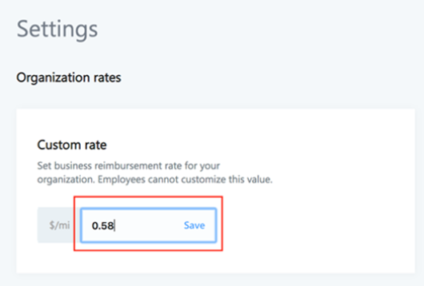

# Edit rates the custom rates for MileIQ

In the MileIQ admin center at [https://admin.mileiq.com](https://admin.mileiq.com), you can set a custom mileage rate that applies to all users in your organization. If you do not have access to the MileIQ admin center, contact your Global IT Admin. You need to be assigned to the Business Administrator role to set the rate.

## Set the mileage rate

1. Sign in to the [MileIQ admin center](https://admin.mileiq.com/login) with your corporate credentials. Select **Settings** from the left panel.
2. Enter a mileage rate for your organization. This rate applies to all users you've added in the MileQ admin center. Click **Save**.

    

> [!NOTE]
> - Users in your organization will not be able to change the mileage rate from their own MileIQ account's settings.
>
> - Changes you make to your organization's custom rate apply to all drives for the year. For example, if you make a change in 2019, the custom rate applies to your organization's drives for 2019. Drives made in past years will not be affected.
