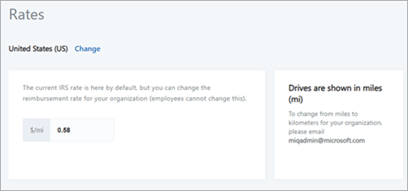
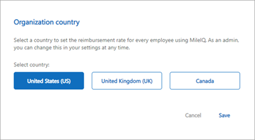
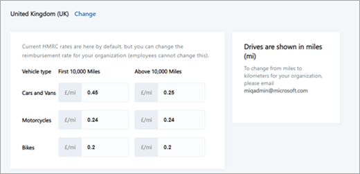
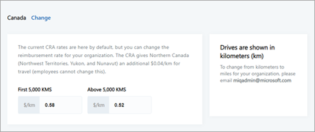

# Edit the custom rates for MileIQ

In the MileIQ admin center at [https://admin.mileiq.com](https://admin.mileiq.com), you can set a custom mileage rate that applies to all users in your organization. If you do not have access to the MileIQ admin center, contact your global admin. You need to be assigned to the business administrator role to set the rate.

This feature is available for organizations in the US, UK, and Canada. The rate for an organization can vary from country to country.

## Set the mileage rate

1. Sign in to the [MileIQ admin center](https://admin.mileiq.com/login) with your work account, and select **Settings** > **Rates**.

2. If you need to change the country, select **Change**. (The following image shows the Rates page for the US.)

    

3. Select a country, and then select **Save**. The change in country applies to all users you've added in the MileIQ admin center.

    

   The Rates page you selected appears.

    

    

4. On the **Rates** page, enter a mileage rate for your organization. This rate applies to all users you've added in the MileQ admin center. Select **Save**.

> [!NOTE]
>
> - Users in your organization can't change the mileage rate from their own MileIQ account's settings.
>
> - Changes you make to your organization's custom rate apply to all drives for the year. For example, if you make a change in 2019, the custom rate applies to your organization's drives for 2019. Drives made in past years are not affected.
>
> - If rates are not defined, rates will default to the country’s current mileage rate.
