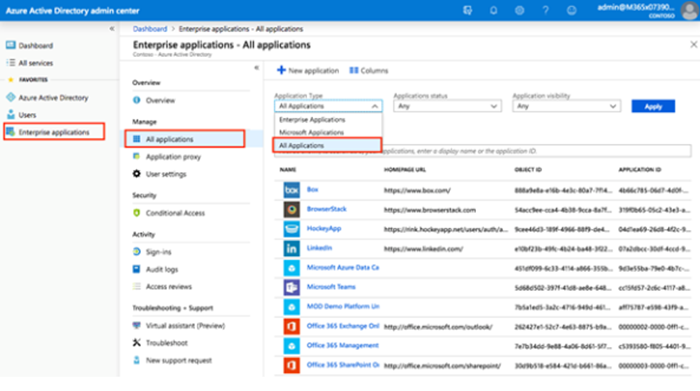
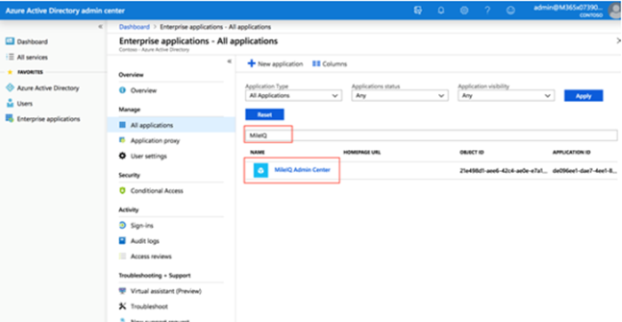

# Give a user access to MileIQ

## How do I access the MileIQ admin center?

You can access the MileIQ admin center at [https://admin.mileiq.com](https://admin.mileiq.com/) after you set up an account with a business administrator role. 

### Assign a user to the business administrator role

The global admin can assign a new administrator role, business administrator, in Azure Active Directory. Once designated, a business administrator can manage the workflows in the MileIQ admin center. The global admin can assign more than one business administrator.

1. Sign in to the [Microsoft 365 admin center](https://admin.microsoft.com/) with an account that's a global admin for the directory.
2. Select **Admin centers** and then select **Azure Active Directory**.

    

3. In the Azure Active Directory admin center, select **Enterprise applications**.
4. On the **Enterprise applications** page, select **All applications**. Then select **Apply**.

    

5. On the **Enterprise applications - All applications** page, select **All Applications** from the **Application Type** list, and then search for MileIQ. Select **MileIQ Admin Center**.  

     

6. On the **MileIQ Admin Center** page, select **Users and groups**.  
7. On the **MileIQ Admin Center - Users and groups** page, select **Add user**.

     

8. On the **Add Assignment** page, select **Users and groups**.  
9. On the **Users and groups** page, select one or more users or groups from the list, and then choose **Select** at the bottom of the page.
10. On the **Add Assignment** page, **MDLAdminCenterRole.Admin** is selected and is dimmed. Select **OK** at the bottom of the page.
11. On the **Add Assignment** page, select **Assign** at the bottom of the page. The assigned user or groups will now be able to enter the [MileIQ admin center](https://admin.mileiq.com).  

> [!NOTE]
> To access the MileIQ admin center, global admins must also add themselves to the business administrator role. Global admins can manage MileIQ admin access at any time by adding or removing business administrators through the Azure portal.
