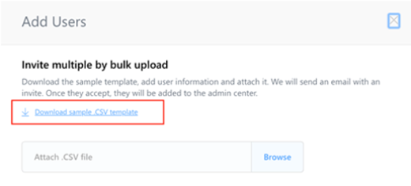
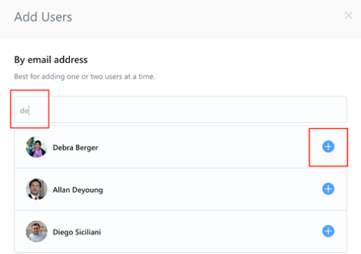
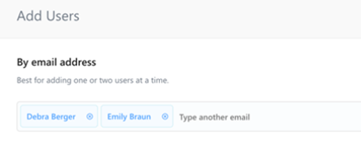
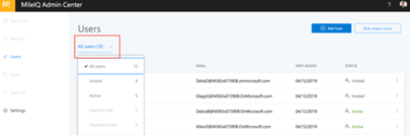

# Invite users in your organization to join MileIQ

In the MileIQ admin center, you can invite people in your organization to join and use MileIQ with the reimbursement mileage rates you set. If you do not have access to the MileIQ admin center, contact your global admin. You need to be assigned to the business administrator role to invite users.

The people you invite need to be part of your organization's directory through Azure Active Directory (AAD) set up by your global admin.

## Invite users by importing a list of email addresses

The MileIQ admin center accepts a CSV (comma-separated values) file pre-filled with the email address of each person in your organization who will be invited to join MileIQ. Use these steps when you have a pre-populated list of email addresses that you can save or export to a CSV format.

1. Sign in to the [MileIQ admin center](https://admin.mileiq.com/login) with your work account. Select **Users** from the left panel.
2. Select **Bulk upload users**. 
3. A dialog box appears for you to download a sample CSV file so that you can view the format.

    

4. You can use a spreadsheet program to create a list of email addresses, and then save or export it to the CSV format. The email address for each user must match the email address that your global admin set up in Azure Active Directory. Other information, such as first name and last name, will be populated automatically in the MileIQ admin center, so you do not need to include it in your CSV file.
5. When you are ready, select the CSV file from your computer.
6. The CSV file will be imported and validated for typos, format errors, and duplicate names. A status bar shows the progress. Upon completion, you can see how many users were imported and are ready for the invitation to be sent to them.
7. Select **Send Invite** to send an email invitation to join MileIQ to these users.

> [!TIP]
> Errors encountered during the import process are displayed in a log for you to download and view. Review the errors and make the corrections in your CSV file, and then bulk import again following the steps above.

## Invite users one at a time

You can send an invitation to any person in your organization by selecting his or her name from the directory. Use these steps when you need to invite only a few people at a time.

1. Sign in to the [MileIQ admin center](https://admin.mileiq.com/login) with your work account. Select **Users** from the left panel.
2. Select **Invite User**.
3. In the dialog box that appears, enter the user's email address. You can type in a couple of letters of the email address to find matches in your company directory.
4. Select the user you wish to invite by clicking the **+** button. The user will appear in the add field.

    

5. Repeat these steps until all the users are listed.

    

6. Select **Invite** to send an email invitation to join MileIQ to these users.

## Status of your invitation

The MileIQ admin center show the status of each invited person.

1. Sign in to the [MileIQ admin center](https://admin.mileiq.com/login) with your work account.
2. Use the filter feature to display invitations based on status.

    

  - **Invited** - An invitation has been sent, but the user has not joined MileIQ.
  - **Active** - The user has accepted your invitation, created a MileIQ account, and joined your organization for MileIQ.
  - **Archived** - You've removed the user from your organization. (You can invite the user again.) 

> [!NOTE]
>
> - If there are people in your organization who were previously added as MileIQ users, their names will appear on the list. When doing a bulk import of users, the MileIQ admin center will not invite them again if it sees their email address during the import.
> - There is no expiration on the invitation to join MileIQ that users receive.
> - Invitations cannot be forwarded from one user to another user. Only the intended recipient can join MileIQ with the link in your invitation.
