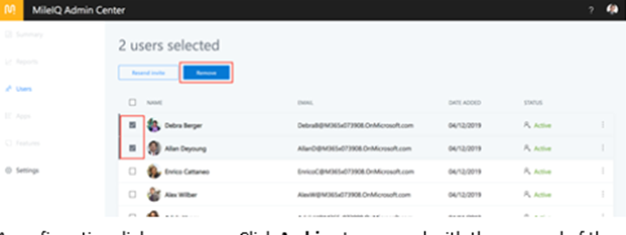
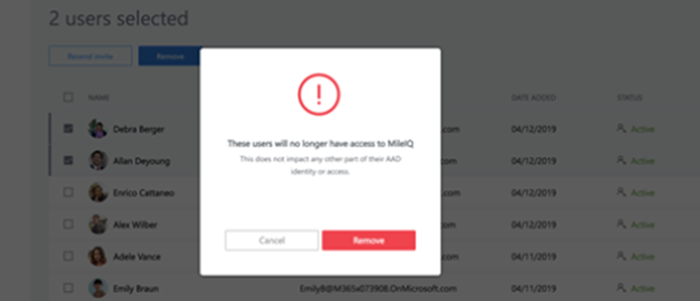
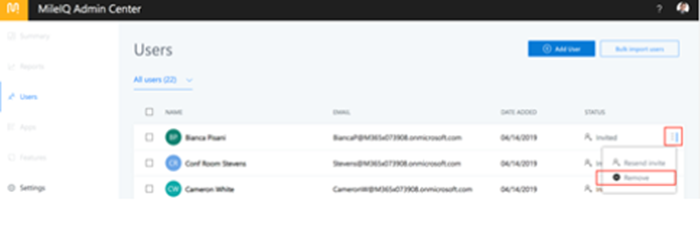

# Remove users in your organization from MileIQ

When people leave your organization, you can use the MileIQ admin center to remove them. Once removed, a person's MileIQ account is no longer associated with your organization. If you do not have access to the MileIQ admin center, contact your global admin. You need to be assigned to the business administrator role to remove users.

## Remove users in your organization

You can remove people from your organization by selecting their names from the admin center's list of users.

1. Sign in to the [MileIQ admin center](https://admin.mileiq.com/login) with your work account. Select **Users** on the left pane.
2. Look for the users you want to remove, and then select the checkbox next to the name. You can select more than one user.
3. Select **Archive**.

    

4. A confirmation dialog box appears. Select **Archive** to remove the selected user(s) from your organization.

    

**Tips**:

- You can select names and choose **Archive** on each page in the MileIQ admin center. When you go to another page of the admin center, your selections are cleared.
- If you wish to remove only one user, you can do a quick remove: click the three vertical dots on the right next to the user's entry, and then select **Archive**.

   

> [!NOTE]
>
> - Any user that you've removed remains in the MileIQ admin center with an **Archived** status. You can re-invite an archived user by sending that user an invitation to join.
> - When you remove a user, an email is sent to the user.
>   - The user can continue to use MileIQ, but has been removed from the organization.
>   - Mileage rates going forward will be reset to standard tax rates in the user's web dashboard.
>   - There is no impact on the use of other Microsoft products or services.
