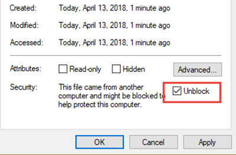

# Prerequisites for making Planner changes in Windows PowerShell

This procedure walks you through downloading the files needed to run Planner admin commands in PowerShell.

If you're new to Windows PowerShell, see [Getting started with Windows PowerShell](/powershell/scripting/learn/ps101/01-getting-started).

## Download Planner Tenant Admin PowerShell Commands

> [!NOTE]
> You must be a global admin to run the Planner Tenant Admin Powershell Commands.

> [!NOTE]
> By downloading this package, you agree to the enclosed license and terms.

Download the [Planner Tenant Admin PowerShell file](https://download.microsoft.com/download/5/9/0/590552d6-d8d0-4e12-9c55-21738e2c8143/planner-tenant-admin.zip). Unzip it to a location you can access from PowerShell.
## Unblock your files

You'll need to "unblock" two of the files you downloaded in the Planner Tenant Admin PowerShell package in order to user them in PowerShell. This is because by default, executing scripts downloaded from the Internet isn't allowed. The files you need to unblock are:

- plannertenantadmin.psm1
- microsoft.identity.client.dll

Do the following to unblock these files:

1. In File Explorer, go to the location in which you unzipped your files.
2. Right-click on one of the unzipped files noted above, and select Properties.
3. On the General tab, select **Unblock**.

     

4. Select **OK**.

5. Repeat these steps for the remaining two files.

## Load the Planner Tenant Admin PowerShell module

After unblocking your files, do the following to load the Planner Tenant Admin PowerShell module:

1. Start Windows PowerShell. In PowerShell, type the following to enable running scripts downloaded from the internet for this session only. It might prompt you to confirm by typing "Y."

   ```PowerShell
   Set-ExecutionPolicy -ExecutionPolicy Unrestricted -Scope Process
   ```

2. Type the following to run the PlannerTenantAdmin PowerShell script. This will import a module with all available cmdlets.

   ```PowerShell
   Import-module "<location of the plannertenantadmin.psm1 file you unzipped>"
   ```

   For example, if your file is stored in C:\AdminScript, you would type:

   ```PowerShell
   Import-module "C:\AdminScript\PlannerTenantAdmin.psm1"
   ```
   
Now you're ready to make changes to Planner at the organizational level using PowerShell.
