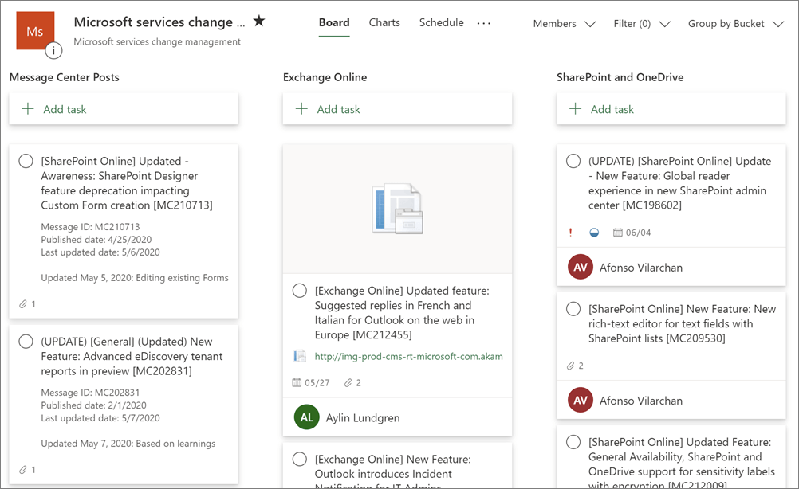
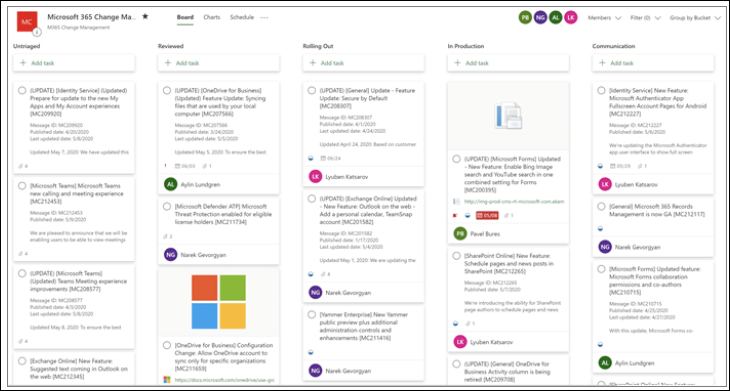
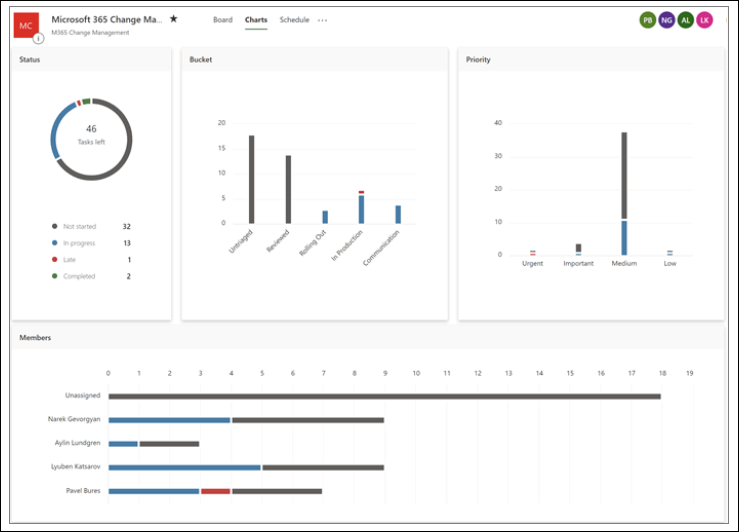
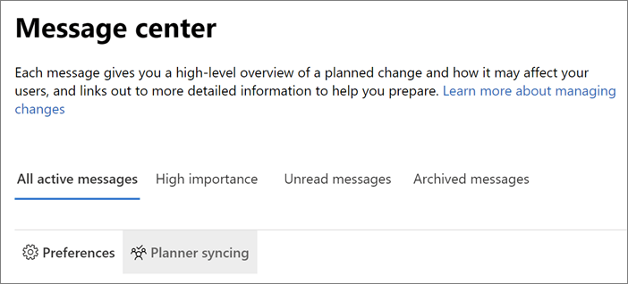
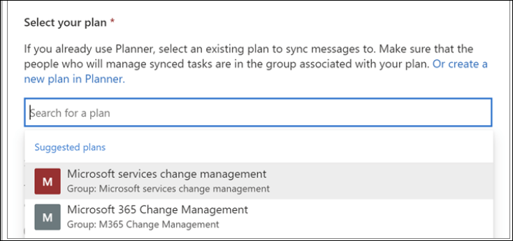
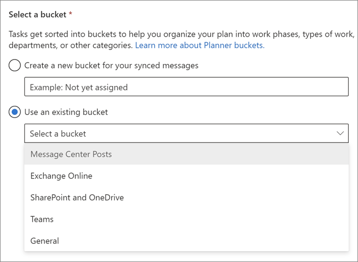
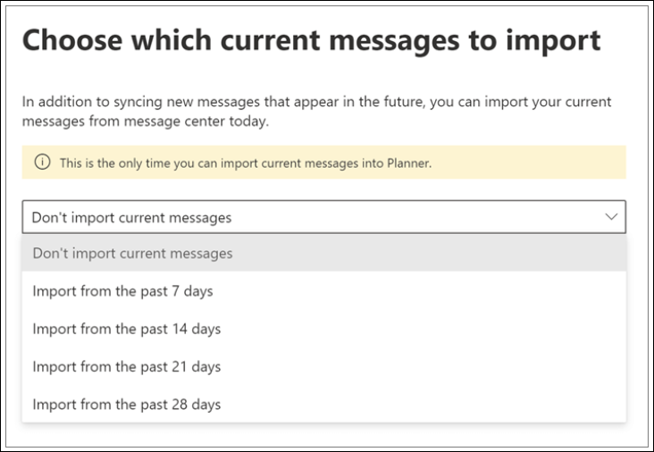
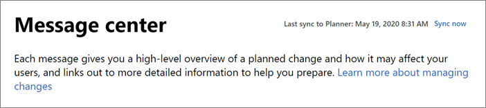

# Track your message center tasks in Planner

> [!VIDEO https://www.microsoft.com/videoplayer/embed/RE4C7Ne]

A lot of actionable information about changes to Microsoft 365 services arrives in the Microsoft 365 message center. It can be hard to keep track of which changes require tasks to be done, when, and by whom, and to track each task to completion. You also might want to make a note of something and tag it to check on later. You can do these things and more when you sync your messages from the Microsoft 365 admin center to Microsoft Planner. This article describes how.

- [How you can use Planner to track your message center tasks](#how-you-can-use-planner-to-track-your-message-center-tasks)  
- [Turn on Planner syncing](#turn-on-planner-syncing)

## How you can use Planner to track your message center tasks

Message center posts will sync to one plan in Planner, and into one bucket of that plan. You can customize this plan however you like; before you turn on Planner syncing, you might want to figure out how you'll be using Planner so you will know which messages you want to sync, and how. If you’re unfamiliar with Planner, watch [Organize your team’s tasks in Planner](https://support.office.com/article/video-organize-your-team-s-tasks-in-microsoft-planner-c931a8a8-0cbb-4410-b66e-ae13233135fb), see the [Planner Quick Start](https://support.office.com/article/sign-in-to-microsoft-planner-fe43c972-5a95-4071-86d4-423a64a3b21e), or browse [Planner help](https://support.office.com/planner).

Based on what we've heard from customers, here are some suggestions about how to organize your plan:

- Sort by service
- Sort by workflow

### Organize your plan by service

If you often assign and track message center tasks by the service or app they’re related to, you might want to organize your plan by service. In this design, you’d create a bucket called “Message Center Posts” for messages to sync into and become tasks. You’ll also create a bucket for each service. For example, the buckets could be named "Exchange Online", "SharePoint and OneDrive", "Teams", and "General". You and other members of the plan can move tasks from Message Center Posts to the relevant column, and then assign them, give them due dates, add checklists, add attachments, and otherwise track their progress.

### Organize your plan by workflow

If you often track message center tasks by what needs to be done in a sequence, you might want to organize your plan by workflow. In this design, you’d create a bucket called “Untriaged” for messages to sync into and become tasks. You’d also create a bucket for each step in the workflow, such as "Reviewed", "Rolling Out", "In Production", and "Communication". You and other members of the plan can meet periodically to triage and assign tasks, and to set task status.

### Check your status using Charts

As you build your plan, you can always see a visual report of status using Charts view in Planner. It shows assignments, priority, and progress, letting you know at a glance how you’re doing.

## Turn on Planner syncing

1. Go to the [admin center](https://admin.microsoft.com).

2. Go to **Show all** > **Health** > **Message center**. Then, right above your messages list, select **Planner syncing**.

    

2. In the **Planner syncing** pane, select **Set up syncing**.

3. Under **Select your plan**, select either:

    - **Search for a plan**, then enter a name or select a plan from the list.

        

    -  **Or create a new plan in Planner**, a link that opens Planner. There you can [create a new plan](https://support.microsoft.com/en-us/office/create-a-plan-in-microsoft-planner-93e65b03-6fac-4661-a502-e3161475ab93), and then return to the message center and search for that plan.

    >[!NOTE]
    >You can only sync your message center with one Planner plan.

4. Under **Select a bucket**, either create a new bucket or select an existing one, and then select **Next**.

    [Buckets](https://support.microsoft.com/en-us/office/create-buckets-to-sort-your-tasks-238af119-3c2b-4cbb-a124-29da99488139) are column-like categories in Planner. After you’ve turned on Planner syncing, each message becomes a task in the bucket you select here.

    

    >[!NOTE]
    >- You can only select one bucket to sync to, but you can turn Planner syncing off and on again to change which bucket you’re syncing to. 
    >- You can easily change the bucket name at any time in Planner.

5. Under **Choose which messages to sync**:

    - Select either **All updates** or **Only major updates**. For each, you can still exclude updates from specific categories, products, and services using check boxes on this page.
    - Decide which categories, products, and services you want to sync by selecting or clearing check boxes in the **Include messages in these categories** and **Include messages about these products or services** lists.
    - Select **Next**.

6. Under **Choose which current messages to import**, you can decide whether you want to import messages from your current message center. You can select **Don't import current messages** or or an option to import from the past 7, 14, 21, or 28 days.

    >[!IMPORTANT]
    >After you start syncing to Planner, you can’t import messages again unless you turn off Planner syncing, then turn it on again, and go through setup another time.

    

7. On the **Review and finish** page, make sure the information is correct, and then select **Finish**.

8. On the **Planner syncing is all set up** page:

    - If you want to sync to Planner on a schedule, do the following:

        - Under **Set up automatic syncing**, choose the sync start date and time, and how often you want to sync (for example, every day or every 2 weeks).

        - Select **Create flow with Power Automate**.

        - Under **Create a flow**, select **Continue**, choose the plus sign (**+**) to sign in if necessary, and then select **Create flow**.

    - If you want to sync manually, there's no setup needed. Whenever you want to sync the latest posts, go to the message center and, at the top of the page, select **Sync now**.

        

9. To get started organizing, assigning, and taking notes, select the **View your plan in Planner** link.

If you want to turn off Planner syncing, go to the message center and select **Planner syncing**, and then **Stop syncing**.

