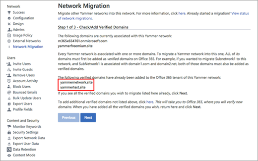
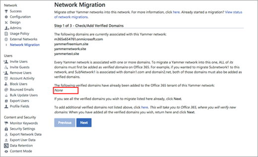

# FAQ: Consolidating multiple Yammer networks

Here are answers to frequently asked questions about consolidating multiple Yammer networks. This article only applies to you if you have multiple email domains in your Office 365 tenant and those email domains are spread across two or more Yammer networks. This consolidation does not apply to external networks.

**Q: How do I know if I have multiple Yammer networks associated with one tenant?**

A: As a Yammer network admin, click the Yammer Settings icon , and then click **Network Migration**.

You’ll see two lists of domains. If you see domains on the bottom list, then you have multiple Yammer networks and you must consolidate all of them until all the domains show in the list on the top.

Here's what the network migration page looks like when you need to consolidate Yammer networks.

Here's what the network migration page looks like if you don't need to consolidate Yammer networks.

**Q: How do I consolidate my Yammer networks?**

A: For steps to consolidate your networks, see [Network migration - Consolidate multiple Yammer networks](consolidate-multiple-yammer-networks.md).

> [!IMPORTANT]
> We strongly encourage you to be proactive and consolidate the networks yourself.

When networks are consolidated, only users are migrated. Groups and data from the secondary networks are not migrated. When you consolidate your networks yourself, you can make sure you pick the right primary network. If you wait for Yammer to automatically consolidate the networks, the primary network selected may not be the one you wanted to have as the primary one. Consolidating your own networks also gives you the chance to export data from the secondary networks.

**Q: Why is Yammer asking customers to do this?**  

A: Yammer is committed to building a more tightly integrated social experience within the Office 365 suite, and we can only accomplish this if we define the organizational boundaries the same way that the Office 365 suite does.

By doing the consolidation yourself you get to choose your primary network, and you can export data from secondary networks.

**Q: What benefits do I get after consolidating my networks?**  

A: There are both short-term and long term benefits:

- Immediate benefits for admins:

    - Reduce Yammer administration cost: admins can manage one single Yammer service, rather than managing multiple Yammer networks.

    - Seamlessly manage Yammer from Office 365: admins can manage the Yammer service from Office 365 in the same way they currently manage other Office 365 services. For example, admins can manage the lifecycle of all Yammer users and domains centrally in Office 365.

    - Suite connected groups: by integrating tightly with the Microsoft 365 suite, a new group created in Yammer can be a Micorosoft 365 group. Therefore, features such as dynamic group membership will now be available to admins. Note that you need to [Enforce office 365 identity](../configure-your-yammer-network/enforce-office-365-identity.md) for Yammer users in order to use connected groups.

- Immediate benefits for end users

    - Yammer-Microsoft 365 groups integration: If connected groups are set up, users can create a group once and see it across the other tools in the suite. Users can manage permissions in one of the tools and have these permissions be replicated across the other apps. Users will also navigate easier from Yammer to the other tools through direct links that take you to the specific group folder or environment in the other Office 365 applications.

- Additional benefits

    - Document management through SharePoint. For more information, see the [Microsoft 365 roadmap](https://go.microsoft.com/fwlink/p/?LinkId=509914).

    - Live events: Yammer is delivering a new live event experience for leaders to host live events that includes video and discussion before, during, and after the event. For more information, see [Live events in Yammer](../manage-yammer-groups/yammer-live-events.md).

**Q: What will end users experience during and after the consolidation process?**  

A: The actual technical process of consolidating Yammer networks takes minutes, so there won’t be any down time.

- **Users from secondary networks**: After the process is completed users from the secondary networks will log in and land in the primary network. When users from a secondary network land in the primary network, they’ll use the same user name, and their profile data will be exactly the same as it was in the secondary network. However, these users won’t find their existing groups or messages in the primary network, and they any following relationships that were established in the secondary network are not preserved.

    Because users from the secondary networks will land in an existing, active Yammer network that is not the one they are used to seeing, we suggest that the admins manage these users’ expectations so that they are aware of why they are landing in a different, existing network, and that their previous content and groups have not been migrated. Sample notification text can be found in [Network migration - Consolidate multiple Yammer networks](consolidate-multiple-yammer-networks.md).

- **Users from the primary network**: Users from the primary network will not see any changes to their network other than seeing new users that are now part of the same Yammer network.

**Q: How can I keep groups of employees segmented?**

A: We understand that some organizations might have a variety of business and legal reasons to keep groups of employees segmented. Here are three alternative ways to segment Yammer audiences.

- Create private groups. All messages shared in private groups will only be available to the members of that group. The group admin can decide who the members of the group are. For more information, see [Create a group in Yammer](https://support.office.com/article/create-a-group-in-yammer-b407af4f-9a58-4b12-b43e-afbb1b07c889).

- Office 365 admins can remove Yammer licenses from specific users. For example they can remove licenses from all users whose email address uses the ‘contoso.com’ domain. Yammer admins can then choose to enforce licenses in Yammer. Any user that doesn’t have a Yammer license won’t be able to access Yammer. For more information, see [Manage Yammer user licenses in Office 365](../manage-yammer-users/manage-yammer-licenses-in-office-365.md).

- Organizations can decide to define organizational boundaries by splitting their Office 365 tenant into two or more separate tenants.

**Q: What if I need to move data from the secondary Yammer networks to the primary Yammer network?**  

A: Yammer doesn’t offer this functionality. We only offer the option to export all of one network’s data into a zip folder. Instructions for exporting data can be found in [Export data from Yammer Enterprise](../manage-security-and-compliance/export-yammer-enterprise-data.md).

There are Microsoft partners that can help you move data. If you’re interested, please reach out to your Microsoft Account Team, or [contact a partner](https://products.office.com/yammer/partners).  

**Q: How can I become the administrator of a secondary network so that I can review and export content?**

A: If you're not already a verified admin of the secondary network:

1. Create a temporary Office 365 account in the secondary domain. For more information, see [Add a user](https://support.office.com/article/add-users-individually-or-in-bulk-to-office-365-admin-help-1970f7d6-03b5-442f-b385-5880b9c256ec).

2. Make this account a Global Admin. This makes the account a Verified Admin in Yammer. It takes a while to sync. For more information, see [Assign admin roles in Office 365](https://support.office.com/article/Assign-admin-roles-in-Office-365-for-business-eac4d046-1afd-4f1a-85fc-8219c79e1504).

3. Log into Yammer using the temporary account.
  
4. Perform a network export or other admin activities such as exporting group members.

**Q: What happens when you add a domain to your Office 365 tenant associated with a Yammer Basic network?**

A: In Yammer, having multiple primary networks is not supported. If you add an [external domain with a Yammer Basic network](add-basic-domains-to-office-365.md) (“Basic network”) to your Office 365 tenant, we must disassociate the domain from the basic network in order to associate the domain with the primary network for your O365 tenant. The basic network is then queued for deletion.
  
## Related articles

[Consolidate multiple Yammer networks](consolidate-multiple-yammer-networks.md)
