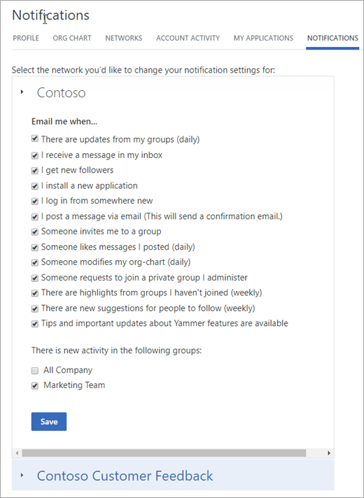

# Configure email and Yammer

Yammer is connected to email in several ways: Yammer alerts users to new activity in conversations they follow by email, and users can subscribe to groups in email and post to conversations and groups by email. To make this work smoothly in your organization:
  
- Email admins are responsible for setting up email correctly.

- Yammer admins can customize the logo in email messages Yammer sends, and can require verification before users can post to Yammer by email.

- Users can choose the types of notifications they receive.

For information about when email notifications are sent, see [Yammer email and push notifications](https://support.office.com/article/93e530e0-189f-4768-8f28-7683d48cc996).
  
## Initial setup: Follow Office 365 email best practices

Follow the mail flow guidelines in [Security best practices for Office 365](/microsoft-365/admin/security-and-compliance/secure-your-business-data). If these configurations are not in place, users may be required to take additional steps to verify every message sent to Yammer by email.
  
> [!NOTE]
> These email setting changes must be done by your internal email administrator. Yammer admins and support can't help configure your mail systems.
  
- See [Office 365 URLs and IP address ranges](https://support.office.com/article/8548a211-3fe7-47cb-abb1-355ea5aa88a2) to find information about URL and IP Safe Recipients lists for [Office 365 URLs and IP address ranges](https://support.office.com/article/8548a211-3fe7-47cb-abb1-355ea5aa88a2#BKMK_Yammer).

- When using Yammer through an email client, it is recommended that SPF and/or DKIM is configured within your email system. For instructions, see:

  - [Use DKIM to validate email sent from your domain in Office 365](/microsoft-365/security/office-365-security/use-dkim-to-validate-outbound-email)

  - [Set up SPF in Office 365 to help prevent spoofing](/microsoft-365/security/office-365-security/set-up-spf-in-office-365-to-help-prevent-spoofing)

## Email settings admins control

Admins control the following settings:
  
- The logo on emails that Yammer sends to users. For more information, see [Customize the look of your Yammer network](customize-the-look-of-yammer.md).

- Whether all users have to confirm messages posted by email. For more information, see [Configure your Yammer network](configure-yammer.md).

## Email settings users control

Users control what email notifications they receive.
  
Users can go to Yammer settings  \> **Edit settings** \> **Notifications** and select which notifications to receive.
  

  
For more information, see [Yammer email and push notifications](https://support.office.com/article/93e530e0-189f-4768-8f28-7683d48cc996).