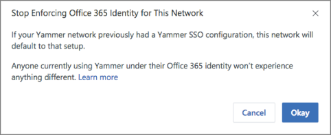

# Enforce Office 365 identity for Yammer users

As Yammer becomes a core service for your organization, you'll want users to be able to log into it seamlessly, just like any other Office 365 service. Additionally, you'll probably want to maintain a single identity for all Office 365 users for easier user management. You can achieve both of these goals by enforcing Office 365 identity in Yammer. By enforcing Office 365 identity in Yammer and configuring [password hash sync](/azure/active-directory/hybrid/how-to-connect-password-hash-synchronization), [pass-through authentication](/azure/active-directory/hybrid/how-to-connect-pta), or [Understanding Office 365 identity and Azure Active Directory](https://support.office.com/article/06a189e7-5ec6-4af2-94bf-a22ea225a7a9#BK_Federated) for Office 365, admins can achieve single sign-on (SSO) capabilities for all services in Office 365, including Yammer. 
  
## How enforcing Office 365 identities in Yammer works

The following flowchart shows what happens when a user logs in to Yammer.
  

  
Below is the user's login experience when Office 365 identity is and is not enforced for Yammer:
  
1. A user tries to login to Yammer, and is presented with a login dialog box.
    
2. The user enters his or her email address.
    
3. When Office 365 identity is enforced, the user is prompted to login with his/her Office 365 identity. If the customer has implemented the federated identity model in Office 365, the user will log in with single-sign-on.
    
4. When Office 365 identity is not enforced (this is the default setting), if there is an Office 365 account corresponding to the user's email address, the user is prompted to log in with his or her Office 365 identity.
    
5. When Office 365 identity is not enforced (this is the default setting), if there is no Office 365 account corresponding to the user's email address, the user is prompted to log in with his or her Yammer identity (email and password)
    
The following table compares the user login behavior when Office 365 Identity is enforced or not enforced. Note that Office 365 identity is not enforced by default. 
  
| Is Office 365 identity enforced? | Is there an Office 365 account for that user's email address? | What happens when the user logs in: |
|:-----|:-----|:-----|
|Yes    |Yes    |The user is prompted to log in with his or her Office 365 identity.    |
|No    |Yes    |The user is prompted to log in with his or her Office 365 identity.    |
|No    |No    |The user is prompted to login with his or her Yammer identity (email and password).    |
   

## Start enforcing Office 365 identity in Yammer

It takes just a few steps to start enforcing Office 365 identities in Yammer. However, turning this setting on can accidentally disrupt users' access to Yammer. So before you begin, do the following to make sure your Yammer users can continue working smoothly:
  
- **Make sure all current Yammer users have a corresponding Office 365 identity.** When you enforce Office 365 identities for Yammer, any user without a corresponding Office 365 identity will be locked out of Yammer. So before you begin, make sure that all of your current Yammer users have corresponding Office 365 identities. One method to check this is to go to the **Export Users** page in Yammer and export all users. Then compare that list to the list of users in Office 365 and make any changes required. 
    
- **Tell your users about this change.** We strongly recommend that you tell users that you are switching to enforce Office 365 identities, because it can disrupt their day to day usage of Yammer. We have provided a sample email you can use in the settings below. 
    
You must be a global administrator on Office 365 who was synchronized to Yammer as a Verified Admin to perform these steps. To check if your account was synchronized, you can go to the **Network Admin** page on Yammer and check the **Admins** section. Global administrators will sync to Yammer only if their user principal name (UPN) in Office 365 matches a domain on Yammer. The following screenshot shows what a synced admin looks like on the Admins page in Yammer. 
  

  
 If you are ready to enforce Office 365 identity in Yammer, follow the steps below. 
  
 **To start enforcing Office 365 identity in Yammer**
  
1. In Yammer, go to the **Network Admin** section, and choose **Security Settings**.
    
2. In the Security Settings page, go to the **Office 365 Identity Enforcement** section and select **Enforce Office 365 identity**. 
    
    You must be both a Yammer verified administrator and a global administrator to see this section. 
    
    
  
3. You see a confirmation message that asks you to select the most appropriate level of enforcement: 
    
   - **Committed Enforcement**:  Choose this option if all of your Yammer users already have an Azure Active Directory (AAD) account. 
    
     > [!IMPORTANT]
     > Once you save this change, you won't be able to undo it, and your users won't be able to log in using their Yammer usernames and passwords anymore. 
  
   - **Temporary 7-Day Enforcement**: Choose this option if you're testing the enforcement of Office 365 identity on your network, and may need to revert it back. Once you save this change, a temporary enforcement period of seven days will begin, and your users won't be able to log in using their Yammer usernames and passwords anymore. After seven days, your network will automatically be committed to Office 365 Identity enforcement.
    
     
  
4. If you want, you can automatically log out all current users, so that you can be sure that everyone using the Yammer service has logged in with their Office 365 identities. If you want to do this, select the Log out all users checkbox. If you choose to do this, we recommend that you communicate this change to your users by using the following sample email.
    
   *Subject Line: [Action Required] Log back in to Yammer* 
    
   *Hi,* 
    
   *This email is to let you know that [ORGANIZATION'S NAME] is making changes to the way we all access Yammer. If you're currently working on Yammer, then we may temporarily interrupt you by logging you out. It's necessary for us to securely set up Office 365 sign-in for Yammer.* 
    
   *You can resume your work immediately by logging in to Yammer using your Office 365 username and password.*
    
   *We've made this change so that you can access all of Office 365 with a single identity. If you're unable to log in using your Office 365 username and password, please let your network administrator know.* 
    
   *Thank You,* 
    
   *[SIGNATURE]* 
    
5. If you are ready to start enforcing this setting, select **Okay**. This returns you to the Security Settings page where the **Enforce Office 365 identity in Yammer** checkbox is now selected. 
    
   > [!NOTE]
   > You can also select [Start blocking users who don't have Yammer licenses](../manage-yammer-users/manage-yammer-licenses-in-office-365.md#StartBlocking) to ensure that only users with Yammer licenses can login to Yammer. 
  
6. Choose **Save** to save all your settings on the page. 
    
   If you don't choose **Save** but instead navigate away from the page, your settings will not take effect. 
    
## Stop enforcing Office 365 identity in Yammer

> [!IMPORTANT]
> You can only stop enforcing Office 365 identities in Yammer when you are in the temporary 7-day enforcement period. 
  
When you stop enforcing Office 365 identities in Yammer:
  
- Any users who were already logging into Yammer with their Office 365 identities will be unaffected by this change.
    
- Other users can join your network by signing up with their work email and verifying it.
    
If you no longer want to enforce Office 365 identities, you can follow the steps below to stop. You must be both a Yammer verified admin and a global administrator to perform these steps.
  
**To stop enforcing Office 365 identity in Yammer**
  
1. In Yammer, go to the **Network Admin** section, and choose **Security Settings**.
    
2. In the Security Settings page, go to the **Office 365 Identity Enforcement** section and clear the **Enforce Office 365 identity** checkbox. 
    
   You see a confirmation message so you can verify that you are ready to stop enforcing Office 365 identity.
    
   
  
3. Select **Okay** to confirm your choice. 
    
   This returns you to the Security Settings page where the **Enforce Office 365 identity in Yammer** checkbox is now cleared. 
    
4. Choose **Save** to save all your settings on the page. 
    
   If you don't choose **Save** but instead navigate away from the page, your settings will not take effect. 
    
## FAQ

### Q: Once Office 365 Identity Enforcement is set to 'Committed Enforcement', why can't I revert it back?

A: Once your organization has committed to enforcing Office 365 identity and has one Office 365 tenant associated with a single Yammer network, connected groups will be enabled for this network.. In this configuration, whenever a group is created in Yammer,  a connected Microsoft 365 group is also created, and users can take advantage of tools like SharePoint, Planner and OneNote connected to the group. At this point, reverting the **Enforce Office 365 Identity** setting will be disruptive to the user experience, since users who login with their user names and passwords cannot access these connected resources any more.
  
### Q: How will this change impact guest and external users?

A: Guests and external users will continue to follow the login settings and requirements of their home network, and will be unaffected. 
  
### Q: How long does it take for this setting to be applied?

A: Enforce Office 365 Identity is applied immediately after the setting is set.
  
### Q: We use the same ADFS configuration in Yammer and Office 365. Should we log users out during the transition?

A: Yes. Logout ensures all users logged in after that are connected to their Office 365 identity, which connects users for user lifecycle management from Office 365 and also provides a consistent experience for them, with things like Office 365 suite navigation.
  
### Q: What is the experience for users being logged-out when enforcing Office 365 identities?

A: Users will be logged out of their web and mobile sessions immediately and will be required to login in all their devices and browser sessions again, this time using their Office 365 identity configuration and credentials.
  
### Q: How can I audit and clean up Yammer users when compared to Office 365 and Azure AD?

A: You can audit Yammer users in networks connected to Office 365 and take appropriate actions based on it. See more information and examples in [How to audit Yammer users in networks connected to Office 365](../manage-yammer-users/audit-users-connected-to-office-365.md).
