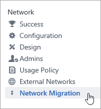
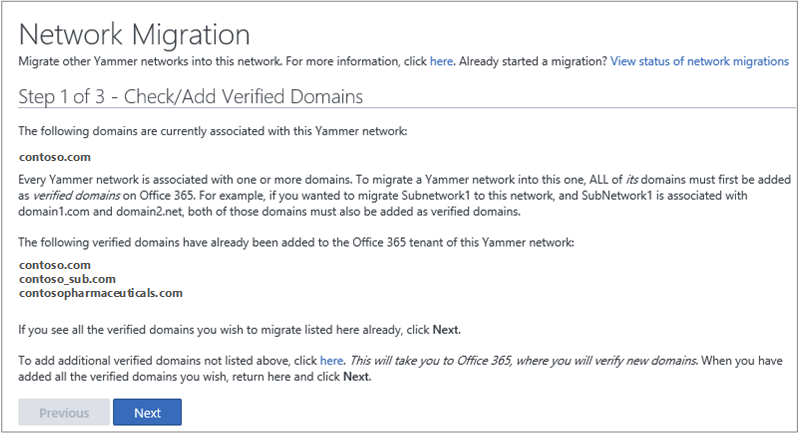
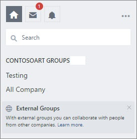

# Manage Yammer domains in Office 365

As the Office 365 administrator, you manage Yammer domains in Office 365 from the **Domains** link in the Microsoft 365 admin center. When you add or remove a domain in Office 365, it will be automatically added to or removed from the corresponding Yammer network, usually within minutes.
  
- If you just have one domain, or don't have a legacy Yammer network from before you started using Office 365, once your domain is set up in Office 365, your Yammer network is automatically created.

- If you have multiple domains but no legacy Yammer networks, setting up your domains in Office 365 is straightforward. Users in all domains you add to Office 365 can use your Yammer network.

- It gets a little more complicated when you have a legacy Yammer network associated with one or more of your domains.

## Initial setup for your primary Yammer domain

Once your domain is set up in Office 365, your Yammer network is automatically created. Your Yammer primary domain is based on the first custom domain name added to Office 365. So if your custom domain is contoso.com, you can access your Yammer network at [https://www.yammer.com/contoso.com](https://www.yammer.com/contoso.com). If you do not have a custom domain name in Office 365, your Yammer network will be created using your .onmicrosoft.com domain.

## Add an additional domain to Yammer

1. To add an additional domain to Yammer, add the domain in Office 365 by following the directions in [Add a domain to Office 365](https://support.office.com/article/6383f56d-3d09-4dcb-9b41-b5f5a5efd611). You must be a global administrator on Office 365 who was synchronized to Yammer as a verified admin to perform these steps.

    For example, say you have an Office 365 subscription that uses the domain contoso.com, and a corresponding Yammer network. If you add a domain contosopharmaceuticals.com to your Office 365 tenant, that domain will be automatically added to Yammer. After this, a new user of that domain, such as ryani@contosopharmaceuticals.com, can log in to Yammer seamlessly with Office 365 credentials.

2. Verify that the domain you added in Office 365 has been added to Yammer.  
  
    a. In Yammer, select the Yammer settings icon  in the left nav, and then click **Network Admin**.

    
  
    b. In the **Network** section choose **Network Migration**.

    
  
    c. In the **Step 1 of 3 - Check/Add Verified Domains** page, you'll see the list of domains on the Yammer network.

    
  
## Remove a domain from Yammer

When you remove a domain from Office 365, the domain is immediately removed from Yammer. This means everyone with email addresses on the domain you remove will no longer be able to access your Yammer network.

For instructions, follow the steps in [Remove a domain from Office 365](https://support.office.com/article/Remove-a-domain-from-Office-365-f09696b2-8c29-4588-a08b-b333da19810c).

If instead you want to consolidate multiple domains into one Yammer network, see [Consolidate multiple Yammer networks](./consolidate-multiple-yammer-networks.md) and [FAQ: Consolidating multiple Yammer networks](./faq-consolidate-multiple-yammer-networks.md).

## Change the network name displayed in the left navigation in Yammer

To change the displayed network name shown below, change the **name** in the Office 365 Organization profile. This overrides the **Network Name** set in the Yammer Network admin. For steps, see [Change your organization's address, technical contact, and more](https://support.office.com/article/Change-your-organization-s-address-technical-contact-and-more-a36e5a52-4df2-479e-bb97-9e67b8483e10).

   
  
## Change the Yammer primary domain

If you have just one domain in Office 365, when the default domain changes in Office 365 to a verified domain, the primary domain of the corresponding Yammer network is updated.

   >[!NOTE]
   >If you change the primary domain in O365 to the .onmicrosoft.com domain, Yammer will not update the primary domain to the .onmicrosoft.com domain. Automatic domain updates in Yammer are only for non .onmicrosoft.com domains.

## Change the Yammer primary domain when you use a federated domain as your Office 365 default domain

Contact Yammer support to help you do this domain setup.

## If your Yammer network has domains not verified on the Office 365 tenant

If your Yammer network has domains that are not verified on the corresponding Office 365 tenant, you can't manage your domains from Office 365. For example:
  
- Verified domains on the Office 365 tenant: contoso.onmicrosoft.com, contoso.com, northwind.com

- Domains on the corresponding Yammer network: contoso.com, tailspin.com

Note that tailspin.com on the Yammer network is not verified on the Office 365 tenant. If your network is in this situation, you can remedy the situation so that you can manage the domains from Office 365. To do this, you have two options. You can either:
  
1. Add and verify the missing domains to the Office 365 tenant. In the example above, you would add tailspin.com to the Office 365 tenant.

2. Remove the additional domain in Yammer. To remove Yammer domains from your network, contact the Yammer support team. In the example above, you would remove tailspin.com

After you take one of the actions above, the rest of the domains (contoso.onmicrosoft.com, northwind.com) will be added to Yammer, and from this point on, you can manage your domains across their lifecycle in Office 365.
  
> [!TIP]
> To ensure that you don't miss this step, all Yammer verified administrators will receive an email notification if the list of domains on Yammer is out of sync with the list on Office 365.
  
## If your Office 365 tenant is associated with more than one Yammer network

These additional networks could be free Yammer Basic networks created by employees of your company. For example:
  
- Verified domains on the Office 365 tenant: contoso.onmicrosoft.com, contoso.com, northwind.com

- Domain on Yammer network1: contoso.com

- Domain on Yammer network2: northwind.com

This configuration is no longer supported as of October 16, 2018. For more information, see [Consolidate multiple Yammer networks](./consolidate-multiple-yammer-networks.md) and [FAQ: Consolidating multiple Yammer networks](./faq-consolidate-multiple-yammer-networks.md).

Beginning December 2019, if you add an [external domain with a Yammer Basic network](add-basic-domains-to-office-365.md) (“Basic network”) to your Office 365 tenant, we must disassociate the domain from the basic network in order to associate the domain with the primary network for your O365 tenant. The basic network is then queued for deletion.

## If you have more than one Office 365 tenant associated with one Yammer network

This configuration is not supported. For more information, see [About Yammer networks and Office 365 tenants](yammer-and-office-365.md).

For example:
  
- Verified domains on the Office 365 tenant1: contoso.onmicrosoft.com, contoso.com

- Verified domains on the Office 365 tenant2: northwind.onmicrosoft.com, northwind.com

- Domains on Yammer network: contoso.com, northwind.com
