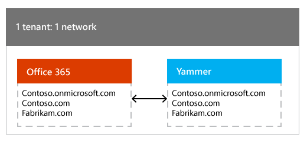

# About Yammer networks and Office 365 tenants

Beginning December 2019, we are changing what happens when a domain associated with a basic (free) Yammer network is added to your Office 365 tenant. We will start with a gradual roll out and complete the process by the end of the year.

For the best end-user and management experience, it is required that one Office 365 tenant is associated with just one Yammer network. If you are not in this configuration, we recommend you [consolidate previously migrated basic networks](consolidate-multiple-yammer-networks.md) into a single primary network for your tenant in order to move Yammer into a supported state for your tenant.
  
> [!NOTE]
> Have you recently received a communication from Yammer stating that your Office 365 tenant is associated with two or more Yammer networks? If you are wondering what that means, read this article for context, and the more detailed [blog post from Yammer support](https://askyammer.github.io/post/2016-04-15-your-office365-tenant-is-associated-with-two-or-more-canonical-home-yammer-networks/) for information about what actions you can take.
  
## The changing role of Yammer network

A Yammer network represents people who are part of the same organization, and work together closely. A Yammer network acts as an organizational boundary and as a management entity. As Yammer becomes an integral part of Office 365, Yammer uses the associated Office 365 tenant as the organizational boundary and for managing key functions.
  
 **Yammer network as an organizational boundary** Only users who are part of the same organization can join the network, which provides trust between members of the network, so they can collaborate freely. As Yammer becomes an integral part of Office 365, the organizational boundary for Yammer and Office 365 become the same; all Office 365 users who are part of the same Office 365 tenant (with a Yammer subscription), can access Yammer. And when the organization grows, and say, a new domain is added to the Office 365 tenant, that domain is automatically synchronized to Yammer, enabling users of that domain to readily access Yammer.
  
 **Yammer network as a management entity** All aspects of the Yammer service used to be managed at the network level, including identity, domain and user management. As Yammer becomes an integral part of Office 365, key aspects of the Yammer service are managed in Office 365, including identity, domain, user and license management. This provides one common and powerful set of tools for Office 365 administrators to manage all Office 365 services, including Yammer. We recommend that Yammer Administrators only manage Yammer specific configurations (such as notification defaults or External network settings) at the network level.
  
## How Yammer networks can be associated with Office 365 tenants

Several customers adopted Yammer before it was closely integrated with Office 365, which resulted in the following configurations.
  
### One Office 365 tenant associated with one Yammer network (1 tenant:1 network)

In this scenario, your Office 365 tenant is associated with a single Yammer network. For example:
  
- **Verified domains on the Office 365 tenant:** contoso.onmicrosoft.com, contoso.com, fabrikam.com

- **Domains on Yammer network:** contoso.onmicrosoft.com, contoso.com, fabrikam.com

The following illustration shows this relationship of one Office 365 tenant associated with one Yammer network:
  

  
How customers get into this configuration: Since Yammer is on by default in Office 365, whenever a new Office 365 tenant is created, a new Yammer network is automatically created, and the domains from Office 365 are added to Yammer. Also, as part of Yammer activation waves, we are activating Yammer for all tenants with an Office 365 Yammer Enterprise subscription. Whenever domains are added to or removed from the Office 365 tenant, the domains continue to be synchronized with the Yammer network.
  
This is the most common configuration, and is the recommended configuration. Below is the list of key benefits of this configuration.
  
- **Reduce Yammer administration cost:** You can manage one single Yammer service, rather than managing individual Yammer networks.

- **Seamlessly manage Yammer from Office 365:** You can manage the Yammer service seamlessly from Office 365, similar to how you would manage other Office 365 services. For example, you can manage the lifecycle of all Yammer users centrally in Office 365, and you can manage the lifecycle of Yammer domains from Office 365.

- **Reduce information silos in your organization:** Having a consolidated Yammer service that is shared by all your users, empowers them to connect and work with everyone in your organization.

Below is the list of key capabilities related to managing Yammer in Office 365 that are supported in this configuration.
  
|**Capability**|**Support in 1 tenant: 1 network configuration**|
|:-----|:-----|
|Login    |Yes    |
|Single sign on    |Yes    |
|User lifecycle management    |Yes    |
|Administrator lifecycle management    |Yes    |
|License management    |Yes    |
|Domain lifecycle management    |Yes    |
|Consolidating free Yammer basic networks    |Yes    |
|Future Yammer-Office 365 Groups Integration    |Yes    |
|Other future Yammer-Office 365 integrations    |Yes    |

 **Yammer-Office 365 groups integration:** Office 365 connected groups are only available to customers in the 1 tenant: 1 network configuration.
  
 **Future Yammer-Office 365 integrations:** In the future, we may introduce other Yammer-Office 365 integration features. These features will be available to customers in the 1 tenant: 1 network configuration.
  
For information about managing your tenant in this configuration, see [Manage Yammer domains across their lifecycle in Office 365](manage-yammer-domains.md).
  
### One Office 365 tenant associated with many Yammer networks (1 tenant: many networks)

In this scenario, your Office 365 tenant associated with two or more Yammer networks. For example:
  
- **Verified domains on the Office 365 tenant:** contoso.onmicrosoft.com, contoso.com, fabrikam.com

- **Domains on Yammer network1:** contoso.onmicrosoft.com, contoso.com

- **Domains on Yammer network2:** fabrikam.com

The following illustration shows this relationship of one Office 365 tenant associated with many Yammer networks:
  

  
How customers get into this configuration: Typically, large customers find themselves in this scenario. A large organization (contoso.com) could have several subsidiaries (say fabrikam.com is one of them). While the organization itself has an official Office 365 tenant and an official Yammer network (contoso.com network), users in the subsidiary companies may have independently signed up for their own Yammer networks with their email domains (fabrikam.com network). For really large companies, this could be tens of Yammer networks, and most of these subsidiary networks are lightly used or just not used - probably because they are separate from the more active larger network. We require that the organization consolidate these smaller networks into the larger parent network by performing [network migration](consolidate-multiple-yammer-networks.md). Once consolidated, the organization can enjoy the key benefits listed above for organizations in the 1 tenant: 1 network configuration.
  
Even after consolidation, you may be in a situation where due to strong business reasons, one Office 365 tenant may need to connect with a few Yammer networks. **This is not a supported configuration. Until you consolidate, you will experience the following limitations:**
  
- **Increased Yammer administration cost:** You have to manage multiple Yammer networks, thereby increasing the administration cost.

- **Inability to collaborate with everyone in the organization:** All employees of your organization are not on the same Yammer network, so users will not be able to connect with everyone in the organization using Yammer. Some examples below.

  - Company-wide announcements: If the CEO of the company has to communicate a message to everyone in the organization, she has to do it in every network individually, and the employee reactions to the announcement will not be available to everyone in the organization.

  - Organic information discovery: If employees in one network are working on a project, and need to refer to a similar project that already happened in another subsidiary, they cannot readily access it. This causes additional friction that may result in loss of organic collaboration.

- **Confusion caused due to organization boundaries being different in Yammer vs. Office 365:** In this configuration, the organizational boundary in Office 365 is larger than the individual Yammer networks, causing potential confusion. Some examples below.

  - Yammer comments on Office 365 content: An Office 365 video may be shared with everyone in the organization. A contoso.com network user may comment on an [Office 365 Video](https://support.office.com/article/ca1cc1a9-a615-46e1-b6a3-40dbd99939a6) - but this comment will be visible only to other users in the contoso.com network. Then a fabrikam.com network user adds another comment similar to the one by the contoso.com user, but this comment will not be visible to the contoso.com user (sine they are on different networks).

  - Yammer conversations during a Skype meeting broadcast: You can [Add a Yammer feed to a Skype Meeting Broadcast](https://support.office.com/article/0d92d1c4-4032-4b5b-bee4-cdeab1aea7c0) to any Skype meeting broadcast. You typically choose a group in Yammer to include in the meeting broadcast, and the group belongs to a specific Yammer network. But the meeting broadcast itself can include anyone from the Office 365 tenant. So, there may be a situation when a user is logged in to the Skype meeting broadcast, but is not a member of the associated Yammer group, and so cannot participate in the conversation.

- **Yammer-Office 365 groups integration not available:** As announced in the Yammer blog, we are working on integrating Yammer groups with Office 365 groups infrastructure. This feature will not be available to customers in the 1 tenant: many network configuration. This is also due to the difference in organizational boundaries between Office 365 and Yammer. An example scenario below.

  - Group membership management: Once Yammer groups are integrated with Office 365 groups infrastructure, say a group is created in the contoso.com network, and will contain only users who can be part of the contoso.com network. But when this integrated group is managed in Office 365, a user with the fabrikam.com domain could be added to the group. Now this fabrikam.com user cannot be added to the group in Yammer.

- **Future Yammer-Office 365 integrations not available:** In the future, we may introduce other Yammer-Office 365 integration features. These features may not be available to customers in the 1 tenant: many networks configuration.

- **An Office 365 tenant can have 150 networks or less:** Office 365 tenants can only have 150 Yammer networks or less. Customers with domains matching more than 150 will only see connections between 150 of them, and the rest of the networks will remain disconnected from their tenant. Administrators will need to consolidate their networks using the network migration tools to 150 or less.

Below is the list of key capabilities (related to managing Yammer in Office 365) that can be used in this configuration.
  
|**Capability**|**In 1 tenant: many networks configuration**|
|:-----|:-----|
|Login    |Yes    |
|Single sign on    |Yes    |
|User lifecycle management    |Yes    |
|Administrator lifecycle management    |Yes    |
|License management    |Yes    |
|Domain lifecycle management    |Yes    |
|Consolidating free Yammer basic networks    |Yes    |
|Future Yammer-Office 365 Groups Integration    |No    |
|Other future Yammer-Office 365 integrations    |No    |

 **Login:** Even when an Office 365 tenant is associated with many Yammer networks, one Office 365 user is associated with just one Yammer network. And when users access Yammer, they will land in the right network.
  
- Linda and John are users of the same Office 365 tenant, but members of different networks. Say, linda@contoso.com tries to access Yammer - either by clicking on the Yammer tile or by logging in at www.yammer.com. Linda will be prompted for her Office 365 credentials, and will land on the contoso.com network. Similarly john@fabrikam.com can access Yammer, login with his Office 365 credentials, and will land on the fabrikam.com network. If Linda or John were Yammer users previously, their Office 365 accounts will be associated with that already existing Yammer user (no new user will be created).

- Dorena is a user of the Office 365 tenant, with multiple emails that correspond to multiple networks. Say, dorena@contoso.com tries to access Yammer. Her primary email is dorena@contoso.com, but she also has a proxy email dorena@fabrikam.com. In this scenario, Dorena will be prompted for her Office 365 credentials, and will land on the contoso.com network (she will be associated with just one of the Yammer networks)

  - If the user's primary email matches a network, the user will be logged in to that network.

  - Else, if the user's non-primary email matches the network, the user will be logged into that network. If there are more than one non-primary email matches, one of them will be chosen.

  - Else, if the user's UPN (User Principal Name, such as user@domain.com) matches the network, the user will be logged in to that network

  - If this user was a Yammer user before, the Office 365 account will be associated with that already existing Yammer user (no new user will be created).

    To access the other network, Dorena can do the following.

  - Get invited as a guest user from the other fabrikam.com network. If both networks are configured to use the 'Enforce Office 365 identity' configuration, this is the only option.

  - Create a new account in the other network, and login with email and password.

Once all users in the tenant can login to the network with their Office 365 accounts, you can manage the lifecycle of all users in Office 365 and also setup Office 365 single sign on.
  
 **Administrator lifecycle management:** Administrators who belong to the Global Admin role in the Office 365 tenant will be added as [Yammer Verified Administrators](../manage-yammer-users/manage-yammer-admins.md) to the matching network(s); once the Global Admin role is removed from their user account, they will no longer be Verified Administrators on Yammer. In the example above, if a global admin has 2 emails, admin@contoso.com and admin@fabrikam.com, this administrator will be added to both the contoso.com network and fabrikam.com network as Verified Administrator. But as explained in the Login section, they can login to only one of the networks with their Office 365 credentials.
  
 **Domain lifecycle management:** When an Office 365 tenant is associated with many Yammer networks, you can still manage Yammer domains across their lifecycle in Office 365.
  
- When a domain is added in Office 365, it will be added to the network that's designated as the primary network for domain lifecycle management. At the time Yammer was activated in the Office 365 tenant, the network with the largest number of activated users gets designated as the primary network for domain lifecycle management. This is so that any new domains get added to the largest network. Note that the .onmicrosoft.com domain on the Office 365 tenant (the domain that cannot be removed from the tenant) will be added to this primary network.

- When a domain is removed in Office 365, it will be removed from the corresponding network. If this is the last domain on the network, the network will be disabled.

You have the following options to move to a 1 tenant: 1 network configuration:
  
- Consolidate the smaller networks into the larger network by performing [network migration](consolidate-multiple-yammer-networks.md). In the example above, do the following. First, ensure that Yammer is activated on your Office 365 tenant. If you haven't done already, perform [Yammer Enterprise activation](../get-started-with-yammer/admin-quick-start.md) and activate Yammer on the domain associated with the larger parent network (in this case, contoso.com). Then, navigate to the network migration section (that's part of Yammer administration pages) and migrate the smaller fabrikam.com network into the contoso.com network; you need to be a Yammer verified administrator and Office 365 Global Administrator to do this operation. At the end, you will reach the following state:

|**Domains on the Office 365 tenant**|**Domains on the Yammer network**|
|:-----|:-----|
|Contoso.onmicrosoft.com    Contoso.com    Fabrikam.com    |Contoso.onmicrosoft.com    Contoso.com    Fabrikam.com    |

- If the subsidiary has been fully assimilated with the parent organization, or has been spun off - the subsidiary company's domain can be removed from the Office 365 tenant. In the example above, you would remove fabrikam.com from the Office 365 tenant. At the end, you will reach the following state:

|**Domains on the Office 365 tenant**|**Domains on the Yammer network**|
|:-----|:-----|
|Contoso.onmicrosoft.com    Contoso.com    |Contoso.onmicrosoft.com    Contoso.com    |

Even after you move into a 1 tenant: 1 network configuration, you could accidentally move back to a 1 tenant: many networks configuration. Say, contoso.com acquires a company tailspin.com that has a free Yammer basic network. Contoso then adds tailspin.com to the Office 365 tenant, which will cause the tailspin.com network to be upgraded to Enterprise, and now the tenant is connected to 2 Yammer networks. We recommend that in such situations, you use the guidance above to get back to the recommended 1 tenant: 1 network configuration and regain all the benefits.
  
### Many Office 365 tenants associated with one Yammer network (many tenants: 1 network)

You may have two or more Office 365 tenants that are associated with a single Yammer network. For example:
  
- **Verified domains on the Office 365 tenant1:** contoso.onmicrosoft.com, contoso.com

- **Verified domains on the Office 365 tenant2:** fabrikam.onmicrosoft.com, fabrikam.com

- **Domains on Yammer network:** contoso.com, fabrikam.com

The following illustration shows this relationship of many Office 365 tenants associated with one Yammer network:
  

  
How customers get into this configuration: Typically, large customers find themselves in this scenario. A large organization (contoso.com) could have several subsidiaries (say fabrikam.com is one of them). This organization has a Yammer network and may have added all the domains in the company to the Yammer network. While the organization itself has an official Office 365 tenant, the subsidiary company may have independently created another Office 365 tenant (fabrikam.com).
  
 **This is not a supported configuration.** Only one of the tenants is associated with Office 365 for management, and login. The following table shows the key capabilities related to managing Yammer in Office 365 that are supported or not supported in this configuration.
  
|**Capability**|**Support in many tenants: 1 network configuration**|**Details**|
|:-----|:-----|:-----|
|Login    |No    |Users from only one of the Office 365 tenants can login to Yammer with their Office 365 login. The first user to login with her Office 365 credentials will determine which Office 365 tenant gets associated with the Yammer network for login.    |
|Single sign on    |No    |Since not all users can login to Yammer with their Office 365 credentials, you cannot [Enforce office 365 identity](enforce-office-365-identity.md) in Yammer, and implement the Office 365 based single sign on solution. The Office 365 based single sign on solution cannot be implemented in the many tenants: 1 network configuration.    |
|User lifecycle management    |No    |User lifecycle can be managed only for users who can login to Yammer with their Office 365 credentials. So, you cannot manage all Yammer users across their life cycle in Office 365.    |
|Administrator lifecycle management    |No    |Only Global administrators of one of the tenants will be added as Verified Administrators in Yammer. So, you cannot manage the lifecycle of all Yammer administrators across their life cycle in Office 365.    |
|License management    |No    |Licenses can be managed only for users who can login to Yammer with their Office 365 credentials. Also, since you cannot [Enforce office 365 identity](enforce-office-365-identity.md), you cannot block Office 365 users without Yammer licenses.    |
|Domain lifecycle management    |No    |This configuration is not supported for domain lifecycle management, so you cannot [Manage Yammer domains across their lifecycle in Office 365](manage-yammer-domains.md).    |
|Consolidating free Yammer basic networks    |Yes    |You can login to Yammer, and consolidate Yammer basic network to the Office 365 tenant that's associated with the Yammer network for management.    |
|Future Yammer-Office 365 Groups Integration    |No    ||
|Other future Yammer-Office 365 integrations    |No    ||

You have the following options to move out of this unsupported configuration:
  
- Add all the relevant domains to one tenant using the Microsoft 365 admin center. In the example above, you would ensure that both contoso.com and fabrikam.com are on the same tenant. At the end, you will reach the following state:

|**Domains on the Office 365 tenant**|**Domains on the Yammer network**|
|:-----|:-----|
|Contoso.onmicrosoft.com    Contoso.com    Fabrikam.com    |Contoso.onmicrosoft.com    Contoso.com    Fabrikam.com    |

- Create separate Yammer networks, one per tenant. In the example above, you would remove either contoso.com or fabrikam.com from the Yammer network, and create a new network with that domain. To remove Yammer domains from your network, contact the [Yammer Support](https://go.microsoft.com/fwlink/?LinkId=523736) team. Before removing a domain from a network you will need to delete all the user accounts containing that domain. If needed, these users can later be invited as guests from the newly created network. At the end, you will reach the following state:

|**Domains on the Office 365 tenant1**|**Domains on the Yammer network**|
|:-----|:-----|
|Contoso.onmicrosoft.com    Contoso.com    |Contoso.onmicrosoft.com    Contoso.com    |

|**Domains on the Office 365 tenant2**|**Domains on the Yammer network**|
|:-----|:-----|
|Fabrikam.onmicrosoft.com    Fabrikam.com    |Fabrikam.onmicrosoft.com    Fabrikam.com    |

Even after you move into a 1 tenant: 1 network configuration, you could accidentally move back to a many tenants: 1 network configuration. Say, due to some reason the contoso.com network has an additional domain tailspin.com, which has not yet been added to the Office 365 tenant. In this situation, a new Office 365 tenant is created for tailspin.com. Now two tenants (contoso.com and tailspin.com) are connected to the same Yammer network. **To avoid getting into this situation, we strongly recommend that you add all the domains in your Yammer network to your Office 365 tenant.** If you do get into this situation, you can use the guidance above to get back to the recommended 1 tenant: 1 network configuration and regain all the benefits.
  
### FAQ

 **Q: One of our users is redirected to the wrong Yammer network.**
  
A: This can happen if your network is in an unsupported configuration with 1 tenant and many Yammer networks. For more information, read about the [1 tenant: many Yammer networks scenario](#OneTenantManyNetworks).

You can either [consolidate your Yammer networks](consolidate-multiple-yammer-networks.md), or change the user's account, as explained in [A Yammer user is displayed as former member when you use Office 365 sign in for Yammer](https://go.microsoft.com/fwlink/?LinkId=871019).
