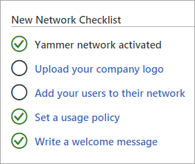

# Yammer admin quick start

If you're doing a quick trial of Yammer, you can experiment with the Yammer settings, add some users, and go. 
  
## Quick start

1. Go to the Yammer admin center.
    
      - In Office 365, go to **Admin** \> **Yammer**.
    
      - Or, in Yammer, click the Yammer settings icon , and then click **Network Admin**.
    
2. Click the links in the **New Network Checklist** to get started. 
    
    
  
You can also click **Start Here** to go to the Yammer Success Site, your resource library for product training, IT integration guides, and community tips to engage your network. 
  
## Ready for more?

Get an overview of key concepts and first steps to setting up your Yammer network with [Yammer admin key concepts](admin-key-concepts.md).
  
For links to everything you need to administer your network, see [Yammer admin help](../index.yml).