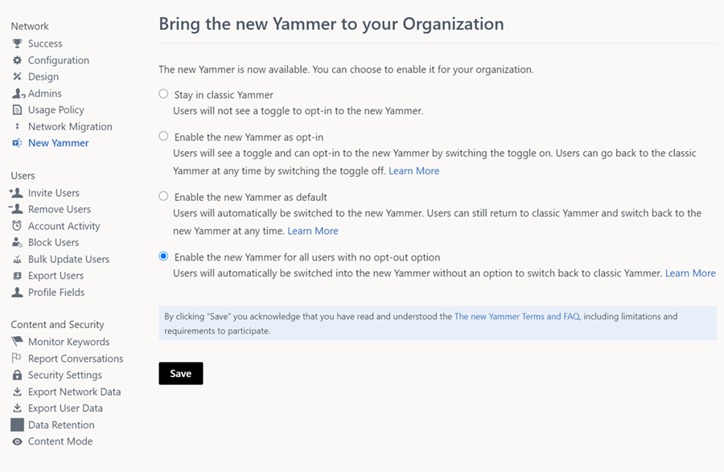

# Bring new Yammer to your organization

> [!IMPORTANT]
> A key change is coming in mid-October to how customers opt into new Yammer. Enable the new Yammer as opt-in will become the default setting, and the Stay in classic Yammer option will be removed as we continue to enhance the new Yammer experience.  See the [Enable the new Yammer as opt-in section](#enable-the-new-yammer-as-opt-in) for more information.

Global admins and verified network admins can now control participation in new Yammer for your organization. Please note that only one of these settings can be selected at a time. You can go back and forth between these options but we strongly recommend understanding what selecting and unselecting each setting entails before making that choice.

## Enable the new Yammer as opt-in

Selecting this option ensures that users in your organization are able to see the **New Yammer** toggle to opt into new Yammer from the classic Yammer experience.

Users would be able to opt out of the new experience at any time, using the opt-out toggle. Users would be able to opt out of the new experience at any time, using the opt-out toggle. When users opt into the new experience, they will encounter an opt-in dialog box prompting them to opt into the new Yammer experience. When they click **Let’s Go**, it opts in the user.

    

- If the user clicks on **Not Now**, the user will be taken to the corresponding page on the classic Yammer experience.

## Enable the new Yammer as default

Selecting this option would ensure users in your organization are able to see the **New Yammer** toggle to opt into new Yammer  from the classic Yammer experience, and users who have never tried the new experience would automatically be switched to new Yammer. 

Users can choose to opt-out of this new experience and go back to classic Yammer at any point.

- This would not impact those users who have tried new Yammer before and made the explicit choice to opt out of it. These users would continue to stay in the classic Yammer experience. 
- Users who have already opted in through the opt-in toggle are not impacted. These users would stay in the new experience but can opt out at any time through the opt-out toggle. 
- If your organization is completely new to Yammer, and you want all your users to directly move to the new Yammer experience, the **Enable the New Yammer as default** setting is the one we recommend.

 ## Enable new Yammer for all users with no opt-out option

Selecting this option would ensure users in your organization are in the new Yammer experience and do not see the toggle-out option. This is an accelerated setting to get all users in your organization using new Yammer.

>[!NOTE]
> Please note that users can access the new experience through a direct link. If your organization wants to remove all access to the new Yammer you will need to contact Microsoft support. If you remove all access, then users from all networks in a 1:M (1-to-many) scenario will no longer be able to access the new Yammer features.

## FAQ

**Q: Why can I not select the Stay in Classic Yammer option anymore?**

A: We have removed the option to stay only in classic Yammer as we continue to enhance the new Yammer experience.

**Q: Which networks get the opt-in toggle?**

A: In some situations, multiple Yammer networks are connected to a single Office 365 tenant. This is called a 1 tenant: many networks (1:M) configuration. All networks attached to the tenant can get the toggle, but each will need to be enabled independently. We recommend that administrators consolidate down to a single network.

## Related articles

[New Yammer FAQ](newyammer-faq.md)

[Yammer Blog](https://techcommunity.microsoft.com/t5/yammer-blog/bg-p/YammerBlog)

[Yammer admin Help](https://docs.microsoft.com/yammer/yammer-landing-page)

[Yammer admin key concepts](https://docs.microsoft.com/yammer/get-started-with-yammer/admin-key-concepts)

[Yammer Help and Support Center for end-users](https://support.office.com/yammer)
